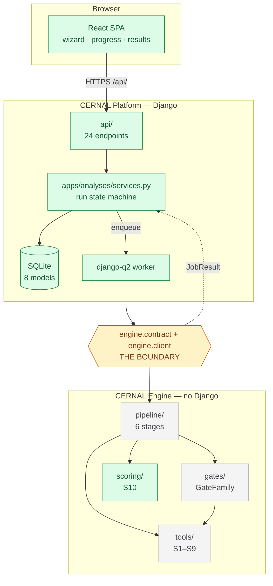
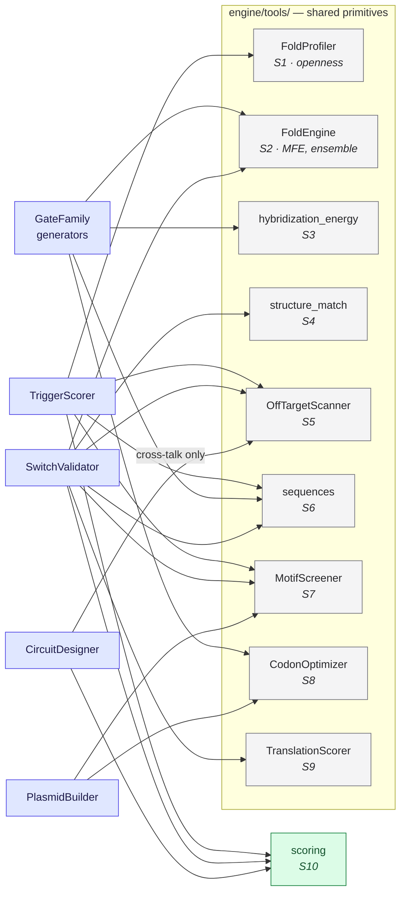
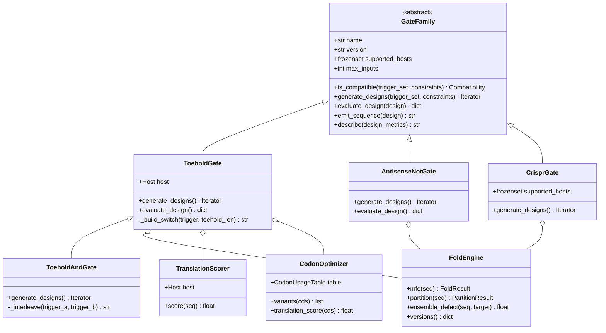
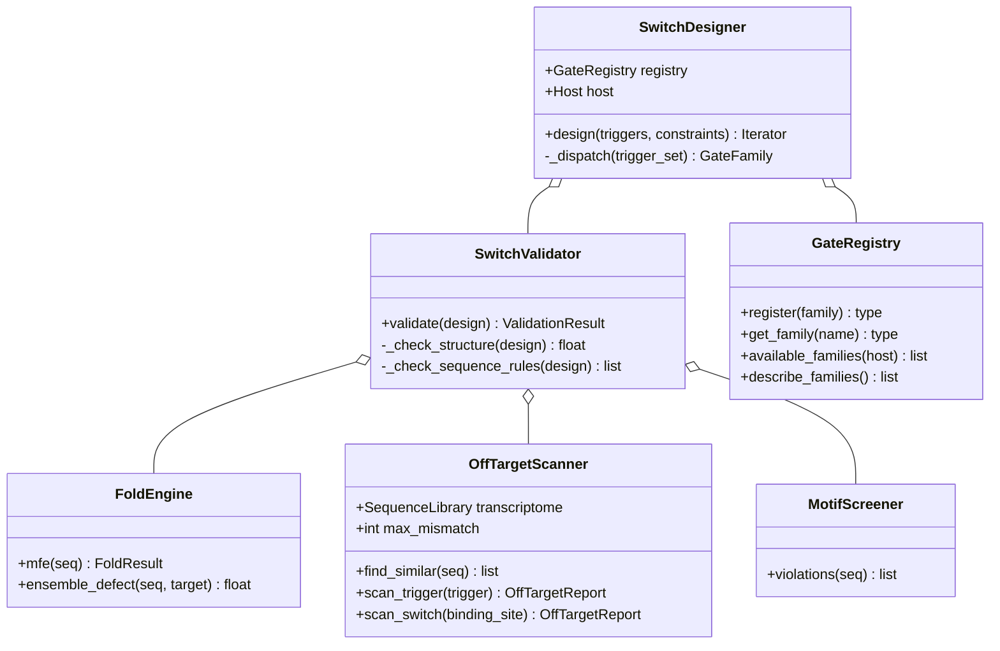
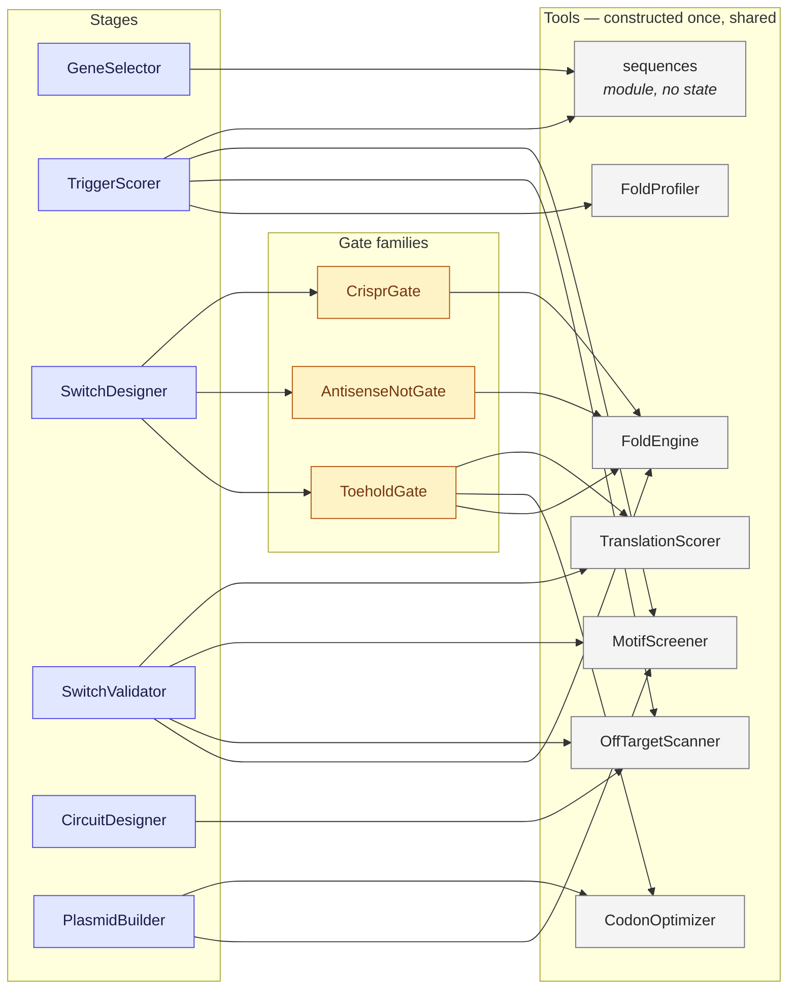
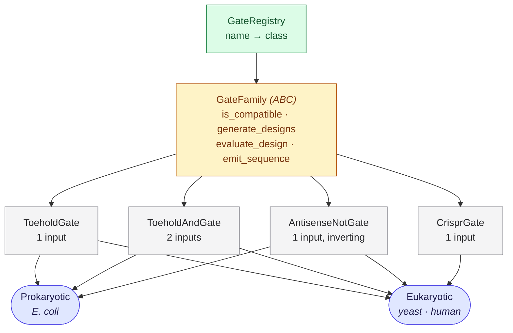
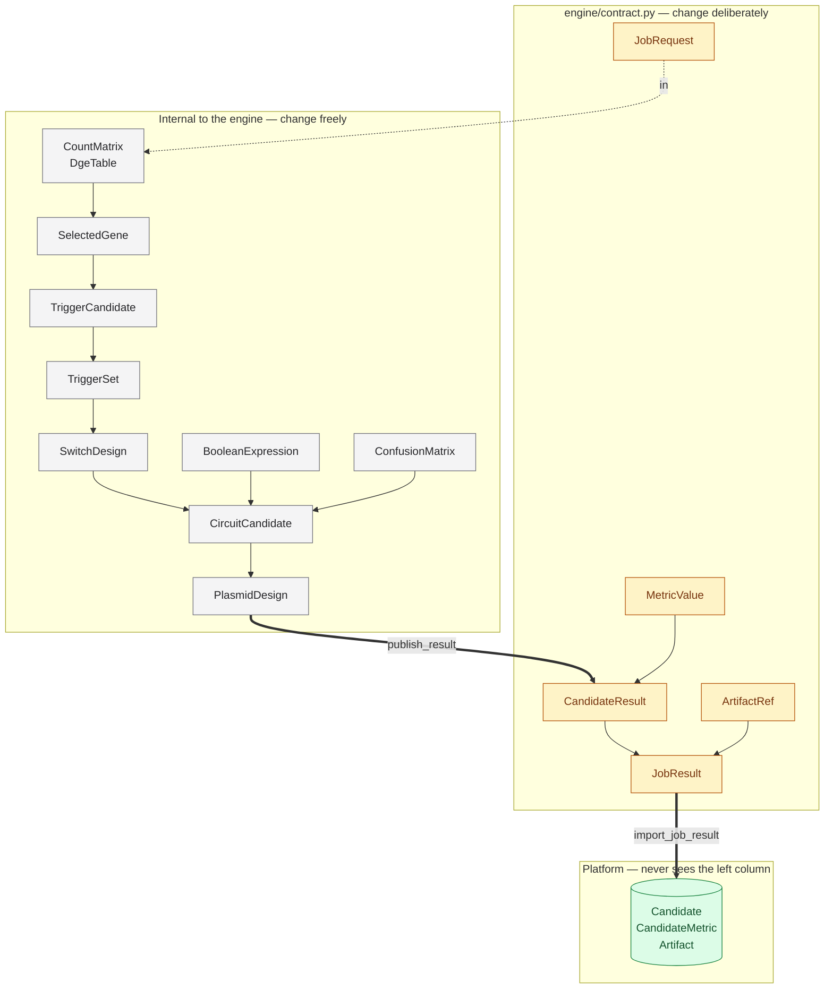
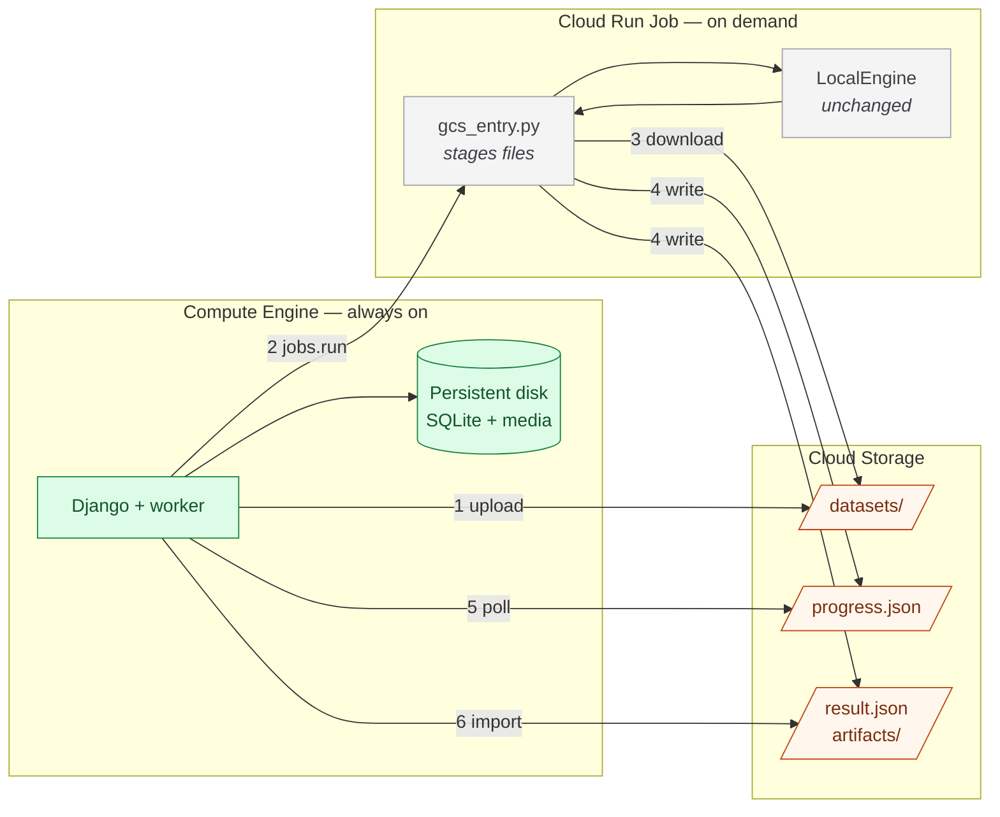
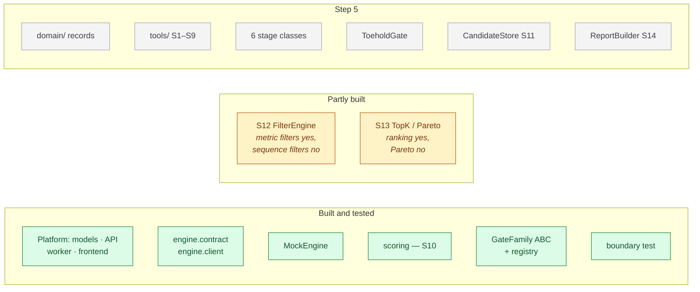

# Engine map

> Visual companion to [`engine-classes.md`](engine-classes.md) (what each class is) and
> [`engine-design.md`](engine-design.md) (why it is shaped that way).
>
> Diagrams are Mermaid — they render in GitHub, in VS Code with a Markdown preview, and
> in Obsidian.

**Legend used throughout:** green = built and tested · amber = partly built ·
grey = to build in Step 5.

---

## 1. The whole system

Where the engine sits, and what the boundary actually separates.



Everything green is done. **The engine is the remaining work**, and the boundary is what
lets it be done without touching anything above it.

---

## 2. The pipeline

Six stages, and the record each one produces. Read left to right.

```mermaid
flowchart LR
    IN1[/"RNA-seq counts<br/>.csv"/]
    IN2[/"DGE results<br/>.csv"/]
    IN3[/"Organism<br/>+ desired outcome"/]

    QC["InputQualityCheck<br/><i>S15</i>"]
    GS["GeneSelector"]
    TS["TriggerScorer"]
    SD["SwitchDesigner"]
    CD["CircuitDesigner"]
    PB["PlasmidBuilder"]
    RB["ReportBuilder"]

    R1(["SelectedGene[]"])
    R2(["TriggerCandidate[]"])
    R3(["SwitchDesign[]"])
    R4(["CircuitCandidate[]"])
    R5(["PlasmidDesign[]"])
    OUT[/"JobResult<br/>+ artifacts + PDF"/]

    IN1 --> QC --> GS
    IN2 --> GS
    IN3 --> SD
    GS --> R1 --> TS --> R2 --> SD --> R3 --> CD --> R4 --> PB --> R5 --> RB --> OUT
    R1 -.-> CD
    R2 -.-> CD
    R1 -.-> PB

    classDef stage fill:#f4f4f5,stroke:#71717a,color:#27272a
    classDef record fill:#e0e7ff,stroke:#4f46e5,color:#1e1b4b
    classDef io fill:#fff7ed,stroke:#c2410c,color:#7c2d12
    class QC,GS,TS,SD,CD,PB,RB stage
    class R1,R2,R3,R4,R5 record
    class IN1,IN2,IN3,OUT io
```



Dotted lines are the map's "inputs [12] [15]" — later stages reading earlier records
directly, not only their immediate predecessor.

**The pruning point is `TriggerScorer` → `SwitchDesigner`.** Everything downstream scales
with how many trigger candidates survive, which is why that filter sets the compute budget
([step-5 §3](step-5-engine-plan.md)).

---

## 3. Which stage uses which tool

The S1–S9 dependency map. This is the diagram that shows why the tools are worth building
first.



`FoldEngine` (S2) and `sequences` (S6) are used by nearly everything — build them first
and well. `scoring` (S10) is already done, and every stage that ranks anything goes
through it.

A tool takes sequences and returns facts; it never knows which stage called it. What
differs between callers is the *question* and the *interpretation*, and both live in the
stage — see [engine-classes §4a](engine-classes.md). `CircuitDesigner` is the one
qualified arrow: it reuses the off-target penalties already stored upstream and only
searches for cross-talk between a circuit's own components.

---

## 3a. Classes and methods

Two kinds of arrow, and the difference between them is the whole answer to "why not put
shared methods on the base class":

- **`<|--` inheritance** — *"a toehold **is** a gate"*. Points up to the base.
- **`o--` composition** — *"a toehold **uses** folding"*. Points sideways to a tool.

### Gate families



`FoldEngine` sits to the side because `TriggerScorer` needs it too, and a trigger scorer
is not a gate. Everything gate-specific — `describe`, the ABC's contract — lives on
`GateFamily`, exactly as expected.

### A stage in detail

The same pattern one level up. `SwitchDesigner` **is** nothing; it **uses** everything.



### Who holds which tool

The whole composition picture. Every arrow is "holds an instance of", and each tool is
constructed **once** per run and passed in.



**`FoldEngine` is constructed once per run**, so its cache is shared across every stage
and every family. Construct it inside each class instead and you get four caches, four
sets of ViennaRNA parameters, and scores that are not comparable.

```python
# engine/pipeline.py — wire the tools once, hand them down
def run_pipeline(request, on_progress):
    folder   = FoldEngine()
    profiler = FoldProfiler(window=80, max_span=40, unpaired=10)
    off      = OffTargetScanner(transcriptome, max_mismatch=2)
    screener = MotifScreener(standard=AssemblyStandard.RFC10)

    triggers = TriggerScorer(profiler, off, screener).score(genes, sequences)
    switches = SwitchDesigner(registry, SwitchValidator(folder, off, screener)).design(...)
```

That function is the only place that knows how the pieces fit together. Everything else
receives what it needs.

---

## 3b. Where the code lives

Yes — **everything under `src/engine/`**. Not one file, and not one file per class either.

> **A module is a topic, not a class.** Related classes live together: `ToeholdGate` and
> `ToeholdAndGate` share `toehold.py`; `SwitchDesigner` and `SwitchValidator` share
> `switches.py`.

```
src/engine/
├── contract.py        crosses the boundary          ~200 lines   ✅ built
├── client.py          MockEngine · LocalEngine      ~350         ✅ built
├── errors.py          the exception hierarchy       ~40          ✅ built
├── domain.py          ALL records + enums           ~300         ★ start here
├── pipeline.py        run_pipeline — wiring only    ~80          ★
├── store.py           CandidateStore · ParetoFilter ~150         ★
│
├── tools/
│   ├── folding.py     FoldEngine · FoldProfiler · structure_match   S1 S2 S4
│   ├── binding.py     hybridization_energy                          S3
│   ├── off_target.py  OffTargetScanner                              S5
│   ├── sequences.py   pure functions, no class                      S6
│   ├── motifs.py      MotifScreener                                 S7
│   ├── codons.py      CodonOptimizer                                S8
│   └── translation.py TranslationScorer                             S9
│
├── gates/
│   ├── base.py        GateFamily ABC                ✅ built
│   ├── registry.py    GateRegistry                  ✅ built
│   ├── toehold.py     ToeholdGate + ToeholdAndGate  ★
│   ├── antisense.py   AntisenseNotGate              ★
│   └── crispr.py      CrisprGate                    ★
│
├── scoring/           ✅ built and tested — S10
│   ├── profiles.py    MetricSpec · HardFilter · ScoringProfile
│   └── normalize.py   normalize · weighted_score · rank
│
├── stages/
│   ├── quality.py     InputQualityCheck             S15
│   ├── genes.py       GeneSelector
│   ├── triggers.py    TriggerScorer
│   ├── switches.py    SwitchDesigner + SwitchValidator
│   ├── circuits.py    CircuitDesigner + ConfusionEvaluator
│   ├── plasmids.py    PlasmidBuilder
│   └── reporting.py   ReportBuilder + StructureRenderer   S14
│
└── runner/
    └── gcs_entry.py   container entrypoint
```

### Why these groupings

| Choice | Reason |
|---|---|
| **`domain.py` as one file** | Records reference each other constantly. Splitting them early invites circular imports. Split into a `domain/` package when it passes ~400 lines, not before |
| **`tools/` by scientific topic** | `folding.py` holds S1, S2 and S4 because they all wrap ViennaRNA and share its cache. Splitting them would mean three modules importing `RNA` |
| **One module per gate chemistry** | A new family is a new file plus one `register()` call. Nothing else changes |
| **`stages/` mirrors the pipeline map** | Someone reading the map can find the code by name |
| **`pipeline.py` is one flat file** | It only wires things together. If it grows past ~150 lines, logic has leaked into it |

### The import rule

Dependencies point **downward only**, which is what keeps any of it testable in isolation:

```
runner  →  pipeline  →  stages  →  gates  →  tools  →  domain
                            ↘  scoring  ↗
```

`tools/` imports nothing but `domain` and its scientific library. `domain` imports
nothing at all. So a tool can be tested with no pipeline, and a stage tested with fake
tools.

**Nothing imports upward.** A tool that needs to know which stage called it is the
signal something is in the wrong place.

---

## 4. Gate families

The one real class hierarchy, and the host constraint the pipeline map specifies.



**CRISPR is eukaryotic only.** That is why `GateFamily` needs `supported_hosts` rather
than a single `available` flag, and why capabilities should be reported per host — so the
wizard greys CRISPR out when *E. coli* is selected ([engine-classes §7](engine-classes.md)).

---

## 5. Types, and what crosses the boundary



**Only `publish_result` crosses.** Everything on the left can be redesigned without
touching the API schemas, the database or the frontend — which is the whole return on the
boundary.

---

## 6. Deployment

Where each piece runs once the engine moves to Google Cloud
([gcp-deployment.md](gcp-deployment.md)).



`LocalEngine` is unchanged in the cloud — `gcs_entry.py` stages files around it, which is
what keeps the pipeline runnable on a laptop.

---

## 7. Status at a glance



**Start with `domain/` and `tools/`** — no scientific input needed, no ViennaRNA for S6
and S7, and everything else depends on them.
