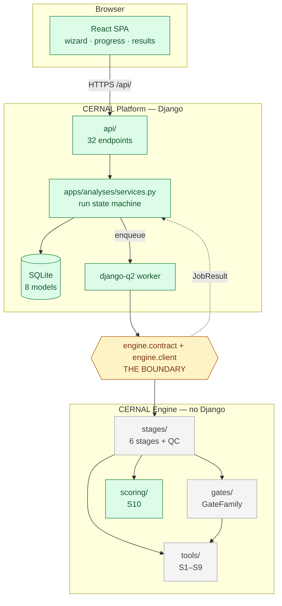
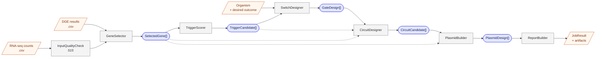
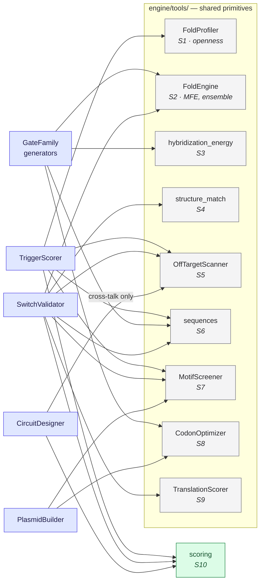
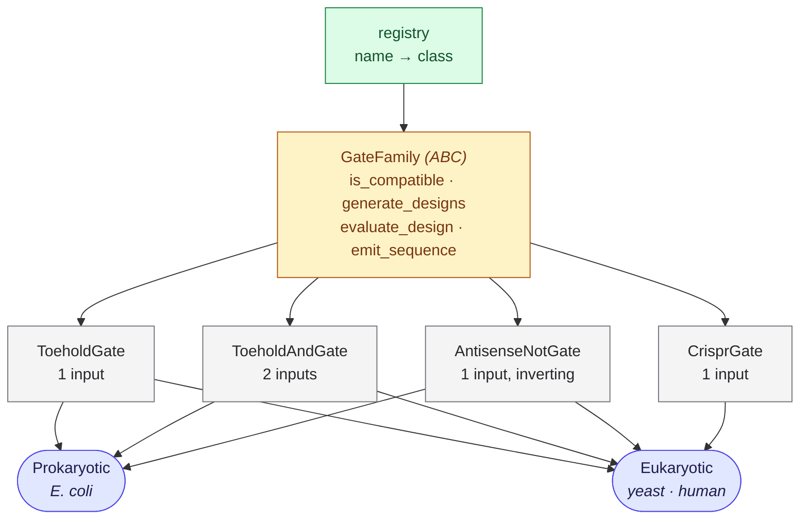
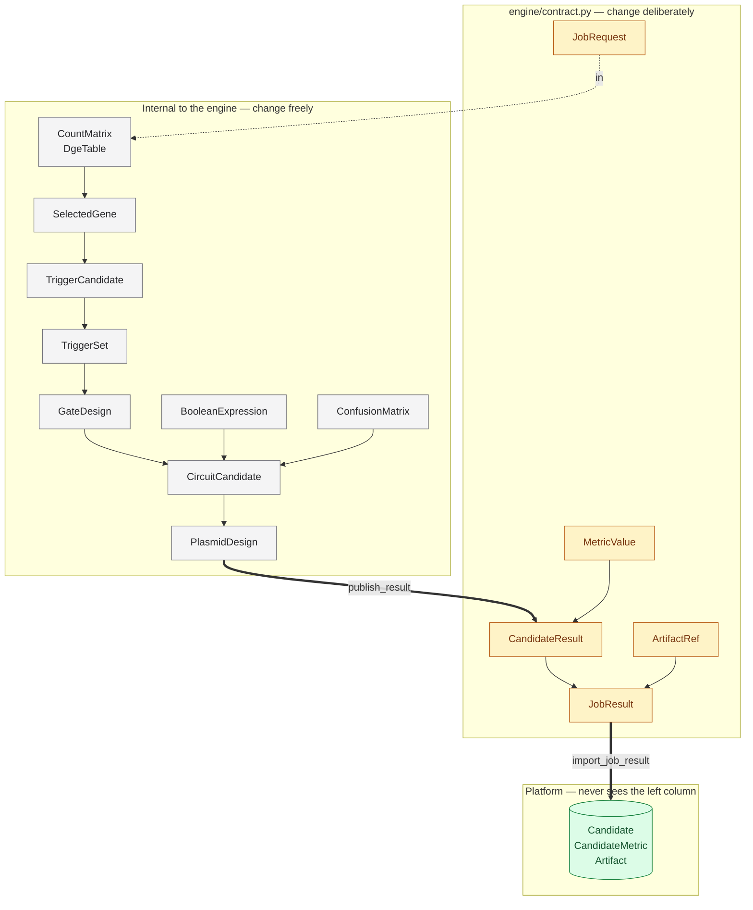
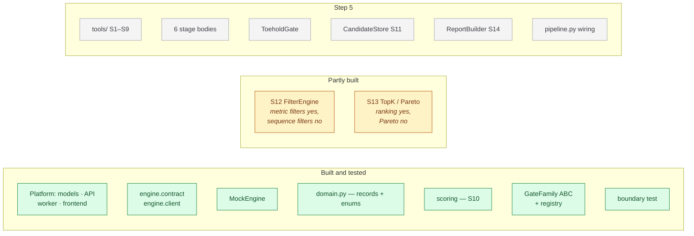

# The CERNAL Engine

> Everything about the scientific engine: what crosses its boundary, how it is built
> inside, what each class is, and where the code lives.
>
> - **Architecture around it:** [architecture.md](architecture.md)
> - **The four design axes it computes over:** [modalities.md](modalities.md)
> - **What is left to build:** [ROADMAP.md](ROADMAP.md)
>
> Derived from the team's *CERNAL Computational Pipeline Map*, reconciled with what is
> actually in `src/engine/`. Diagrams are Mermaid — they render on GitHub, in VS Code and
> in Obsidian.

| § | |
|---|---|
| [1](#1-the-boundary-and-the-contract) | The boundary and the contract — what the Platform sees |
| [2](#2-design-principles) | Design principles — classes, immutability, and the god object not to build |
| [3](#3-anatomy) | Anatomy — stages, records, tools, gates, scoring |
| [4](#4-where-the-code-lives) | Where the code lives |
| [5](#5-naming-conventions) | Naming conventions |
| [6](#6-pipeline-shape) | Pipeline shape, progress and cancellation |
| [7](#7-performance) | Performance, in order |
| [8](#8-testing-scientific-code) | Testing scientific code |
| [9](#9-status) | Status at a glance |

**Legend used in diagrams:** green = built and tested · amber = the seam, or partly built ·
grey = to build in Step 5.

---

## 1. The boundary and the contract

The Platform and the Engine communicate through exactly two modules — `engine.contract`
and `engine.client`. Everything else under `src/engine/` is private to the engine. The
boundary rule and its enforcement are in
[architecture.md §3](architecture.md#3-the-boundary-rule).

In v1 the contract is a set of frozen dataclasses passed in-process. **The fields are the
ones the design maps specify for the eventual HTTP service**, so promoting the engine to a
standalone deployment is a serialisation exercise, not a redesign.



Everything green is done. **The engine is the remaining work**, and the boundary is what
lets it be done without touching anything above it.

### 1.1 The interface

```python
ProgressFn = Callable[[int, str], bool]  # (percent, stage) -> keep_going


class EngineClient(Protocol):
    def run(self, request: JobRequest, on_progress: ProgressFn) -> JobResult: ...
    def capabilities(self) -> EngineCapabilities: ...
```

| Class | Purpose |
|---|---|
| `MockEngine` | Deterministic fake science. **The default**, and what CI and frontend work use |
| `LocalEngine` | The real pipeline, in-process. Raises `NotImplementedError` until Step 5 |
| *a remote client* | *Future.* Same Protocol, runs the same pipeline elsewhere. [deployment.md](deployment.md) |

Selected by dotted path: `engine = load_engine(settings.CERNAL_ENGINE)`. `load_engine`
takes the path **as an argument** rather than reading `settings` itself — `engine/` may not
import Django.

### 1.2 The types

#### `JobRequest`

An immutable snapshot of one submission. Carries references and values only — never a model
instance, a file handle or an open connection. Convenience property: `.is_direct_trigger`.

| Field | Type | Notes |
|---|---|---|
| `schema_version` | `str` | Currently `"1"` |
| `run_id` | `str` | `AnalysisRun.id`; the correlation key in every log line |
| `idempotency_key` | `str` | A retry with the same key must not launch a second computation |
| `input_mode` | `str` | `de` · `direct`. Decides which of the next three fields are populated ([modalities.md §1](modalities.md)) |
| `input_path` | `str` | Absolute path the engine may read; empty in `direct` mode. **Opaque** — a local path today, a `gs://` URI later |
| `input_checksum` | `str` | SHA-256; **the engine re-verifies before use**. Empty in `direct` mode |
| `trigger_sequence` | `str` | The pasted mRNA in `direct` mode; empty otherwise |
| `organism` | `str` | See the inconsistency in [modalities.md §2](modalities.md) |
| `params` | `dict` | The normalized parameter snapshot |
| `gate_families` | `list[str]` | Resolved via `engine.gates.registry` |
| `scoring_profile` | `str` | Resolved via `engine.scoring.profiles` |
| `seed` | `int \| None` | Reproducibility |
| `output_dir` | `str` | Where the engine may write artifacts. Also opaque |

#### `JobResult`

The versioned result manifest. `input_checksum` and `params` are echoed back so the
Platform can verify the engine computed against what it actually sent.

| Field | Type | Notes |
|---|---|---|
| `schema_version` | `str` | |
| `engine_version` | `str` | Recorded on the run |
| `status` | `str` | `succeeded` · `failed` · `cancelled` |
| `candidates` | `list[CandidateResult]` | **Includes rejected ones** |
| `artifacts` | `list[ArtifactRef]` | |
| `warnings` | `list[str]` | |
| `error` | `str \| None` | Safe to show a researcher |
| `input_checksum` / `params` | | Echoed |

Convenience properties: `.accepted` (non-rejected, rank order) and `.rejected`.

#### `CandidateResult`

| Field | Type | Notes |
|---|---|---|
| `ref` | `str` | Engine-local id, unique within the job |
| `rank` | `int \| None` | `None` for rejected candidates |
| `overall_score` | `float \| None` | 0–1, higher is better |
| `gate_family` / `logic_type` | `str` | |
| `triggers` / `design` | `dict` | Sequences, structure, plasmid segments, logic graph |
| `summary` | `str` | One-line human description |
| `metrics` | `list[MetricValue]` | The full decomposition |
| `warnings` | `list[str]` | |
| `is_rejected` | `bool` | |
| `rejection_reason` | `str` | **Never empty when rejected** |

#### `MetricValue`, `ArtifactRef`, `EngineCapabilities`

`MetricValue` keeps `raw_value` *and* `normalized_value`, plus `weight` and `direction`,
because the researcher is shown the decomposition rather than a single opaque score.

`ArtifactRef.path` is **relative to `output_dir`**, so the Platform can relocate the
directory without rewriting references. `checksum_sha256` is verified on import.

`EngineCapabilities` carries `gate_families: list[GateFamilyInfo]` and
`scoring_profiles: list[str]`. It exists because the Platform must validate a submission
but may not import `engine.gates.registry` — so the engine advertises instead. It is the
in-process form of the maps' `GET /version` capability document, surfaced at
`GET /api/version`.

**Planned families are deliberately included** with `available=False`, so the wizard shows
CRISPR greyed out with its real label rather than the frontend keeping its own hardcoded
"coming soon" list that nobody remembers to update.

### 1.3 Behavioural rules

**Failures are data; bugs are exceptions.** An expected scientific failure returns a
`JobResult` with `status="failed"` and a safe `error` string. A programming error
propagates as an exception so the Platform logs a traceback and the bug is visible.

**Error text is user-facing.** No paths, no credentials, no stack traces, no internals.
Full detail goes to the log, keyed by `run_id`.

**Cancellation is cooperative.** The engine calls `on_progress(percent, stage)` between
stages; a `False` return means stop. The engine raises `JobCancelled` internally and
returns `status="cancelled"`. Threads are never killed.

**Progress is monotonic**, and every callback carries a human-readable stage label — the
Platform shows these to the researcher directly.

**Determinism.** The same `idempotency_key` and `seed` must produce identical candidates
and byte-identical artifacts. `MockEngine` guarantees this and is tested for it.

**Rejected candidates survive** with a reason attached. Never filtered away silently.

### 1.4 The future HTTP mapping

When the engine becomes a service (design map 08), these dataclasses serialise directly.

| Map 08 field | Contract field |
|---|---|
| API/schema version | `JobRequest.schema_version` |
| platform run ID / correlation ID | `run_id` |
| idempotency key | `idempotency_key` |
| immutable input bundle references + checksums | `input_path` + `input_checksum` |
| normalized parameter snapshot | `params` |
| organism / state metadata | `organism` |
| requested gate families | `gate_families` |
| scoring / reproducibility settings | `scoring_profile` + `seed` |

- `POST /v1/jobs` → `202 Accepted`. In v1 there is no separate engine job id because
  `run_id` already identifies the work.
- `GET /v1/jobs/{id}` → the `on_progress` callback is the in-process form of polling.
- `GET /v1/jobs/{id}/result` → `JobResult` verbatim; it *is* the versioned result manifest.
  Artifact bytes move to signed or bucket-scoped references, so only the resolution of
  `path` changes.
- `POST /v1/jobs/{id}/cancel` → the transport for what `on_progress` returning `False`
  does today.

**What must not change across that migration:** field names and semantics, the status
vocabulary, checksum rules, idempotency behaviour, and the guarantee that rejected
candidates carry reasons.

### 1.5 Using MockEngine

Options go under `JobRequest.params["mock"]` and are ignored by every real engine.

| Option | Default | Effect |
|---|---|---|
| `candidate_count` | `12` | How many candidates to generate |
| `step_delay` | `0.0` | Seconds per stage — set to ~0.5 to watch progress in the UI |
| `fail` | `false` | Produce a `failed` result |
| `fail_message` | generic | The `error` text |
| `fail_at_stage` | last | Zero-based stage index to fail at |

```python
request = JobRequest(..., params={"mock": {"candidate_count": 30, "step_delay": 0.4}})
```

---

## 2. Design principles

### 2.1 The rule

> **Classes where you need polymorphism. Frozen dataclasses for data.
> Plain functions for transformations.**

| Tempting | What it should be | Why |
|---|---|---|
| `GateType` | **Class hierarchy** — `GateFamily` ABC | Toehold, CRISPR and antisense genuinely behave differently. This is what polymorphism is for |
| `Gate` | **Frozen dataclass** — `GateDesign` | A design is a *record of what was computed*, not an object with behaviour |
| `Plasmid` | **Frozen dataclass** — a tuple of segments | Data with a couple of computed properties |
| `Job` | **A function** — `run_pipeline(request, on_progress)` | See [§2.3](#23-the-one-thing-not-to-build). This is the trap |

### 2.2 Why immutability, specifically here

Not style preference. Four concrete reasons, in the order they will bite you:

**Parallelism.** Gate evaluation is embarrassingly parallel and will need
`ProcessPoolExecutor`. Workers communicate by pickling. Frozen dataclasses pickle cleanly
and cannot be mutated across a process boundary in a way you would never see. Mutable
shared objects simply do not survive this.

**Determinism.** The engine must produce identical output for identical input — the
contract promises it and a test asserts it. Mutation is where nondeterminism hides: a stage
quietly modifying a design that a later stage also reads, and the result depending on
ordering.

**Reproducibility.** A `CandidateResult` is a record of what was computed. If it can be
edited after the fact, it stops being evidence.

**Memory.** `slots=True` removes each instance's `__dict__`. Across 100k designs that is the
difference between comfortable and swapping.

And **testability**, which falls out for free: a pure function over frozen data needs no
setup, no mocks and no teardown.

### 2.3 The one thing not to build

The `Job` class. It is the natural first design and it goes wrong the same way every time:

```python
# Don't.
class Job:
    def load_data(self):
        self.data = ...

    def find_triggers(self):
        self.triggers = ...

    def generate_gates(self):
        self.designs = ...

    def evaluate(self):
        self.metrics = ...

    def score(self):
        self.candidates = ...
```

Four problems, all of which arrive late:

1. **You cannot test a stage in isolation.** Testing `score()` means constructing a `Job`
   and running everything before it.
2. **It is a god object.** Every stage can read and write every attribute, so the actual
   data flow becomes unknowable.
3. **It forces materialisation.** `self.designs` is a list, so all 100k live in memory at
   once. Generators are impossible.
4. **It fights parallelism.** You cannot hand `self` to a worker process.

**Instead: functions that take what they need and return what they produce.**

```python
def run_pipeline(request: JobRequest, on_progress: ProgressFn) -> JobResult:
    profile = get_profile(request.scoring_profile)
    table = load_expression_table(request.input_path)
    triggers = discover_features(table, constraints)  # generator
    sets = generate_trigger_sets(triggers, constraints)  # generator
    designs = generate_gates(sets, families, constraints)  # generator
    scored = evaluate_and_score(designs, profile)  # generator
    ranked = rank_and_filter(scored, profile)  # materialised
    artifacts = generate_artifacts(ranked, request.output_dir)
    return publish_result(request, ranked, artifacts)
```

The data flow *is* the code. Every step is independently testable, and the generators mean
memory stays flat until `rank_and_filter` — which is the one place that legitimately needs
everything at once, and by then pruning has cut the volume.

> **`RunContext` is not this class.** It is **frozen**, set once before the pipeline starts,
> and **accumulates nothing**. It carries the profile, constraints, families, seed and
> output directory so stages do not each take six arguments. If anyone adds a mutable field
> to it, it has become the god object and the benefit is gone.

### 2.4 Where behaviour lives

`GateFamily` is the one real class hierarchy, and it already exists. Stages are classes
holding **read-only configuration**, with one public method each. Tools are classes only
where they hold configuration; otherwise modules of pure functions.

Two kinds of relationship, and the difference is the whole answer to *"why not put the
shared methods on the base class?"*:

- **inheritance** — *"a toehold **is** a gate"*. `ToeholdAndGate` extends `ToeholdGate`
  because an AND toehold really is a toehold with more inputs.
- **composition** — *"a toehold **uses** folding"*. Every family holds a `FoldEngine`; none
  inherits from one.

**Where a base-class method is right:** behaviour only gates need, shared by all gates.
`describe()` and `emit_sequence()` are on the ABC with sensible defaults, and that is
correct.

**Where it is wrong:** `mfe()`. Putting folding on `GateFamily` would work right up until
`TriggerScorer` needs to fold — and `TriggerScorer` is not a gate. You would then either
duplicate the folding, or instantiate a gate family to borrow its method. Worse, each
family would carry its own folding parameters, and **two designs folded at different
temperatures produce numbers that `engine.scoring` normalises onto the same axis as though
they were comparable.** The ranking becomes quietly wrong, and nothing detects it.

The general test: **if a non-gate needs it, it is a tool, not a base-class method.**

#### Host: a parameter, not a subclass

`AndProkaryotic` / `AndEukaryotic` is a reasonable instinct and premature today. The two
tracks currently differ by *which constant goes in the loop* — an RBS or a Kozak context —
and a parameter carries that. Designing the hierarchy before the bodies exist means
guessing where the seam is, and a wrong guess is more expensive to undo than a late split.

**Let it emerge.** If the method bodies genuinely diverge, split then.

| Question | Answer |
|---|---|
| Should stages be classes with methods? | **Yes** — that is the design |
| Should gates be a class hierarchy? | **Yes** — `GateFamily` ABC |
| Should shared gate behaviour sit on the base? | **Yes**, when only gates need it |
| Should `mfe()` sit on the base? | **No** — `TriggerScorer` needs it and is not a gate |
| Prokaryotic / eukaryotic subclasses? | **Later, if the bodies diverge.** Parameter first |

### 2.5 What deliberately is *not* a class

As informative as the list of types. Each of these is a dict, a primitive or a function,
and should stay that way:

| Thing | Why not a class |
|---|---|
| Raw metrics from `evaluate_design` | `dict[str, float \| None]`. A class would fix the metric set, which is exactly what must stay open |
| `GateDesign.architecture` | Family-specific and opaque to everything else. A dict is honest about that |
| Warnings | Lists of strings. They are shown to a human, not reasoned about |
| A sequence | `str`. Hashable, sliceable, `lru_cache`-able. A `Sequence` wrapper buys nothing |
| The pipeline itself | Functions. See [§2.3](#23-the-one-thing-not-to-build) |
| Tool versions | `dict[str, str]`, recorded and never inspected |
| `params_snapshot` | A dict by contract. The engine reads what it recognises and ignores the rest, which is what lets the wizard add fields without an engine release |

The test: **does anything dispatch on its type, or enforce an invariant over it?** If not, a
dict is lighter and does not need maintaining.

#### And what to skip entirely

**Pydantic inside the engine.** It is the right tool at the API edge — django-ninja already
uses it — but validation on every object in a hot loop is cost you do not need.
**Validate at the edges, trust inside.**

**A workflow framework** (Prefect, Dagster, Airflow). Six sequential stages in one process
is a function call, not a DAG. These solve distributed scheduling, retries and backfills —
problems you do not have.

**An ORM or database inside the engine.** It receives a request and returns a result. The
Platform owns persistence, and the boundary depends on this staying true.

**Inheritance beyond `GateFamily`.** One hierarchy, one level deep. Composition for
everything else.

#### Modern Python worth using

| Tool | Use it for |
|---|---|
| `@dataclass(frozen=True, slots=True)` | Every domain type. `slots` matters at 100k objects |
| `Protocol` | `EngineClient` — structural typing, no inheritance needed |
| `ABC` | `GateFamily`, where you *want* a base class with shared helpers |
| `StrEnum` | Closed vocabularies. Serialises as a plain string |
| Generators / `itertools.batched` | The whole pipeline. Flat memory |
| `functools.lru_cache` | Folding. The single biggest speed win |
| `ProcessPoolExecutor` | Gate evaluation. ~3.5× on 4 cores, ~10 lines |
| numpy | Metric arrays and normalization — not sequence work |
| pandas | Reading the DE table. **Do not carry DataFrames through the pipeline** |
| pyright / mypy on `engine/` only | Ruff catches style; a type checker catches a `float \| None` used as a `float` |
| `hypothesis` | Scoring invariants — "normalized value is always in 0–1, for any input" |

---

## 3. Anatomy

### 3.1 The pipeline

Six stages plus a quality check, and the record each produces. Read left to right.



Dotted lines are later stages reading earlier records directly, not only their immediate
predecessor.

**The pruning point is `TriggerScorer` → `SwitchDesigner`.** Everything downstream scales
with how many trigger candidates survive, which is why that filter sets the compute budget
([ROADMAP.md §3](ROADMAP.md)).

Each stage is a class with one public method, taking the previous stage's records and
returning the next. They hold **read-only configuration**, never accumulated state.

```python
class InputQualityCheck:  # S15
    """Validate the uploaded matrix before anything runs: distributions, PCA,
    outliers, batch structure. It belongs in front of GeneSelector because
    everything downstream is wasted if the input is unusable."""

    def check(self, counts: CountMatrix, metadata: SampleMetadata) -> QcReport: ...


class GeneSelector:  # Stage 1
    """Keep the genes that actually separate the two cell states. Big enough fold
    change, statistically significant, and expressed in a usable absolute range in
    both states: too low gives false negatives, too high gives false positives."""

    def select(self, counts: CountMatrix, dge: DgeTable) -> list[SelectedGene]: ...


class TriggerScorer:  # Stage 2
    """Slide a window along each selected gene's transcript and rank every
    sub-segment by how unpaired it is in local folding context, plus off-target
    load, GC and forbidden motifs. Per length class, because each gate family
    needs a different footprint."""

    def score(self, genes, sequences) -> Iterator[TriggerCandidate]: ...


class SwitchDesigner:  # Stage 3
    """For each (trigger × gate kind), run the architecture-specific generator,
    then validate the fold and the hard sequence rules. Dispatches to a
    GateFamily; owns none of the chemistry itself."""

    def design(self, triggers, constraints) -> Iterator[GateDesign]: ...


class CircuitDesigner:  # Stage 4
    """Turn the genes' up/down pattern into a Boolean function, generate the
    expressions reproducing it, keep only those buildable from switches actually
    designed upstream, and rank by separation versus complexity."""

    def design(self, genes, designs, counts) -> Iterator[CircuitCandidate]: ...


class PlasmidBuilder:  # Stage 5
    """Lay the winning circuit's parts onto a backbone with promoters,
    terminators and the output gene; check assembly-standard compliance; export
    an orderable sequence."""

    def build(self, circuit, outcome: DesiredOutcome) -> PlasmidDesign: ...


class ReportBuilder:  # Stage 6 · S14
    """Assemble the evidence a user needs in order to decide whether to order a
    plasmid: designs, structures, confusion tables, separation margins, flags,
    caveats."""

    def build(self, run, circuits, plasmids) -> list[ArtifactRef]: ...
```

### 3.2 Records

Frozen dataclasses in `engine/domain.py`. **Fully implemented** — these are data and
arithmetic, not science, so there is nothing here to fill in later. The pipeline map's CSV
column lists became these fields; the CSVs become *exports* of them, not the interface
between stages.

| Record | Produced by | Carries |
|---|---|---|
| `SelectedGene` | Stage 1 | Regulation, fold change, adjusted p, control/condition percentiles, condition specificity, score |
| `TriggerCandidate` | Stage 2 | Sequence, start index, openness, accessibility, MFE, off-target penalty, segment specificity, GC, AUG/stop indexes, optional ribosome occupancy |
| `TriggerSet` | Stage 2→3 | Activators and repressors. `arity`, `logic_type`, `trigger_ids` |
| `GateDesign` | Stage 3 | Sequence, dot-bracket, structure deviation, `mfe_on`/`mfe_off`/`mfe_trigger`, binding-site accessibility and off-target, translation score, architecture dict |
| `CircuitCandidate` | Stage 4 | `BooleanExpression`, `LogicGraph`, its designs, `ConfusionMatrix`, output, score, optional `Rejection` |
| `PlasmidDesign` | Stage 5 | `Plasmid` (a tuple of `Segment`s), assembly standard, violations |

**Three records worth reading the source for**, because their docstrings carry decisions:

- **`TriggerCandidate`** — *a trigger is not a gene.* It is a specific window at a specific
  offset in a specific transcript, and most windows are unusable. `start_index` plus
  `length` locates it exactly, which is what makes a result reproducible.
- **`BooleanExpression`** — a circuit's logic as a **tree, not a string**. A parsed form is
  needed anyway: to evaluate the circuit against samples, to count complexity, and to
  enumerate equivalent expressions. Rendering to text is the easy direction.
  `LogicOperator.IDENTITY` is a leaf so every expression is a tree and callers never
  special-case the one-input form.
- **`ConfusionMatrix`** — **the most honest number the pipeline produces.** Everything
  upstream is prediction; this is measurement against samples the researcher collected.
  `false_positive` is the dangerous one. `separation_margin` (Youden's J), not accuracy, is
  the right headline: a circuit that fires on everything catches every true positive and
  separates nothing, and only the margin says so.

### 3.3 Tools — S1 to S9

The map's shared scientific functions. Each is a **class only where it holds
configuration**; otherwise a module of pure functions. All live under `engine/tools/`.

| Map | Class / module | Shape | Holds |
|---|---|---|---|
| **S1** LocalFoldProfile | `FoldProfiler` | class | Window parameters. `profile(seq)`, `openness(seq, start, end)` |
| **S2** FoldEngine | `FoldEngine` | class | The ViennaRNA adapter. `mfe`, `partition`, `ensemble_defect`, `bppm`, `subopt`. **Cache here** |
| **S3** HybridizationEnergy | `hybridization_energy()` | function | Stateless: `ΔG_bind = G_complex − (G_switch + G_trigger)` |
| **S4** StructureMatch | `structure_match()` | function | `(dot_bracket, target) -> StructureMatch` |
| **S5** OffTargetScan | `OffTargetScanner` | class | The transcriptome index and `max_mismatch` |
| **S6** SequenceUtils | `sequences.py` | module | `reverse_complement`, `translate`, `find_stops`, `find_augs`, `gc_content`, `longest_homopolymer` |
| **S7** MotifScreen | `MotifScreener` | class | The motif sets — RFC10/RFC1000 sites, RBP motifs, RNase sites, homopolymers |
| **S8** CodonTools | `CodonOptimizer` | class | The organism's usage table |
| **S9** TranslationInitiationScore | `TranslationScorer` | class | The host: RBS strength or Kozak match |



**`FoldEngine` (S2) and `sequences` (S6) are used by nearly everything — build them first
and well.**

### 3.4 What makes something a "tool"

> **A tool is an ordinary class.** What makes it a *tool* is only that it is a scientific
> primitive with no opinion about why you are calling it — so stages and gates **use** one
> rather than inheriting from it.

`FoldEngine` does not know what a toehold is. `OffTargetScanner` does not know what a
trigger is. They take sequences and return facts, the way `sha256()` takes bytes and
returns a digest.

**The test:** does it need to know which stage called it? If yes, it is not a tool — it is
stage logic that leaked into the wrong place.

#### The worked example: `OffTargetScanner` in three places

The reasonable objection is that off-target analysis surely means *different code* for a
trigger than for a circuit. That is half right, and the half that differs is the important
part.

**What is genuinely shared** is one hard problem: *given a sequence, find near-matches in
the transcriptome, tolerating mismatches.* That needs an index, a mismatch model and a
consistent penalty scale. It is fiddly, slow to get right, and identical in all three
places.

**What differs** is which sequence you hand it and what the hits mean — and that lives in
the stage, not the tool.

| Caller | Asks | Passes | Does with the answer |
|---|---|---|---|
| `TriggerScorer` | Will this segment be sponged? | The candidate trigger | Feeds `off_target_penalty`; drops the worst before switches are designed |
| `SwitchValidator` | Can the wrong RNA open this switch? | The switch's **binding site**, not the whole switch | Feeds `binding_site_off_target` |
| `CircuitDesigner` | Do this circuit's own parts interfere? | Each trigger against the circuit's *other* switches | Cross-talk penalty; feeds the confusion matrix's false-positive count |

Three questions, three interpretations, three fields on three records — over **one**
transcriptome index.

> `CircuitDesigner` **does not re-scan the transcriptome.** Per-trigger and per-switch
> penalties are already computed and stored upstream; the only genuinely new search is
> cross-talk *within* the circuit's own components. Re-scanning would be both slow and
> inconsistent with the numbers already recorded.

#### What happens if you do not share it

This is the failure the pipeline map is guarding against when it says the existing
generator code should be *refactored into S1–S9 rather than copied per gate*:

- **Three transcriptome indexes**, built three times, in memory at once.
- **Three mismatch conventions.** Does "2 mismatches" include indels? Each copy answers
  differently, and nobody notices.
- **Three penalty scales.** A trigger's off-target number and a switch's off-target number
  are then not comparable — and `scoring` normalises both onto one axis as though they
  were. **The ranking becomes quietly wrong.**
- **A bug fixed once, in one of three places.**

The same argument holds for `FoldEngine`: if each generator carries its own ViennaRNA
parameters, two designs scored on different days are not comparable.

#### Which of the fifteen are really tools

Applying the test — *does it need to know its caller?*

| Genuinely tools | Not tools |
|---|---|
| S1–S9 | **S10** `scoring` — a *layer*, applied once at the end of each stage |
| | **S11** `CandidateStore` — *infrastructure*, not science |
| | **S12/S13** filters — *policy*, configured per stage |
| | **S14** `ReportBuilder` — a *stage* |
| | **S15** QC — a *stage* |

Calling all fifteen "shared functions" flattens a real distinction. Only the first row
belongs in `engine/tools/`.

### 3.5 Gate families

The one real class hierarchy. **Full treatment of each chemistry is in
[modalities.md §3](modalities.md);** this is the interface.



```python
class GateFamily(ABC):
    name: ClassVar[str]
    version: ClassVar[str]  # bump when output changes
    kind: ClassVar[GateKind]
    label: ClassVar[str]  # how it presents in the UI
    description: ClassVar[str]
    supported_hosts: ClassVar[frozenset[Host]]  # availability is (gate, host)
    max_inputs: ClassVar[int]  # 1, or 2 for AND
    available: ClassVar[bool]  # False while designed-but-unbuilt

    @abstractmethod
    def required_tools(self) -> list[ToolRequirement]: ...
    @abstractmethod
    def is_compatible(self, trigger_set, constraints) -> Compatibility: ...
    @abstractmethod
    def generate_designs(self, trigger_set, constraints) -> Iterator[GateDesign]: ...
    @abstractmethod
    def evaluate_design(self, design) -> dict[str, float | None]: ...
    @abstractmethod
    def emit_sequence(self, design) -> str: ...

    def emit_artifacts(self, design, output_dir) -> list[ArtifactRef]: ...  # optional
    def describe(self, design) -> str: ...  # default
```

Four things this interface encodes deliberately:

- **`generate_designs` yields.** A family exploring a length window across thousands of
  trigger sets produces far too many designs to hold in a list.
- **`is_compatible` is cheap checks only.** It runs for every trigger set against every
  family, and its whole purpose is to avoid the expensive work. Nothing there should fold.
  Its `reason` is shown to the researcher, so it is written for them.
- **`evaluate_design` returns raw values.** See [§3.6](#36-scoring-s10-built-and-tested).
- **`available` and `supported_hosts` are separate.** A family may be implemented but wrong
  for the host (CRISPR in *E. coli*), or right for the host but not yet implemented — and
  those need different messages.

**Registration.** `register(family)` raises if `name` or `version` is unset: both end up on
stored results, and a family without them produces untraceable output. `describe_families()`
includes **planned** families with `available=False`, so flipping the flag changes the UI
with no frontend release.

### 3.6 Scoring: S10, built and tested

Already implemented in `engine/scoring/`. This closes a blocker the pipeline map lists as
open: mapping heterogeneous raw metrics onto one scale so unlike gate families can be
ranked together is solved, tested, and already rendering in the UI.

| Type | Role |
|---|---|
| `MetricSpec` | One metric: direction, weight, valid range, missing behaviour |
| `HardFilter` | A disqualifying threshold |
| `ScoringProfile` | The versioned comparison rules. `default-v1` |
| `normalize_value`, `build_metrics`, `weighted_score`, `failed_filter`, `rank_candidates` | The machinery |

**The rule that keeps families comparable:** a gate family returns **raw** values and
nothing else. Normalization, weighting, hard filters and ranking belong here. A family that
scored its own designs could not be compared with another family, which is the central
problem the maps identify.

`default-v1` currently declares nine metrics — `state_separation`,
`trigger_accessibility`, `gate_folding_energy`, `predicted_leakage`, `orthogonality`,
`gc_content`, `dynamic_range`, `predicted_success_rate`, `circuit_complexity` — and they
are **provisional placeholders owned by the scientific team** ([ROADMAP.md](ROADMAP.md)
Q6, Q7).

### 3.7 What crosses the boundary



**Only `publish_result` crosses.** Everything on the left can be redesigned without
touching the API schemas, the database or the frontend — which is the whole return on the
boundary.

---

## 4. Where the code lives

Everything under `src/engine/`. Not one file, and not one file per class either.

> **A module is a topic, not a class.** Related classes live together: `ToeholdGate` and
> `ToeholdAndGate` share `toehold.py`; `SwitchDesigner` and `SwitchValidator` share
> `switches.py`.

```
src/engine/
├── contract.py        crosses the boundary                   ✅ built
├── client.py          MockEngine · LocalEngine               ✅ built
├── errors.py          the exception hierarchy                ✅ built
├── artifacts.py       checksummed artifact writing           ✅ built
├── domain.py          ALL records + enums                    ✅ built
├── pipeline.py        run_pipeline — wiring only             ★ stub
├── store.py           CandidateStore · ParetoFilter          ★ stub
│
├── tools/
│   ├── folding.py     FoldEngine · FoldProfiler · structure_match   S1 S2 S4
│   ├── binding.py     hybridization_energy                          S3
│   ├── off_target.py  OffTargetScanner                              S5
│   ├── sequences.py   pure functions, no class                      S6
│   ├── motifs.py      MotifScreener                                 S7
│   ├── codons.py      CodonOptimizer                                S8
│   └── translation.py TranslationScorer                             S9
│
├── gates/
│   ├── base.py        GateFamily ABC                         ✅ built
│   ├── registry.py    register · get_family · describe       ✅ built
│   ├── toehold.py     ToeholdGate + ToeholdAndGate           ★ stub
│   ├── antisense.py   AntisenseNotGate                       ★ planned
│   └── crispr.py      CrisprGate                             ★ planned
│
├── scoring/           ✅ built and tested — S10
│   ├── profiles.py    MetricSpec · HardFilter · ScoringProfile
│   └── normalize.py   normalize · weighted_score · rank
│
└── stages/
    ├── quality.py     InputQualityCheck                      S15
    ├── genes.py       GeneSelector
    ├── triggers.py    TriggerScorer
    ├── switches.py    SwitchDesigner + SwitchValidator
    ├── circuits.py    CircuitDesigner + ConfusionEvaluator
    ├── plasmids.py    PlasmidBuilder
    └── reporting.py   ReportBuilder + StructureRenderer      S14
```

### Why these groupings

| Choice | Reason |
|---|---|
| **`domain.py` as one file** | Records reference each other constantly. Splitting them early invites circular imports. Split into a package when it passes ~400 lines, not before |
| **`tools/` by scientific topic** | `folding.py` holds S1, S2 and S4 because they all wrap ViennaRNA and share its cache. Splitting them would mean three modules importing `RNA` |
| **One module per gate chemistry** | A new family is a new file plus one `register()` call. Nothing else changes |
| **`stages/` mirrors the pipeline map** | Someone reading the map can find the code by name |
| **`pipeline.py` is one flat file** | It only wires things together. If it grows past ~150 lines, logic has leaked into it |

### The import rule

Dependencies point **downward only**, which is what keeps any of it testable in isolation:

```
pipeline  →  stages  →  gates  →  tools  →  domain
                  ↘  scoring  ↗
```

`tools/` imports nothing but `domain` and its scientific library. `domain` imports nothing
at all. So a tool can be tested with no pipeline, and a stage tested with fake tools.

**Nothing imports upward.** A tool that needs to know which stage called it is the signal
something is in the wrong place.

### Tools are constructed once per run

`pipeline.build_tools()` constructs every tool once and hands them to the stages and gate
families. This is not tidiness:

- **`FoldEngine`'s cache lives on the instance.** Four instances means four cold caches.
- **Worse, four chances to construct one at a different temperature.** Two designs folded
  at different temperatures produce numbers that `engine.scoring` normalises onto the same
  axis as though they were comparable, and the resulting ranking is wrong in a way nothing
  detects.
- The whole configuration of a run is then visible in one place, which is what makes it
  recordable.

**The transcriptome `OffTargetScanner` indexes must be the same build the trigger
sequences came from.** Loading them separately is how two references drift apart, and the
symptom is off-target penalties that look plausible and mean nothing.

---

## 5. Naming conventions

Applied throughout, so the codebase reads consistently:

| Kind | Convention | Examples |
|---|---|---|
| **Stage** — runs one pipeline step | Agent noun, `*er` / `*or` | `GeneSelector`, `SwitchDesigner` |
| **Record** — data a stage produced | Singular noun | `SelectedGene`, `TriggerCandidate` |
| **Tool** — a scientific primitive | `*Engine`, `*Scanner`, `*Screener` | `FoldEngine`, `OffTargetScanner` |
| **Family** — polymorphic behaviour | The thing itself | `ToeholdGate`, `AntisenseNotGate` |
| **Enum** | Singular noun, `StrEnum` | `Host`, `GateKind`, `Regulation` |
| Modules, functions, variables | `snake_case` | `hybridization_energy()` |
| Constants | `UPPER_SNAKE` | `MAX_HOMOPOLYMER` |

Two rules worth stating because the source documents mix styles:

- **No possessive or personal names in code.** "Aviv's generator and validation codes"
  becomes `ToeholdGate` plus the shared tools it was refactored into.
- **Records are named for what they *are*, not which CSV they land in.**
  `TriggerCandidate`, not `GlobalTriggerScoringRow`.

---

## 6. Pipeline shape

Compose the stages with generators. Two principles keep this workable at scale:

**Filter in the stream.** A rejected candidate is yielded with its reason and never
evaluated further. Rule 8 is satisfied *and* the work is avoided.

```python
def evaluate_and_score(designs, profile) -> Iterator[ScoredCandidate]:
    """The expensive part, and the parallel one."""
    for design in designs:
        raw = evaluate(design)  # folding happens here
        if breach := failed_filter(raw, profile):  # prune in the stream
            yield rejected(design, breach.reason)
            continue
        metrics = build_metrics(raw, profile)
        yield ScoredCandidate(design, metrics, weighted_score(metrics, profile))
```

**Materialise only survivors.** `rank_and_filter` is the first stage that needs everything
at once. By then pruning has done its job.

### Progress and cancellation

`on_progress(pct, stage)` returns `False` to cancel. Call it **between batches**, not only
between stages — a ten-minute evaluation that never checks makes cancellation a lie.

```python
for batch_index, batch in enumerate(batched(designs, 500)):
    if not on_progress(pct_for(batch_index), "Evaluating gate designs"):
        raise JobCancelled()
    yield from evaluate_batch(batch)
```

**Weight `pct` by expected cost, not stage index**, or the bar sits at 60% for ten minutes.
`STAGE_WEIGHTS` in `pipeline.py` exists for this and is not yet consumed
([ROADMAP.md](ROADMAP.md) P5).

---

## 7. Performance

Do these in this order, and stop when it is fast enough.

1. **Prune early.** Search space dwarfs everything else ([ROADMAP.md §3](ROADMAP.md)).
2. **Cache folding.** `lru_cache` on `mfe`. Enormous, nearly free.
3. **Generators.** Flat memory, no swapping.
4. **`ProcessPoolExecutor`** on evaluation. ~3.5× on 4 cores, ~10 lines.
5. **numpy** for metric arithmetic across candidates.
6. **Only then** consider a bigger machine.

**Measure before optimising.** `cProfile` on a real run will point somewhere you did not
expect — and if it does not point at folding, the intuition behind this whole plan is wrong
and worth knowing early.

Other practical concerns on one box:

| Concern | Handling |
|---|---|
| **Memory** | Folding is small per call, but holding 100k designs in a list is not. Stream and prune; never materialise the full space |
| **CPU starvation** | Reserve a core for the web process; consider `nice` on the worker |
| **Crash isolation** | A segfault in a C extension kills the worker process. `ProcessPoolExecutor` contains that |
| **Disk** | Artifacts accumulate in `var/media/artifacts/`. Add retention before it matters |
| **Reproducibility** | Record ViennaRNA version, model parameters and seed on every run. `engine_version` exists for this |

---

## 8. Testing scientific code

Different from testing product code, and worth planning.

| Kind | What | Example |
|---|---|---|
| **Unit** | One stage, tiny fixture | 20 genes → expected triggers |
| **Golden** | Fixed input → known output, committed | Catches "the numbers moved" on a refactor |
| **Property** | Invariants over any input | Score in 0–1; ranks contiguous; rejected carry reasons |
| **Determinism** | Same seed twice → identical | Already asserted for `MockEngine`; must hold for `LocalEngine` |
| **Tool** | The adapter against known structures | A hairpin folds as a hairpin |
| **Equivalence** | In-process vs containerised | [deployment.md](deployment.md) |

**Golden tests are the ones teams skip and regret.** Commit a small input and its full
expected output. When a refactor changes a score you find out immediately — and if the
change was intended, you update the file deliberately and bump `ENGINE_VERSION`.

Keep fixtures small enough that `./do test tests/engine` stays under a second. A test suite
nobody runs protects nothing.

---

## 9. Status



| Map item | Where | Status |
|---|---|---|
| User inputs 1–4 | `CountMatrix`, `DgeTable`, `Host`, `DesiredOutcome` | ✅ types built |
| Supporting databases 5–8 | codon tables, sequence library, cell atlas, backbone spec | ✗ **no data source chosen** |
| QC (S15) → Compiler's Output | `stages/` | ★ signatures only |
| S1–S9 | `tools/` | ★ signatures only |
| **S10** ScoreNormalizer + Aggregator | `engine/scoring/` | ✅ **built and tested** |
| S11 CandidateStore | `store.py` | ★ — design decision open, [ROADMAP.md](ROADMAP.md) E10 |
| S12 FilterEngine | `ScoringProfile.hard_filters` + `failed_filter` | ✅ metric filters; sequence filters are S7 |
| S13 TopK / Pareto | `rank_candidates` | ⚠️ ranking yes, **Pareto not built** |
| S14 StructureViz + Report | `stages/reporting.py` | ★ |
| Gate dispatch | `GateFamily` ABC + registry | ✅ built |
| Rejection with reasons | enforced by a **database constraint** on import | ✅ built |
| Metric normalization contract | `MetricSpec` | ✅ built |

**Start with `tools/sequences.py` and `tools/motifs.py`** — no ViennaRNA needed, no
scientific input needed, testable immediately, and everything else depends on them. The
full task list is [ROADMAP.md §5](ROADMAP.md).
