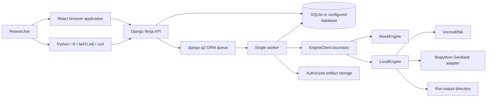
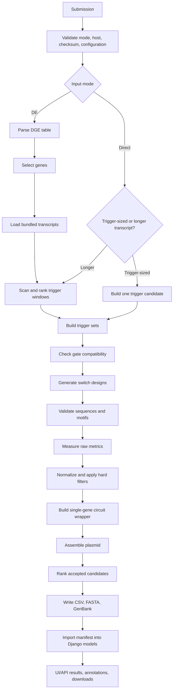
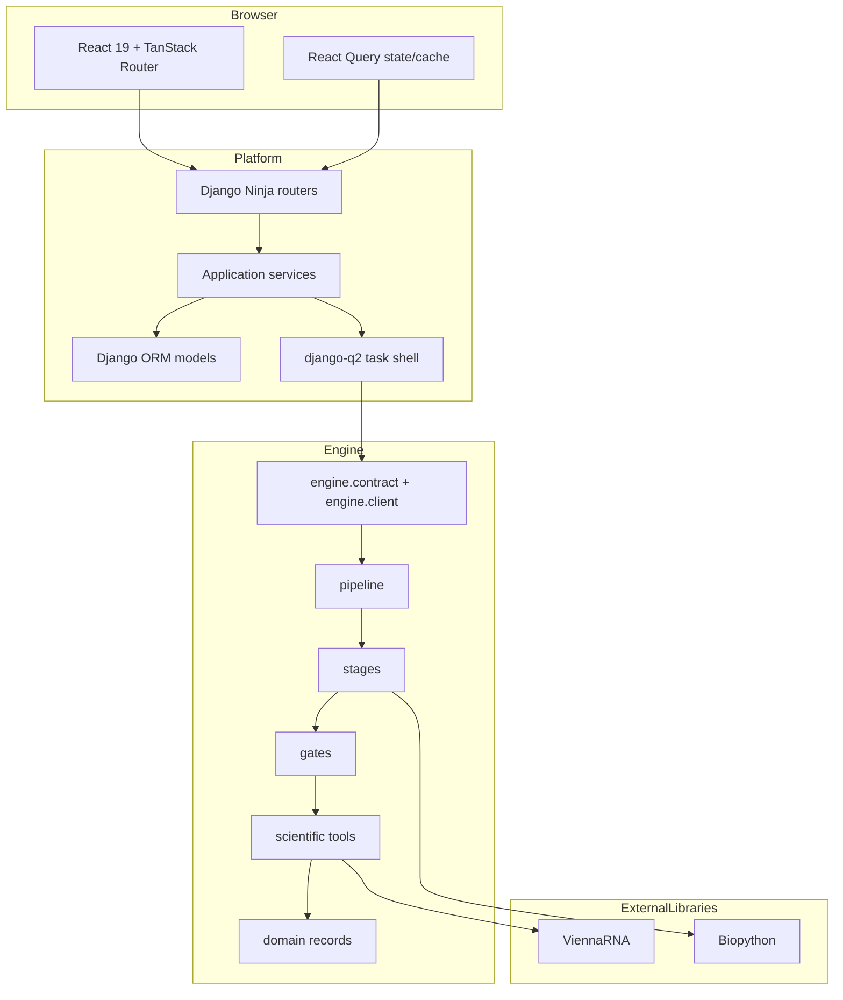

# CERNAL software wiki

> **Implementation status (29 September 2026).** CERNAL is a working web platform with a deterministic mock engine and a partially implemented scientific `LocalEngine`. The direct-sequence path and a scoped differential-expression path for *E. coli* and yeast run through trigger selection, single-input switch generation, scoring, ranking, plasmid assembly, persistence, and downloads. Multi-gene circuit design, two-input AND construction, operational antisense use, CRISPR gates, real off-target matching, generated scientific figures/PDF reports, and wet-lab validation are not complete. This page labels those boundaries rather than presenting planned behavior as current behavior.

## 1. What CERNAL is

CERNAL (Compiler-like Engine for RNA Logic) is a research software platform for turning a transcriptomic signal into inspectable RNA-control designs. A user can start with either:

1. a differential-expression table and ask CERNAL to discover usable transcript windows; or
2. an RNA/DNA sequence and ask CERNAL to treat it as a trigger or scan it for trigger-sized windows.

The software normalizes the input, chooses or constructs trigger candidates, generates compatible RNA gate sequences, predicts selected structural properties, applies explicit filters, ranks candidates under a versioned scoring profile, assembles accepted designs into annotated plasmid records where the required biological parts exist, and exposes every result through a browser UI and an HTTP API.

CERNAL is a **design and decision-support system**, not an experimental proof that a circuit will work. It produces computational candidates and traceable artifacts for review. Current predictions are not calibrated against a completed CERNAL wet-lab validation campaign.

### 1.1 The problem

RNA circuit design combines several decisions that are easy to treat inconsistently when performed in separate scripts:

- which transcript is sufficiently condition-specific;
- which subsequence is accessible and constructible;
- which gate chemistry is compatible with the host and trigger role;
- whether the generated switch contains forbidden motifs or structural problems;
- how unlike measurements such as free energy, leakage proxies, accessibility, and complexity are compared;
- how a selected gate becomes a plasmid sequence and a reproducible result bundle.

CERNAL makes those decisions explicit in one pipeline. It records input checksums, an immutable run configuration, engine and schema versions, raw and normalized metrics, rejected candidates and reasons, and checksummed output files.

### 1.2 What CERNAL does not claim

CERNAL does not currently claim:

- experimentally measured sensitivity, specificity, dynamic range, leakage, or success rate;
- validated biological off-target specificity;
- a finished multi-input Boolean circuit compiler;
- a production deployment that is publicly available;
- that the deterministic scientific engine is artificial intelligence.

## 2. Audience and realistic uses

| Audience | Realistic present use |
|---|---|
| iGEM and synthetic-biology teams | Compare candidate single-input RNA switches, inspect why candidates were rejected, and export sequence/plasmid records for further review. |
| Transcriptomics researchers | Upload DESeq2/edgeR/limma-style tables or select a curated public comparison, then obtain candidate trigger windows for supported hosts. |
| RNA-tool developers | Exercise a stable engine contract, domain model, gate registry, scoring layer, and test suite while extending the scientific stages. |
| Software integrators | Submit jobs and retrieve results from Python, R, MATLAB, or generic HTTP clients using API keys. |
| Judges and reviewers | Trace a displayed result back to code, configuration, source data provenance, metrics, and artifacts without relying on a development chronology. |

Presently defensible scenarios include a direct *E. coli* trigger-to-toehold run, an *E. coli* or yeast differential-expression-to-candidate run, use of a catalog or custom plasmid backbone, and UI/API evaluation under the deterministic mock engine. A human differential-expression run is not supported because no bundled human transcriptome is available; human plasmid defaults are also absent.

## 3. Product at a glance



The default development configuration uses `MockEngine`, which generates deterministic simulated results while exercising the real scoring, lifecycle, persistence, and download paths. Selecting `engine.client.LocalEngine` activates the implemented scientific path. The UI reports which engine is running and labels mock results as simulated.

## 4. Inputs, validation, normalization, and configuration

### 4.1 Input modes

| Mode | User supplies | Implemented behavior | Important limits |
|---|---|---|---|
| Differential expression (`de`) | Uploaded CSV, TSV, TXT, or XLSX; bundled example; curated public comparison; or inline CSV through the public design endpoint | Platform validates and stores the dataset. The engine parses a DGE table, ranks genes, retrieves bundled transcripts, scans trigger windows, and continues through the shared design path. | LocalEngine has bundled transcriptomes for *E. coli* and yeast, not human. It receives a DGE table, not raw counts, so `InputQualityCheck` is not used. |
| Direct trigger/transcript (`direct`) | Pasted RNA or DNA sequence | Whitespace and DNA `T` are normalized; a trigger-sized sequence is evaluated directly, while a longer sequence is scanned for trigger windows. | Maximum pasted length is 10,000 nt. Invalid alphabet, empty input, or unusable length fails safely. |
| Public transcriptomics catalog | Organism → experiment → comparison | A curated, pre-synchronized comparison is materialized into an owned immutable dataset with provider/accession/condition provenance. | Runtime jobs do not call external provider APIs. Catalog refresh is an offline management task. |
| Specific gene UI route | Organism, gene identifier, optional symbol, then a sequence | The choice is recorded as `params.target_gene`; the user is moved to direct mode to paste the sequence. | Gene-to-sequence resolution is informational only and is not implemented. |

Exactly one scientific input source is required. The database constrains a DE run to have a dataset and a direct run to have no dataset. The public `POST /api/design` endpoint extends this rule to exactly one of `trigger_sequence`, `dataset_id`, or inline `dge_csv`.

### 4.2 Dataset validation at the platform boundary

Upload validation is intentionally shallow and synchronous. It establishes whether the file is safe and interpretable enough to queue, without duplicating scientific decisions made in the engine.

Accepted filename types are `.csv`, `.tsv`, `.txt`, and `.xlsx`. Development defaults allow 100 MB per upload. Validation checks include:

- nonempty file and readable table;
- header row;
- a recognized gene identifier column;
- at least one fold-change or expression column;
- numeric parsing of recognized measurement columns;
- a maximum of 200,000 rows;
- duplicate-gene warnings and detailed sampling of the first 5,000 rows.

Common aliases are normalized case-, spacing-, punctuation-, and underscore-insensitively. Examples include:

| Canonical field | Examples recognized |
|---|---|
| `gene_id` | `gene`, `geneid`, `id`, `target_id`, `ensembl_id`, `locus_tag` |
| `gene_symbol` | `symbol`, `gene_name`, `hgnc_symbol` |
| `log2fc` | `log2FoldChange`, `logFC`, `fold_change`, `FC` |
| baseline/target expression | `baseMean`, `control_mean`, `target_mean`, `treatment` |
| significance | `padj`, `FDR`, `qvalue`, `pvalue`, `pval` |

Gene identifiers and display symbols remain separate because symbols are not stable unique identifiers across annotation builds.

Every stored dataset has a SHA-256 checksum, byte size, schema version, validation status, validation report, owner, and immutable file. The engine re-verifies the checksum before reading a DE input.

### 4.3 Engine-side DGE parsing

`engine.inputs.parse_dge_table` is the only raw-table edge inside the framework-free engine. It decodes UTF-8/UTF-8-BOM text, chooses comma or tab separation from the filename, maps recognized columns, converts missing or unparseable optional values to `None`, and drops only rows with no usable identifier or no fold-change value. Downstream stages receive frozen typed records rather than paths, pandas data frames, or dictionaries of strings.

The engine parser currently handles CSV/TSV text. XLSX is accepted and previewed by the platform, but LocalEngine's DGE parser reads text; this is a boundary that requires care before describing XLSX as a fully supported LocalEngine input.

### 4.4 Organisms and host normalization

The product UI exposes *E. coli*, yeast, and human. The host determines:

- prokaryotic versus eukaryotic translation context;
- gate-family compatibility;
- promoter and terminator availability;
- transcriptome availability;
- codon/translation tool configuration;
- permitted default plasmid assembly.

Current LocalEngine scope:

| Host | Direct mode | DE mode | Built-in promoter/terminator | Notes |
|---|---:|---:|---:|---|
| *E. coli* | Yes | Yes | Yes | Bundled transcriptome and BioBrick-oriented defaults. |
| Yeast | Yes | Yes | Yes | Bundled transcriptome; no bundled default backbone, so choose none or upload GenBank. |
| Human | Structurally possible for compatible direct gates | No | No | No bundled transcriptome or mammalian assembly defaults. |

### 4.5 Run configuration

A run freezes the following configuration:

- input mode, dataset reference/checksum or normalized trigger sequence;
- organism;
- gate-family list;
- named scoring profile and optional per-run overrides;
- constraints;
- desired payload outputs;
- optional catalog or custom GenBank backbone;
- seed;
- idempotency key;
- free-form notes and selected informational target gene;
- mock-engine options when the mock is used.

Implemented constraint fields include maximum triggers, minimum/maximum separation, adjusted-p threshold, trigger lengths, maximum switch length, forbidden motifs, assembly standard, maximum genes, baseline-expression bounds, trigger GC range, and direction balancing. Strict public-API mode rejects unknown constraint, scoring, payload, budget, and backbone keys with a structured `422` response.

`budget` and dry-run estimates exist at the API layer. Estimates are deliberately described as rough; budget enforcement is not implemented in the scientific pipeline.

## 5. End-to-end pipeline



### 5.1 Stage 0 — request and tool construction

`LocalEngine.run` calls `run_pipeline` through the stable `EngineClient` protocol. The pipeline resolves the host and scoring profile, builds constraints, and constructs each shared tool once per run:

- `FoldEngine` for ViennaRNA MFE, partition functions, and base-pair probabilities;
- `FoldProfiler` for gate-aware RNAplfold-style opening evidence;
- `MotifScreener` for restriction sites, extra motifs, and homopolymers;
- `OffTargetScanner`;
- `CodonOptimizer` and `TranslationScorer`;
- `PlasmidBuilder`;
- instantiated gate families.

One shared folding instance avoids inconsistent temperature/configuration and preserves its cache. Current runs intentionally construct `OffTargetScanner` with an empty transcriptome because populated-index matching is not implemented; a run warning states that off-target and segment-specificity values are placeholders rather than evidence.

### 5.2 Differential-expression gene selection

For DE mode, `GeneSelector` performs implemented deterministic selection:

1. deduplicate rows by gene identifier;
2. determine significance from adjusted p-values, or apply Benjamini–Hochberg correction when only raw p-values are available;
3. classify regulation direction from fold change;
4. apply separation and optional abundance constraints;
5. remove genes without available transcript sequences;
6. estimate trigger yield by scanning constructible windows and excluding forbidden start codons/motifs;
7. combine separation, abundance, condition-specificity, and trigger-yield evidence when available;
8. reduce redundant expression vectors when count data exists;
9. optionally balance up- and down-regulated selections;
10. return at most the configured number of frozen `SelectedGene` records.

In the current product, no count matrix is collected, so count-dependent quality control and expression-vector redundancy information are normally absent. Missing evidence is kept missing rather than replaced with a favorable number.

### 5.3 Trigger selection and accessibility

`TriggerScorer` scans each selected transcript in the configured length classes, currently centered on 30, 33, and 36 nt. It:

- profiles transcript opening once;
- rejects prohibited motifs and incompatible windows;
- records RNAplfold provenance and selected nucleation-seed evidence;
- computes trigger MFE, GC content, AUG/stop positions, accessibility/openness, and the current off-target placeholder;
- ranks deterministically within length buckets;
- allocates candidates across requested lengths so one bucket does not consume the complete quota.

The gate-aware path stores hypothesis-window and seed coordinates, 20-nt joint opening probability, mean marginal openness, opening-energy proxy, seed probability, and RNAplfold parameters/version. The implemented ranking is computational and provisional; it is not experimentally calibrated as a universal “best trigger” model.

A direct sequence that already fits a trigger footprint takes a fast path and receives structural/accessibility measurements. A longer direct sequence reuses the same scanner used by DE mode rather than truncating the input.

### 5.4 Trigger sets and gate compatibility

`SwitchDesigner` turns triggers into activator/repressor sets and asks each gate family whether it is compatible. Compatibility checks are cheap and explain failures; sequence generation and validation happen only after compatibility passes. Rejection summaries distinguish incompatible trigger sets from invalid generated designs.

The current production pipeline is effectively single-input. `CircuitDesigner`, `ConfusionEvaluator`, and multi-gene Boolean enumeration remain unimplemented. The pipeline wraps each accepted gate in a one-gene `CircuitCandidate` so plasmid construction and the product UI can operate without pretending that a real multi-gene circuit was synthesized.

### 5.5 Toehold generation

`ToeholdGate` is the active pipeline chemistry. It supports *E. coli*, yeast, and human through generic and host-specific registered names. For each trigger, it sweeps toehold lengths of 12, 15, and 18 nt where the trigger footprint permits.

Construction uses:

- a leader sequence;
- a reverse-complement trigger-binding toehold;
- a designed stem around the translation-initiation region;
- a bulge and loop;
- an *E. coli* ribosome-binding site or eukaryotic Kozak context;
- an AUG start codon;
- a fixed linker.

The design records boundaries and parameters in `architecture`, allowing later code and users to relocate the toehold, stem, loop, and start codon without re-deriving them. Generated sequences are RNA, deterministic, and checked against maximum switch length.

Raw toehold measurements currently include gate folding energy, predicted leakage proxy, dynamic-range proxy, trigger accessibility carried from trigger selection, and GC content. They are derived from ViennaRNA MFE/base-pair probabilities and deterministic formulas. Some planned translation/codon and ensemble-defect measurements remain unavailable.

### 5.6 Other registered gate families

| Family | Registry/API state | Pipeline state |
|---|---|---|
| `toehold`, `prokaryotic_toehold`, `eukaryotic_toehold` | Available | Implemented single-input path. |
| `toehold_and` and host-specific AND variants | Inherit an available flag and are advertised | Explicitly skipped because two-input sequence construction/evaluation is not implemented. |
| `antisense` | Family implementation and family tests exist; advertised available | Explicitly skipped because normal pipeline construction lacks the required payload-aware wiring/library. It must not be presented as an operational UI path. |
| `crispr` | Registered with `available=false` | Planned; generation/evaluation stubs remain. |

The antisense family is scientifically distinct: it is ON without trigger and predicts residual expression when a repressor trigger is bound. It sweeps UTR-arm length, spacer length, and trigger offset; evaluates initiation-region ensemble accessibility, switch–trigger hybridization energy, and a success proxy. This code is useful implemented groundwork, but the pipeline guard prevents it from being marketed as a completed product feature.

### 5.7 Validation

`SwitchValidator` collects violations rather than silently discarding a design. Implemented checks include sequence validity, length, AUG/stop behavior, forbidden motifs/restriction sites/homopolymers, and selected gate-specific structural rules. Some intended structure-ensemble and translation-placement checks depend on still-unimplemented tool methods and are therefore not complete.

`MotifScreener` supports linear and circular screening. Circular screening pads across the origin so a restriction site created at the plasmid join is not missed.

### 5.8 Scoring, filtering, and ranking

Gate families return **raw measurements only**. The scoring layer owns normalization, weighting, hard filters, and ranking.

The default versioned profile is `default-v1`:

| Metric | Better direction | Weight | Declared range | Current evidence caveat |
|---|---:|---:|---:|---|
| `state_separation` | Higher | 3.0 | 0–10 log2 fold | Missing on the present single-trigger gate path. |
| `trigger_accessibility` | Higher | 2.0 | 0–1 | Computed from structural profiling. |
| `gate_folding_energy` | Lower | 2.0 | −60–0 kcal/mol | ViennaRNA-derived. |
| `predicted_leakage` | Lower | 2.5 | 0–1 | Deterministic structural proxy, not measured leakage. |
| `orthogonality` | Higher | 1.5 | 0–1 | Not presently measured. |
| `gc_content` | Higher | 0.5 | 30–70 percent | Sequence-derived. |
| `dynamic_range` | Higher | 2.0 | 1–500 linear fold | Structural proxy, not calibrated expression fold-change. |
| `predicted_success_rate` | Higher | 1.0 | 0–1 | Available for antisense family evaluation, not the active toehold path. |
| `circuit_complexity` | Lower | 1.0 | 1–10 components | Missing until real circuit design is implemented. |

Normalization is min–max with clamping, inverted for lower-is-better metrics so `1.0` is always best. Missing metrics follow their profile rule; in the default profile they contribute the worst normalized value rather than being invented. The weighted mean is on 0–1.

Default hard filters reject:

- `predicted_leakage > 0.85`;
- `state_separation < 0.5` when that measurement exists.

A missing value does not automatically fail a hard filter. Rejected candidates remain in the result manifest and database, carry a reason, have no rank, and can be requested in the UI/API. Accepted candidates receive contiguous one-based ranks. Custom API scoring can change weights, add/replace per-metric hard filters, and replace tie-breakers; metric directions and valid ranges cannot be changed.

### 5.9 Plasmid construction

For every generated design, the current pipeline builds a one-gene circuit wrapper and asks `PlasmidBuilder` to assemble:

1. host promoter;
2. switch/gate sequence;
3. payload CDS;
4. host terminator;
5. optional opaque backbone segment.

Current built-in parts include *E. coli* J23119/B0015, yeast GPD/ADH1 regulatory parts, GFPmut3b as the only built-in payload, and a catalog of real iGEM BioBrick vectors. The UI can choose no backbone, a catalog vector, or upload a custom GenBank record. Custom payload sequence is supported through the `other` output and is validated as a complete CDS. Other named UI outputs are skipped if no payload sequence exists; the warning is preserved.

`PlasmidBuilder` checks payload start/stop/frame properties, motif/restriction compliance, circular-origin joins, and segment/frame relationships. Assembly uses CERNAL domain records; Biopython is confined to custom-GenBank parsing and GenBank export. Codon optimization is not implemented, so payloads are emitted verbatim.

### 5.10 Artifacts and platform import

The engine writes files through one artifact helper that records SHA-256. LocalEngine currently writes:

- `candidates.csv`, including accepted and rejected candidates;
- one switch FASTA per accepted candidate;
- one annotated circular GenBank file per accepted candidate.

The engine returns an immutable `JobResult` manifest containing schema/engine versions, status, candidates, artifact references, warnings, input checksum, and parameters. Platform import verifies manifest identity/checksums, creates candidates and metric rows transactionally, copies artifacts to protected media storage, and exposes files only through ownership-checked download endpoints.

## 6. System architecture

### 6.1 Boundaries



The architectural rule is machine-checked:

- `src/engine/` never imports Django, API, or application modules;
- platform code imports only `engine.contract` and `engine.client`, not engine internals;
- cross-boundary values are frozen dataclasses;
- engine selection is a dotted `CERNAL_ENGINE` setting.

This keeps the present in-process design reversible: a future remote engine can implement the same client/contract without rewriting the web product.

### 6.2 Web/backend runtime

The backend is Django 5.2 with Django Ninja, one database, and a django-q2 ORM-backed queue. Default SQLite settings use WAL, foreign keys, a busy timeout, and a single worker. A queued task is a thin call into the analysis service; lifecycle transitions, progress, cancellation, manifest verification, and result import remain in services rather than the task wrapper.

Run states are `DRAFT`, `QUEUED`, `RUNNING`, `COMPLETED`, `FAILED`, and `CANCELLED`. Legal transitions are explicit. Cancellation is cooperative: the worker callback checks `cancel_requested` at stage and batch boundaries. Expected scientific errors become safe terminal results; unexpected programming errors are logged without exposing tracebacks or filesystem paths to users.

### 6.3 Persistence model

| Model | Purpose |
|---|---|
| `User` | Django account; new self-registrations are inactive until staff approval. |
| `ApiKey` | Hashed long-lived non-browser credential with scopes, quotas, expiry, revocation, and last-used time. |
| `Dataset` | Immutable owned input, checksum, validation report, and optional public-source provenance. |
| `AnalysisRun` | Immutable submission snapshot plus controlled lifecycle, progress, engine version, warnings, and safe errors. |
| `Candidate` | Accepted or rejected design, engine reference, rank/score, trigger/design JSON, warnings, and rejection reason. |
| `CandidateMetric` | Queryable raw/normalized metric, weight, and direction. |
| `Artifact` | Protected file, kind/category/label, checksum, size, and optional candidate link. |
| `Annotation` | User decision/note: none, pinned, shortlisted, rejected, or synthesize. |

Ownership is enforced by query construction. Non-staff users see only their resources; unauthorized object access is returned as not found to avoid revealing existence.

## 7. Codebase and module map

| Area | Principal paths | Responsibility |
|---|---|---|
| Settings and routing | `src/config/` | Environment settings, URL order, WSGI/ASGI, static/media configuration. |
| API | `src/api/` | Auth, schemas, capability/version endpoint, runs, design endpoint, datasets, results, public catalog, error envelopes. |
| Accounts | `src/apps/accounts/` | Registration/approval and API-key lifecycle. |
| Datasets | `src/apps/datasets/` | Upload storage, validation, previews, bundled example. |
| Public expression data | `src/apps/expression/` | Offline provider adapters, normalized catalog, provenance, materialization. |
| Analysis lifecycle | `src/apps/analyses/` | Run model, submission, queueing, progress, cancellation, worker execution. |
| Results | `src/apps/results/` | Manifest import, candidate/metric/artifact persistence, annotations, CSV export. |
| Engine boundary | `src/engine/contract.py`, `src/engine/client.py` | Versioned request/result dataclasses and mock/local client implementations. |
| Engine orchestration | `src/engine/pipeline.py` | Tool construction and current direct/DE execution path. |
| Domain model | `src/engine/domain.py` | Frozen records/enums for hosts, genes, triggers, gates, circuits, plasmids, folding, validation. |
| Scientific stages | `src/engine/stages/` | Genes, trigger structure, motifs, off-targets, switches, circuits, plasmids, reporting. |
| Gate chemistries | `src/engine/gates/` | Registry, base contract, toehold, antisense, CRISPR, gate-specific tools/notebooks. |
| Scoring | `src/engine/scoring/` | Profiles, normalization, hard filters, weighted scores, ranking. |
| Frontend | `frontend/src/` | Routes, compile wizard, results UI, docs, settings, API client, state/query hooks. |
| Automation clients | `clients/` | Python, R, MATLAB clients and cross-client fixtures/tests. |
| Tests/tools | `tests/`, `tools/` | Unit/integration/E2E tests, architecture rules, API-surface generator, transcriptome sync. |

### 7.1 Core engine records

The engine uses immutable `dataclass(frozen=True, slots=True)` records. Major records include:

- `DgeRow`, `DgeTable`, `CountMatrix`, `SampleMetadata`;
- `SelectedGene`, `TriggerCandidate`, `SeedOpeningTrial`, `TriggerSet`;
- `Constraints`, `Compatibility`, `ValidationResult`, `Rejection`;
- `GateDesign`, `BooleanExpression`, `LogicGraph`, `CircuitCandidate`;
- `Segment`, `Plasmid`, `PlasmidDesign`;
- `FoldResult`, `StructureMatch`, `OffTargetReport`, `QcReport`;
- contract-level `JobRequest`, `CandidateResult`, `ArtifactRef`, and `JobResult`.

Coordinates are zero-based with an inclusive start and exclusive end. RNA is uppercase `ACGU`; DNA is normalized explicitly. Free energies are kcal/mol, GC is percent 0–100, most accessibilities are fractions 0–1, state separation is log2 fold, and dynamic range is linear fold.

## 8. Browser product and user experience

### 8.1 Route tree and navigation

| Route | Function |
|---|---|
| `/` | Redirects to dashboard. |
| `/login` | Session login, including pending-approval state and generic invalid-credential error. |
| `/register` | Requests an account; shows the staff-approval boundary. |
| `/dashboard` | Recent runs and empty-state entry into a new circuit. |
| `/compile` | Four-step compiler wizard. |
| `/runs/:runId` | Live progress/cancellation, then candidate exploration and downloads. |
| `/settings` | API-key creation, one-time secret reveal, regeneration, revocation, scope and expiry display. |
| `/guide` | Product quick guide. |
| `/api-docs` | Human-readable API/client/scoring reference. |
| `/use-cases` | Example use cases; current text includes placeholders and must not be cited as implemented evidence. |
| `/about` | Engine capabilities and project description. |

The authenticated shell provides links to New Circuit, Dashboard, Quick Guide, Use Cases, API Reference, About Us, and Settings. It displays the app/engine state in the footer and explicitly identifies MockEngine results as simulated.

### 8.2 Compile wizard

The compiler has four visible steps:

1. **Inputs** — choose organism; select DE upload/existing dataset/public dataset, direct trigger, or specific gene; inspect validation and expression previews.
2. **Logic** — configure desired marker logic and choose a gate mechanism from live engine capabilities; unavailable mechanisms are disabled.
3. **Payload** — choose one or more downstream outputs or provide a custom CDS.
4. **Vector** — choose no backbone, a capability-advertised catalog vector, or upload a custom `.gb` GenBank file.

The route derives a blocking explanation before submission. It prevents invalid combinations such as no dataset in DE mode, an underspecified direct sequence, unavailable gate mechanism, no output, missing custom CDS, or too-short custom GenBank content. Submission includes an idempotency key so a retry does not create duplicate computation.

The public dataset picker follows organism → experiment → comparison and shows provider, conditions, gene counts, significance coverage, retrieval time, analysis method, DOI when present, and source provenance before materialization. Dataset preview ranks rows by absolute log2 fold-change and caps browser rendering.

### 8.3 Run monitoring and error states

The run page polls every three seconds until a terminal state. While active it shows stage, percentage, progress, and a cooperative cancel action. Failure and cancellation have distinct states with safe messages and a route back to the dashboard. Root-level 404 and unexpected-page errors have reload/home recovery paths.

### 8.4 Result exploration

Completed runs provide:

- ranked candidate list;
- output filter for multi-output runs;
- precision filters and rejected-candidate visibility;
- candidate selection and detailed metric decomposition;
- plasmid-ring and logic-circuit views;
- trigger and design sequence/structure details;
- accepted/rejected status and rejection reasons;
- artifact downloads by file, category, selected IDs, or whole-run ZIP;
- flat candidate/metric CSV export;
- candidate annotations and decision tags.

The plasmid ring is proportional to segment lengths in the stored design. The logic view tolerates variable gene counts, including an empty graph, and has a server-render regression test. Current LocalEngine logic graphs are single-gene wrappers, not completed multi-gene Boolean designs.

### 8.5 State and API handling

The frontend is a static React 19 SPA using TanStack Router and React Query. Query keys separate session, capabilities, datasets, public catalog levels, runs, candidates, artifacts, annotations, and API keys. Run polling stops automatically at terminal status. Session writes include CSRF; API errors are normalized into a typed `ApiError` carrying status, code, message, and detail.

### 8.6 Accessibility and responsiveness

Implemented accessibility practices include semantic headings/forms, labels, required fields, `role="alert"`/`role="status"`, descriptive button labels, keyboard-capable Radix UI primitives, text alternatives for logos, and disabled states. The layout uses responsive utility classes and hides the full desktop navigation on small screens.

This is not equivalent to a completed WCAG audit. No repository evidence demonstrates formal screen-reader, contrast, keyboard-only, or mobile-device certification.

## 9. API and automation

### 9.1 Authentication

The same-origin browser uses Django session cookies and CSRF protection. Non-browser clients use `X-API-Key`.

API keys:

- start with a recognizable `cern_live_` prefix;
- are shown only when created or regenerated;
- are stored only as SHA-256 digests with a short lookup/display prefix;
- can expire, be revoked, or be regenerated;
- carry `read` and/or `design` scopes (`design` implies `read`);
- default to two concurrent runs and 60 requests per minute;
- cannot create, list, regenerate, or revoke API keys themselves;
- cannot delete datasets, even with design scope.

Rate counters use Django's database cache so they are shared across web workers. Session users are exempt from API-key quotas.

### 9.2 Main HTTP surface

| Area | Endpoints |
|---|---|
| Meta | `GET /api/health`, `GET /api/version`, `GET /api/openapi.json`, interactive `/api/docs` |
| Session/auth | `GET /api/auth/csrf`, `POST /api/auth/register`, `POST /api/auth/login`, `POST /api/auth/logout`, `GET /api/auth/me` |
| API keys | list/create/revoke/regenerate under `/api/auth/keys`; `GET /api/auth/whoami` for key verification |
| Datasets | list/upload/get/preview/delete; bundled example listing/materialization |
| Public catalog | organisms, experiments, comparisons, comparison detail, materialization |
| Runs | list, submit, status, detail, cancel |
| Fast design API | `POST /api/design`, `GET /api/design/{id}`, `GET /api/design/{id}/results` |
| Results | paginated/filterable candidates, candidate detail, artifacts, protected download, ZIP, CSV export |
| Decisions | list/create candidate annotations; delete annotation |

All API errors use one envelope with code, message, and structured detail. The public design API supports asynchronous `202`, optional server-side wait up to 300 seconds, dry-run estimate without persistence, strict typo detection, custom scoring, selected artifact kinds, top-N results, and idempotency.

### 9.3 Versioning and provenance

`GET /api/version` advertises app version, selected engine class/version, engine schema version, registered gate families and availability, scoring profiles, metric vocabulary/units, hard filters, and available backbones. The engine contract has a schema version. Scoring profiles and gate families have their own versions. Each run stores engine version, scoring configuration, seed, parameters, warnings, and input checksum.

`docs/api-surface.md` is generated from the actual Python engine surface. A freshness test regenerates it and fails if the committed document differs.

### 9.4 Client libraries

| Client | Implemented surface | Validation status |
|---|---|---|
| Python | `Client.design/status/results/artifact/capabilities`; `Job.wait/best/to_dicts/to_dataframe/artifact`; typed exceptions | Conformance tests run against a live Django test server. |
| R | `cernal_client`, design/wait/results/artifact/capabilities; typed S3 errors; tibble output | Code and conformance tests exist; README states it was not independently verified because an R interpreter was unavailable at authorship time. |
| MATLAB | `cernal.Client` and `cernal.Job`, request/error translation, table conversion and tests | Code/tests exist; runtime verification depends on a MATLAB environment. |
| curl/generic HTTP | Complete REST surface documented by OpenAPI | Works with `X-API-Key`; users must manage polling and downloads. |

Cross-client fixtures define a common design request and expected result columns. A downloadable Jupyter quickstart demonstrates capabilities, submission, waiting, custom scoring, dry-run sweeps, plotting, and artifact download; it contains placeholders for deployment URL/key and is not an executed benchmark.

## 10. Outputs and reproducibility

### 10.1 Candidate records

A candidate contains:

- engine reference and database UUID;
- rank and 0–1 overall score when accepted;
- gate family, logic type, and selected output;
- trigger features and structural provenance;
- switch sequence, structure, toehold length, trigger offset;
- plasmid segments and total length;
- logic graph representation;
- full metric decomposition;
- warnings;
- rejection flag and reason.

Rejected candidates are first-class output. Database constraints require a rejection reason and prohibit a rejected candidate from having a rank.

### 10.2 Files

| File/artifact | Contents |
|---|---|
| Candidate export CSV | Candidate identity, rank, family, logic, score, rejection status/reason; platform CSV expands metric columns. |
| FASTA | Accepted switch sequence with candidate metadata. |
| GenBank | Annotated circular plasmid record for each accepted candidate. |
| ZIP | Server-generated archive of all, one category, or selected artifacts. |
| Mock artifacts | Deterministic files used to exercise product paths; not scientific evidence. |
| Planned report/figures | Artifact kinds and stubs exist, but LocalEngine does not yet produce PDF reports or structure/logic image artifacts. |

Every engine artifact has a kind, relative path, media type, SHA-256 checksum, and optional candidate reference. The platform records byte size, protects downloads with ownership checks, sanitizes storage paths, and uses `X-Content-Type-Options: nosniff`.

### 10.3 Determinism

The mock engine seeds generation from idempotency key and optional seed. The real engine avoids mutable global scientific state, uses stable identifiers/orderings, and records configuration. Reproducibility still depends on the exact engine version, ViennaRNA/Biopython versions, bundled transcriptome/catalog revisions, and selected/custom biological parts. A seed cannot compensate for changed scientific code or reference data.

## 11. AI, machine learning, and scientific-model boundary

### 11.1 Runtime AI/ML

There is **no runtime generative AI, large language model, neural network, trained classifier, or remote inference service** in the implemented application. The Python and JavaScript dependency manifests contain no AI inference SDK. Runs do not send biological data to an AI provider.

### 11.2 What is deterministic computation

The following are deterministic software algorithms, not AI:

- column normalization and validation;
- Benjamini–Hochberg adjustment and rule-based gene filtering;
- sliding-window trigger enumeration;
- motif/restriction/homopolymer screening;
- gate sequence templates and reverse complements;
- min–max normalization, weighted means, hard filters, and ranking;
- plasmid concatenation and GenBank serialization;
- lifecycle, quotas, authentication, persistence, and UI filtering.

### 11.3 What is a scientific model/tool

ViennaRNA secondary-structure thermodynamics, partition functions, MFE structures, and base-pair probabilities are scientific computational models. Structural leakage/dynamic-range/success quantities built from them are **proxies**. They should be described as predictions or heuristics, not as measured biology and not as AI.

The mock engine is deterministic simulated output. It is a testing fixture, not a scientific model.

### 11.4 AI-assisted development/documentation

The repository records AI-assisted design/development provenance in `docs/attribution.md` and preserves the Lovable-origin frontend design reference. AI assistance in coding, drafting, or documentation does not make AI part of the runtime system. The final iGEM attribution must state the tools used, the human review performed, and which retained work was AI-assisted.

## 12. Installation, operation, and deployment

### 12.1 Requirements

- Python 3.13 (the project excludes 3.14);
- `uv` for locked Python environments;
- Node.js 22+ for frontend build/development;
- ViennaRNA and Biopython installed through the Python environment;
- a worker process in addition to the web process.

### 12.2 Local operation

```bash
./do install
./do migrate
./do superuser
./do build-frontend
./do dev
```

In another terminal:

```bash
./do worker
```

Without the worker, submissions remain queued. The production frontend is built into Django static assets; production does not require a Node server.

To run the scientific path, set:

```bash
CERNAL_ENGINE=engine.client.LocalEngine
```

The safe development default is `engine.client.MockEngine`. Production requires an explicit secret key and allowed hosts; optional settings include trusted CSRF origins, database URL, media root, upload limit, and log level. Secrets must not be committed.

### 12.3 Deployment status

The repository currently tracks only `deploy/.gitkeep`; no Dockerfile, systemd unit, Nginx/Caddy configuration, or deployment automation is implemented under `deploy/`. `docs/deployment.md` describes a proposed VPS/cloud separation and runbook, not verified deployed infrastructure. Production Django settings include TLS/security assumptions, but operators must provide and test the actual reverse proxy, services, backups, monitoring, static collection, worker supervision, and upgrade process.

SQLite plus one ORM-queue worker is the accepted v1 architecture. PostgreSQL and another broker are possible configuration changes, but multi-machine worker scaling and independent engine scaling are not implemented.

## 13. Testing and validation evidence

### 13.1 Test map

| Suite | What it validates |
|---|---|
| `tests/engine/` | Domain records, contract, inputs, gene/trigger selection, RNA tools, toehold/antisense families, switches, plasmids, scoring, pipeline, store, transcriptomes, and house rules. |
| `tests/api/` | Authentication, registration, API keys/scopes/quotas, datasets, public datasets, input modes, runs, fast design API, results, artifacts, CSV/ZIP, annotations. |
| Top-level backend tests | Models, lifecycle/cancellation, result import, expression providers/services, admin, seed demo, architecture boundary, scaffold, API-surface freshness. |
| `tests/e2e/test_full_workflow.py` | Researcher workflow and failed-run presentation through backend/API layers. |
| `frontend/e2e/render-logic.mjs` | Server-renders logic diagrams for varying activator/repressor counts and empty graphs. |
| `frontend/e2e/smoke.mjs` | Browser workflow against a live server/worker; parts of this script still reference obsolete project routes and require maintenance before being treated as current evidence. |
| Python client conformance | Live-server submission, capabilities, auth errors, typo suggestions. |
| R/MATLAB client tests | Source-level conformance suites requiring their respective runtimes. |
| `tests/test_api_surface_is_fresh.py` | Generated API-surface document matches the engine. |
| `tests/test_boundary.py` | Engine/platform import boundary. |
| `tests/engine/test_house_rules.py` | Shared tools, metric vocabulary, raw-value rules, forbidden imports, and construction discipline. |

### 13.2 What tests demonstrate

The tests substantiate software behavior: deterministic transformations, validation, lifecycle transitions, authorization, API response shapes, checksum/import behavior, mathematical normalization, and selected scientific computations against fixtures/golden cases.

They do **not** demonstrate:

- wet-lab function of generated constructs;
- predictive accuracy across organisms or conditions;
- validated off-target specificity;
- clinical safety or fitness for diagnostic/therapeutic use;
- production reliability of an undeployed public service.

Repository test counts and historical README numbers can become stale; the relevant claim is the result of the exact verification commands run against the published revision.

### 13.3 Verification snapshot for this wiki revision

On 29 September 2026, the branch revision documented by this page was checked with the repository's locked Python environment and Node.js 22.23.3:

- `pytest -q`: **1,148 tests passed** in 61.54 seconds;
- `ruff check .`: passed;
- `ruff format --check .`: 206 files already formatted;
- Django `manage.py check`: passed after the frontend production assets were generated;
- Vite production build: 2,533 modules transformed and the static application bundle generated;
- frontend `npm run check`: TypeScript, ESLint, and all seven logic-diagram render cases passed;
- wiki validation: clean Git whitespace diff, balanced code fences, required sections present, and all 67 relative Markdown links resolved.

These checks verify the software and documentation behavior represented in the repository. They do not substitute for biological experiments, production-service monitoring, or independent accessibility/security assessment.

## 14. Security, safety, and responsible use

### 14.1 Security controls

Implemented controls include:

- same-origin session cookies with CSRF protection;
- HttpOnly Django session design rather than browser-stored JWTs;
- API-key hashing, expiry, revocation, scopes, concurrency ceilings, and rate limits;
- inactive-by-default self-registration with staff approval;
- owner-scoped queries and protected artifact downloads;
- safe error envelopes without tracebacks/paths;
- upload size/row limits and sanitized artifact paths;
- production secure cookies, HTTPS redirect, HSTS, frame denial, MIME sniffing protection, and same-origin referrer policy;
- no automatic retry of expensive worker jobs.

Remaining operational security work includes threat modeling and review of a real deployment, dependency scanning/update policy, backup/restore drills, log/privacy policy, incident contact, and independent penetration testing.

### 14.2 Biological safety

CERNAL generates nucleotide sequences and therefore must be used under institutional and competition biosafety processes. Computational motif/restriction checks are not a hazard screen. The code has no validated pathogen/toxin database, sequence-order risk classifier, or biological containment assessment.

Users must independently review:

- host, payload, vector, selectable marker, promoter, and terminator;
- unintended open reading frames and regulatory elements;
- organism-specific off-targets;
- assembly standard and laboratory protocol;
- local biosafety, synthesis-provider, and legal requirements.

The `SYNTHESIZE` annotation is a user decision label, not automated safety approval.

### 14.3 Scientific limitations

- Real off-target matching is stubbed; current specificity fields are placeholders with warnings.
- The active pipeline designs single-input/single-gene candidates, not general Boolean circuits.
- AND toehold generation and CRISPR gates are not implemented.
- Antisense is implemented at family level but not operationally wired into normal runs.
- Human DE and default human plasmid assembly are unsupported.
- Only GFP is a built-in payload; other outputs require a custom validated CDS.
- No codon optimization is performed.
- Several scoring metrics are missing on current candidates and therefore depress scores under the default missing-value rule.
- Scoring ranges, weights, filters, and structural proxies are provisional.
- No current candidate set has CERNAL-specific wet-lab validation.

## 15. Licensing, attribution, citation, and reuse

CERNAL source is licensed under Apache License 2.0. Redistributors must preserve the license and NOTICE obligations. `CITATION.cff` provides the software citation but still contains a team task to replace collective authorship and add the final repository-code URL.

Third-party components have their own licenses. Of particular importance, ViennaRNA is installed by the user and is not under an OSI-approved license; a distributed CERNAL bundle must not be described as wholly open source without that qualification. Biopython, Django, Django Ninja, React, TanStack, Radix, and other dependencies must be attributed according to `docs/attribution.md` and their licenses.

The frontend originates from a Lovable design export that was substantially adapted into a static SPA; the preserved design reference and ADR document that provenance. Public expression datasets retain provider/accession/condition/retrieval/publication fields where available.

Teams reusing CERNAL should preserve the engine/platform boundary, version scientific profiles and gate rules when behavior changes, keep raw measurements, record missing evidence as missing, and add tests before enabling a family in capabilities.

## 16. Implemented, optional, and planned summary

| Capability | Current | Configuration-dependent | Planned/incomplete |
|---|---|---|---|
| Browser accounts, runs, results, downloads | Implemented | Staff approval, worker running | — |
| Mock engine | Implemented and default | Candidate count/delay/failure test options | — |
| Local direct path | Implemented for compatible hosts/families | `CERNAL_ENGINE=LocalEngine`, valid parts/output | Broader gate support/calibration |
| Local DE path | Implemented for *E. coli*/yeast | Bundled transcriptome and accepted table | Human transcriptome/count-based QC |
| Toehold single-input | Implemented | Host-specific variants | Experimental calibration |
| Toehold AND | Registry-visible | — | Generation and evaluation |
| Antisense NOT | Family implementation/tests | Not constructible through normal pipeline | Payload-aware pipeline integration |
| CRISPR | Registered unavailable | — | Scientific implementation and genomic off-target model |
| Plasmid assembly | Implemented for available parts | No/catalog/custom backbone; GFP/custom payload | Additional validated host parts/payloads/protocols |
| API and keys | Implemented | Session or key scope/quota | Delegated auth/webhooks if ever required |
| Python client | Implemented/tested | Deployment URL/key | Packaging/release operations |
| R/MATLAB clients | Implemented source/tests | Runtime environments/live server | Independent runtime verification |
| Deployment | Development operation documented | Operator-provided infrastructure | Committed deployment artifacts and public service |
| Wet-lab validation | None in repository | — | Experimental campaign and model recalibration |

## 17. Future work

Priority technical work follows directly from present boundaries:

1. implement and validate populated off-target search with reference-build provenance;
2. complete `CircuitDesigner`/`ConfusionEvaluator` and multi-gene logic;
3. implement two-input toehold generation and intermediate-state evaluation;
4. wire payload-aware antisense into the normal pipeline and keep its inverted safety semantics visible;
5. decide and implement any CRISPR mechanism with a genomic, not transcriptomic, off-target model;
6. calibrate scoring metrics/thresholds against experimental measurements;
7. expand verified host parts, payloads, transcriptomes, and assembly protocols;
8. implement report/figure generation and per-stage snapshots;
9. execute R/MATLAB conformance in CI and update the stale live browser smoke flow;
10. add real deployment artifacts, operations documentation, monitoring, and public-service status only after deployment exists.

## 18. Source and provenance appendix

This appendix maps the main claims above to repository evidence. Source code and tests are authoritative when prose documents describe older states.

| Subject | Authoritative paths |
|---|---|
| Repository rules and current scope | [`../CLAUDE.md`](../CLAUDE.md), [`../README.md`](../README.md), [`ROADMAP.md`](ROADMAP.md) |
| Project metadata/dependencies/config | [`../pyproject.toml`](../pyproject.toml), [`../.env.example`](../.env.example) |
| Architecture and decisions | [`architecture.md`](architecture.md), [`decisions/0001-single-repo-in-process-engine.md`](decisions/0001-single-repo-in-process-engine.md), [`decisions/0002-sqlite-and-orm-task-queue.md`](decisions/0002-sqlite-and-orm-task-queue.md), [`decisions/0003-same-origin-spa-session-auth.md`](decisions/0003-same-origin-spa-session-auth.md), [`decisions/0004-django-ninja-over-drf.md`](decisions/0004-django-ninja-over-drf.md) |
| Engine contract/clients | [`../src/engine/contract.py`](../src/engine/contract.py), [`../src/engine/client.py`](../src/engine/client.py) |
| Pipeline and configuration | [`../src/engine/pipeline.py`](../src/engine/pipeline.py), [`../src/engine/inputs.py`](../src/engine/inputs.py), [`../src/engine/transcriptome.py`](../src/engine/transcriptome.py) |
| Domain records | [`../src/engine/domain.py`](../src/engine/domain.py), [`domain-model.md`](domain-model.md) |
| Genes and triggers | [`../src/engine/stages/genes.py`](../src/engine/stages/genes.py), [`../src/engine/stages/triggers.py`](../src/engine/stages/triggers.py), [`../src/engine/stages/folding.py`](../src/engine/stages/folding.py), [`genes.md`](genes.md), [`triggers.md`](triggers.md) |
| Gate implementations | [`../src/engine/gates/base.py`](../src/engine/gates/base.py), [`../src/engine/gates/registry.py`](../src/engine/gates/registry.py), [`../src/engine/gates/toehold.py`](../src/engine/gates/toehold.py), [`../src/engine/gates/antisense.py`](../src/engine/gates/antisense.py), [`../src/engine/gates/crispr.py`](../src/engine/gates/crispr.py) |
| Scientific tools and validation | [`../src/engine/gates/tools/`](../src/engine/gates/tools/), [`../src/engine/stages/switches.py`](../src/engine/stages/switches.py), [`../src/engine/stages/motifs.py`](../src/engine/stages/motifs.py), [`../src/engine/stages/off_target.py`](../src/engine/stages/off_target.py) |
| Scoring | [`../src/engine/scoring/profiles.py`](../src/engine/scoring/profiles.py), [`../src/engine/scoring/normalize.py`](../src/engine/scoring/normalize.py) |
| Plasmids/artifacts | [`../src/engine/stages/plasmids.py`](../src/engine/stages/plasmids.py), [`../src/engine/artifacts.py`](../src/engine/artifacts.py), [`plasmids.md`](plasmids.md), [`decisions/0007-biopython-for-genbank-export.md`](decisions/0007-biopython-for-genbank-export.md) |
| Platform models/services | [`../src/apps/accounts/`](../src/apps/accounts/), [`../src/apps/datasets/`](../src/apps/datasets/), [`../src/apps/expression/`](../src/apps/expression/), [`../src/apps/analyses/`](../src/apps/analyses/), [`../src/apps/results/`](../src/apps/results/) |
| API | [`../src/api/`](../src/api/), [`api.md`](api.md), [`public-api.md`](public-api.md), [`api-surface.md`](api-surface.md) |
| Public datasets | [`../src/apps/expression/catalog/manifest.json`](../src/apps/expression/catalog/manifest.json), [`public-datasets.md`](public-datasets.md) |
| Frontend routes/UI | [`../frontend/src/routes/`](../frontend/src/routes/), [`../frontend/src/components/compile/`](../frontend/src/components/compile/), [`../frontend/src/components/results/`](../frontend/src/components/results/), [`../frontend/src/api/`](../frontend/src/api/) |
| Automation clients/notebook | [`../clients/python/`](../clients/python/), [`../clients/r/`](../clients/r/), [`../clients/matlab/`](../clients/matlab/), [`../clients/fixtures/`](../clients/fixtures/), [`../frontend/public/downloads/cernal-quickstart.ipynb`](../frontend/public/downloads/cernal-quickstart.ipynb) |
| Deployment status/design | [`../deploy/`](../deploy/), [`deployment.md`](deployment.md), [`development.md`](development.md) |
| Tests and generated surface | [`../tests/`](../tests/), [`../frontend/e2e/`](../frontend/e2e/), [`../tools/gen_api_surface.py`](../tools/gen_api_surface.py) |
| Licensing/citation/AI attribution | [`../LICENSE`](../LICENSE), [`../NOTICE`](../NOTICE), [`../CITATION.cff`](../CITATION.cff), [`attribution.md`](attribution.md) |
| Supporting gate/trigger audits | `/home/zivbental/workspace/reports/cernal-gates/`, `/home/zivbental/workspace/reports/cernal-trigger-selection/` (development-machine reports; source/tests above remain authoritative) |

## 19. Publication checklist

Before copying this page to the final iGEM wiki, the team should complete one concise review:

- record the final repository/release/archive URL and individual citation authors;
- confirm the public deployment statement with an actual tested service or state clearly that no public service exists;
- run and record the exact test/check matrix on the publication revision;
- replace placeholder use-case/demo material with captioned results that clearly label MockEngine versus LocalEngine;
- complete the official human/AI/third-party/data attribution and asset permissions;
- add wet-lab evidence only if experiments were actually performed, with methods, controls, failures, and uncertainty.
