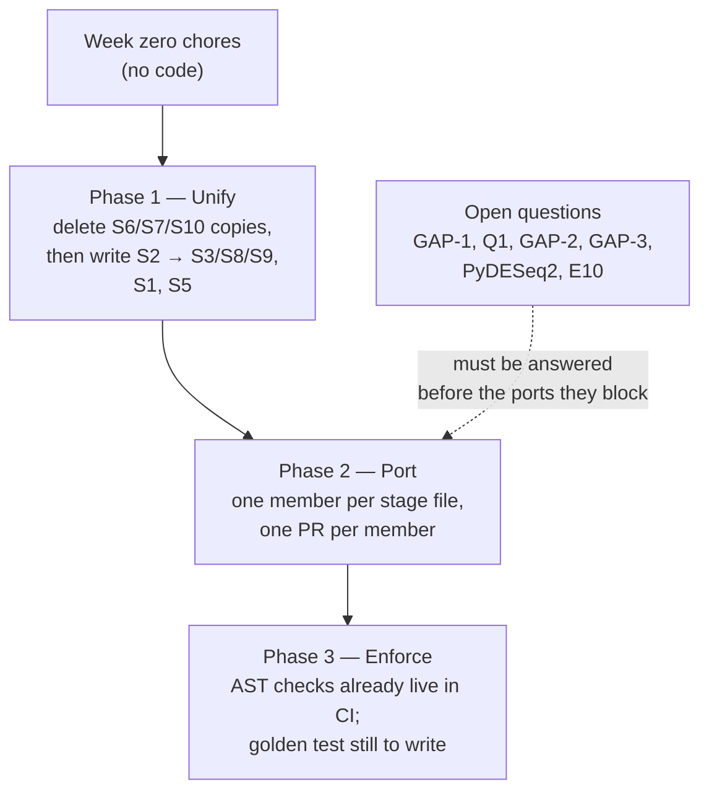

# Integration plan

**Audience:** Offer and Ziv — the two people who merge to `main`.
**Scope:** how seven separately vibe-coded repositories become one engine without silently forking the numbers.
**Companion documents:** [`docs/onboarding.he.md`](onboarding.he.md) is what the team reads; [`docs/ROADMAP.md`](ROADMAP.md) is what is built and what is not; [`docs/engine.md`](engine.md) is the contract every stub docstring restates.

This is a sequencing document. It says what happens in what order, who is blocked on whom, and which questions must be answered by a human before code moves. It deliberately does not assign deadlines.

---

## 1. The two-phase rule

> **Unify the shared functions first. Port the pipelines second.**

The reason is arithmetic, not aesthetics. Seven modules ported first and unified afterwards means seven implementations of the same quantity land in `main`, each one plausible, none of them raising. `engine.scoring` then normalises all of them onto one axis as though they were comparable, and the ranking is quietly wrong — the failure mode the whole architecture exists to prevent (`src/engine/stages/off_target.py`, class docstring: "Constructing three of these with different settings is the failure mode this class exists to prevent").

### The refinement the research adds

"Unification" is not one activity. For three of the fifteen shared functions it is **deletion**, because the shared version is already written and tested:

| Shared function | Module | What "unify" actually means |
| --- | --- | --- |
| S6 sequence utilities | `src/engine/sequences.py` | **Delete** the member's private copy, import this |
| S7 motif screening | `src/engine/stages/motifs.py` | **Delete** the member's regex loop; contribute their motif list as data |
| S10 scoring | `src/engine/scoring/` | **Delete** every member's "Final Score" column; emit raw metrics instead |

Plus `FoldEngine.mfe`, `CandidateStore.mint_id`, all of `src/engine/domain.py` and all of `src/engine/artifacts.py` — built, tested, and not to be re-written.

That leaves the genuinely-unify work at **S1, S2 (the rest of it), S3, S4, S5, S8, S9** — seven items, not fifteen. And of those, **S2 `FoldEngine` unblocks three** (S3 `hybridization_energy` calls it directly; S8 `CodonOptimizer.variants` and S9 `TranslationScorer.rbs_strength` both direct callers to it in their docstrings).

---

## 2. Week zero — before anyone onboards

Four chores. None of them are code, all of them are cheap now and expensive later.

| # | Chore | Why it cannot wait | Done when |
| --- | --- | --- | --- |
| 0.1 | **Move the repo out of OneDrive.** Clone fresh to `C:\dev\cernal_software` | Every entry under `.git` is a OneDrive cloud placeholder (reparse tag `0x9000E01A`, attributes include *Unpinned*). OneDrive holds handles on `.git/index` and loose objects mid-write, which already produced one `.git/rebase-merge` lock failure. It can also resurrect a deleted lock file or a stale index from a conflict copy — silent history corruption | The working copy is outside any synced folder and `git status` runs from `C:\dev\` |
| 0.2 | **Run `uv lock` and commit the result** | `uv.lock` is stale: commit `eab9cd3` added `viennarna>=2.7` to `pyproject.toml` without regenerating it, so the lock lists 25 packages and viennarna is not among them. `uv lock --check` and `uv sync --locked` both fail today; plain `uv sync` silently *rewrites* the file on disk. Seven people running install for the first time will each get a modified 30k-line generated file in `git status` — and a lockfile conflicts catastrophically on merge | `uv lock --check` exits 0 on `main`, and the regenerated lock is committed |
| 0.3 | **Turn on branch protection for `main`** | `main` has never carried a `.github` directory — not in history, not on `origin/engine/gate-notebooks` — and the only CI file, `.gitlab-ci.yml`, is ignored by GitHub completely. So until a workflow lands *and* protection is switched on in the repository settings, every push to `main` is unchecked. With seven beginners this is how a shared metric function gets forked. Note that branch protection is a **web setting**, not a file: merging a workflow does not enable it | `main` requires a pull request; the workflow is a required check; only Offer and Ziv can merge; force-push disabled |
| 0.4 | **Delete the leftover `src/engine/tools/` directory** | Commit `43843aa` moved the shared tools to `src/engine/gates/tools/` and left behind an untracked, source-less `src/engine/tools/` containing only `__pycache__`. Because it has no `__init__.py` it still resolves as an implicit namespace package, so `import engine.tools` *succeeds* while `from engine.tools import folding` fails with a confusing partial-import error rather than a clean `ModuleNotFoundError`. An AI writer given the S1–S15 tool map will plausibly emit the old path | The directory is gone and the tool import root is stated as `engine.gates.tools` (plus `engine.sequences` at the root) in the rules the writers read |

Adjacent, not blocking, but worth the same sitting — and each may already be landing on the integration branch, so check before writing one:

- A `.gitattributes` with `* text=auto` and `do text eol=lf`. `main` carries none, `core.autocrlf=true` is set system-wide by the Git for Windows installer, and `do` is therefore LF in the index and CRLF in every Windows working copy — which is why WSL rejects it with `/usr/bin/env: 'bash\r': No such file or directory` while Git Bash tolerates it.
- A GitHub Actions workflow mirroring the GitLab job: `uv run ruff check .`, `uv run ruff format --check .`, `uv run python manage.py check`, `uv run pytest -q`. It must use `uv sync`, **not** `uv sync --locked`, until chore 0.2 is done.
- A `CODEOWNERS` on `src/engine/gates/tools/` and `src/engine/scoring/` — the two directories where a silent reimplementation does the most damage.

**A note on `./do`:** it hard-fails when `uv` is absent and needs Git Bash. Onboarding documents `uv run pytest -q` and `uv run ruff check .` directly instead — those two commands are the entire quality gate. Do not put `./do install` in front of a Windows beginner.

---

## 3. Phase 1 — the ordered harvest

Ranked by how many members each unblocks, cross-checked against the repo's own build order (`docs/ROADMAP.md` E1: sequences → motifs → FoldEngine → FoldProfiler → binding → off_target → codons/translation).

| # | Shared fn | Module and symbols | State today | Who depends on it | Action |
| --- | --- | --- | --- | --- | --- |
| 1 | **S6** sequences | `src/engine/sequences.py` — `to_rna`, `to_dna`, `is_valid_rna`, `reverse_complement`, `gc_content`, `codons`, `translate`, `find_augs`, `find_stops`, `longest_homopolymer`, `hamming`, `windows`, `CODON_TABLE` | ✅ built + tested | everyone | **Delete duplicates.** Zero risk, zero scientific decisions, can run today |
| 2 | **S7** motif screening | `src/engine/stages/motifs.py` — `MotifScreener.violations`, `.is_compliant` | ✅ logic built + tested; `RNASE_SITES = {}` and `RBP_MOTIFS = {}` are empty and marked "Provisional. Owned by the scientific team." RFC10/RFC1000 tables are filled | Liran, Aviv, Ziv | **Harvest data, not code.** Collect every member's forbidden-motif list into those two dicts; delete their regex loops |
| 3 | **S2** folding + **S4** structure match | `src/engine/gates/tools/folding.py` — `FoldEngine.mfe` ✅ (cached); `partition`, `ensemble_defect`, `base_pair_probabilities`, `suboptimal`, `versions` ✗; module-level `structure_match` ✗ | ⚠️ partial | Aviv, both unowned generator authors, Liran | **Write first.** Highest fan-in of anything unbuilt; imported by `switches.py`, `toehold.py`, `antisense.py`, `crispr.py`, `binding.py`. Unblocks #5 and #7 |
| 4 | **S5** off-target | `src/engine/stages/off_target.py` — `build_index`, `find_similar`, `scan_trigger`, `scan_switch` | ✗ all stubs | Liran (`scan_trigger`), Aviv's validator (`scan_switch`), Offer (`find_similar` only) | **Unify the interface now, stub the index.** Blocked on Q1 for real data |
| 5 | **S8** codon optimisation | `src/engine/gates/tools/codons.py` — `variants`, `translation_score` | ✗ stubs | Aviv, antisense owner, Ziv | Two members computing CAI slightly differently is the same silent break as three off-target indexes |
| 6 | **S1** fold profiling | `src/engine/stages/folding.py` — `FoldProfiler.profile`, `.openness` | ✗ stubs | Liran directly; Aviv indirectly via `TranslationScorer.ramp_is_unstructured` | The cross-layer consumer is easy to miss — if Liran's RNAplfold code stays inside `TriggerScorer`, the ramp check grows a second copy with different `-W/-L/-u` |
| 7 | **S3** hybridization energy | `src/engine/gates/tools/binding.py` — `hybridization_energy(switch, trigger, folder)` | ✗ stub | Aviv + both generator owners | Depends on #3 |
| 8 | **S9** translation scoring | `src/engine/gates/tools/translation.py` — `score`, `rbs_strength`, `kozak_match`, `ramp_is_unstructured` | ✗ stubs | Aviv, antisense owner | Where the prokaryotic/eukaryotic split genuinely bites; `score()` is the method callers use, it dispatches on `self.track` |
| 9 | **S10** scoring | `src/engine/scoring/` — `normalize_value`, `build_metrics`, `weighted_score`, `failed_filter`, `rank_candidates` | ✅ built + tested | everyone | **Enforce.** Every member's "Trigger Score" / "Final Switch Score" / "Final Circuit Score" column is deleted and replaced by raw metrics + this layer |

### Two invariants to settle inside Phase 1, not after

- **Temperature.** `FoldEngine.__init__(temperature=37.0)` threads an explicit `RNA.md()`; `FoldProfiler.__init__(window=80, max_span=40, unpaired=10)` has **no temperature at all** and will use ViennaRNA's process global. Set a 30 °C protocol and `trigger_accessibility` comes from one physical model while `gate_folding_energy` comes from another — both feeding one weighted score. Fix while writing #3 and #6, not later.
- **`FoldEngine.versions()` first.** It is one of the smallest stubs and the docs say its result is written into every `JobResult`. `viennarna>=2.7` is a floor, not a pin — two members can be on different patch releases with different Turner defaults and nothing records which was used.

---

## 4. Phase 2 — the per-member port

One member, one destination file, one PR. The ownership boundaries here are cut along **file** lines, not along the spec's Appendix B section lines — they do not match, and file lines are the ones Git enforces.

| Member | Destination | Class / symbols | Must delete from their repo | Blocked on |
| --- | --- | --- | --- | --- |
| **Shir** — User's Inputs | `src/engine/stages/quality.py` | `InputQualityCheck.check(counts, metadata) -> QcReport` | any private QC scaffolding; any DataFrame that would cross a stage boundary | **GAP-1** (the parser has no module) and ROADMAP P1 (organism free text vs `Host` enum). Scientifically she is the only member with **zero** blockers — she can start the day GAP-1 is answered |
| **Ze'ev** — Gene Selection | `src/engine/stages/genes.py` | `GeneSelector.select(counts, dge) -> list[SelectedGene]` | private thresholds (read `self.constraints`), any DataFrame return (emit `SelectedGene`), any PyDESeq2 run | the PyDESeq2 conflict below. `atlas` is the constructor slot for the missing condition-specificity |
| **Ze'ev** — Supporting Databases | *no module exists* | — | — | **Q1.** This is the critical path for Liran, Aviv and Ziv simultaneously |
| **Liran** — Initial Trigger Scoring | `src/engine/stages/triggers.py` | `TriggerScorer.score(genes, sequences, constraints) -> Iterator[TriggerCandidate]` (it **yields**) | any inline RNAplfold call (→ S1), any private GC / AUG / STOP / window helper (→ S6), any off-target scan (→ S5), any "Trigger Score" (→ S10) | Ze'ev's transcript sequences (Q1) **and** the S1 `FoldProfiler` body |
| **Aviv** — generation | `src/engine/gates/toehold.py` | `ToeholdGate.is_compatible / generate_designs / evaluate_design / emit_sequence`; two-input AND in `ToeholdAndGate.generate_designs` | any `import RNA`, any `FoldEngine()` construction, any `final_switch_score` | S2, S3, S4, S8, S9 |
| **Aviv** — validation | `src/engine/stages/switches.py` | `SwitchValidator.validate(design) -> ValidationResult`; dispatch in `SwitchDesigner` | the same pass/fail rules if they also appear inside the gate — they live **once**, here | S2, S5 |
| **Offer** — Circuit Design | `src/engine/stages/circuits.py` | `CircuitDesigner.design / enumerate_expressions`; `ConfusionEvaluator.evaluate / cross_talk_penalty` | his confusion-matrix code and his boolean-tree code — `BooleanExpression` (`.evaluate`, `.gene_ids`, `.complexity`, `.render`) and `ConfusionMatrix` (`.sensitivity`, `.specificity`, `.separation_margin`) exist and are tested | **GAP-2** and **GAP-3**. Calls S5 for exactly one thing (`find_similar`, cross-talk); re-scanning the transcriptome here is forbidden |
| **Ziv** — Plasmid Construction | `src/engine/stages/plasmids.py` | `PlasmidBuilder.build / payload_segment` | any private motif screen (→ S7), any private codon table (→ S8) | Q11 (no payload sequence library: GFP, mCherry, luciferase, AmpR, apoptosis inducer) and Ze'ev's backbone spec |
| **Ziv** — Compiler's Output | `src/engine/stages/reporting.py` | `StructureRenderer.render_structure / render_circuit`; `ReportBuilder.build` | any hand-rolled file writing — `engine.artifacts.write_artifact` computes the sha256 the Platform verifies on import | everything upstream. Rule: "everything here reads; nothing computes science" — a figure that needs an unrecorded value means the value belongs upstream |
| *unowned* | `src/engine/gates/antisense.py`, `src/engine/gates/crispr.py` | `AntisenseNotGate`, `CrisprGate` — both `available = False`, both returning `Compatibility.no(reason)` | — | **needs two owners named.** Q9 (does the trigger *act as* the antisense or *drive* one?), Q10 (CRISPR activator vs repressor). CRISPR additionally needs a **genomic** off-target index — `OffTargetScanner` indexes the transcriptome only, so that is a new tool, not a parameter |

### Two per-port notes worth repeating in every PR review

- **Aviv's single source file has four destinations**: generation → `gates/toehold.py`, validation → `stages/switches.py`, off-target → `stages/off_target.py`, visualisation → `stages/reporting.py`. Say this explicitly before the port starts, not during review.
- **`ToeholdAndGate` inherits `available = True`** from `ToeholdGate` while its bodies raise `NotImplementedError` (ROADMAP P9). A submission requesting `toehold_and` validates at submit time and crashes mid-run. Either set `available = False` on the subclass now, or land it in the same PR as `ToeholdGate`.

---

## 5. Open gaps — decide these before the ports they block

Each is phrased as a question for the team, with what the repo actually contains today and what it costs to decide late.

### GAP-1 — Where does the CSV → domain parser live?

Nothing in `src/engine/` converts `JobRequest.input_path` into `CountMatrix` / `DgeTable` / `SampleMetadata`. `run_pipeline`'s own sketch uses `counts`, `dge`, `metadata`, `sequences`, `transcriptome` and `outcome` as undefined free variables; `MockEngine._verify_input` only stats the path and checks the sha256, it never parses. ROADMAP E2 says "Read the DE table with pandas. **Do not carry DataFrames through the pipeline** — convert to `DgeTable` at the edge." That edge has no file.

> **Q:** Is the parser `src/engine/inputs.py`, or a package `src/engine/io/`? What are its function signatures?

**Cost of deciding late:** Shir's pandas code lands inside `GeneSelector` and Ze'ev inherits it.

### Q1 — Supporting Databases has no module, and it blocks three people

All four database inputs are defaulted constructor parameters with no producer anywhere in the repo: `OffTargetScanner(transcriptome, max_mismatch=2)`; `CodonOptimizer(host, usage_table=None)` whose docstring says "Step 5 should load the bundled table for `host`"; `PlasmidBuilder(..., backbone=())`; `GeneSelector(..., atlas=None)`. Plus the transcript sequences themselves, passed to `TriggerScorer.score(genes, sequences, constraints)`. `docs/engine.md` records this as "no data source chosen"; ROADMAP calls it the one thing blocking everything else.

> **Q:** What module path holds the databases, in what format, and which build of the transcriptome?

**Non-negotiable once answered:** the transcriptome fed to `OffTargetScanner` must be the **same build** the `sequences` dict came from. Otherwise every off-target number is plausible and meaningless.

### GAP-2 — Per-gene τ, and three more things in Offer's spec with no home

`ConfusionEvaluator.evaluate(expression, counts, threshold: float)` takes **one global float**, and its own docstring calls the global cut-off "the weakest assumption in this stage". Offer's write-up specifies a per-gene τ_g. Three neighbours have no home either: Quine–McCluskey / Espresso minimisation with don't-cares (no code, no dependency, no mention anywhere); bootstrap / leave-one-out over samples (no field); Pareto frontier selection (`ParetoFilter.frontier` exists in `src/engine/store.py` but is a stub, is never imported by `circuits.py`, and ROADMAP E11 states Pareto filtering is not built).

> **Q1:** Widen to `threshold: float | dict[str, float]`, or introduce a `ThresholdRule` frozen dataclass (`kind`, plus its parameter) constructed once and echoed into `JobResult.params`?
> **Q2:** Is minimisation in scope for 2026 at all, or do we enumerate over observed patterns only?
> **Q3:** Who owns wiring `ParetoFilter` into `circuits.py`? Nobody does today.

**Cost of deciding late:** per-gene τ gets smuggled into a module constant where nothing else can see it — and because the confusion matrix is the pass/fail gate and `separation_margin` (Youden's J) is the headline ranking metric, a different τ rule reorders the entire final output while every intermediate number stays identical.

### GAP-3 — The Pass A / Pass B two-pass dependency is not representable

Offer's spec defines Pass A (rank circuits on cheap a-priori features *before* switches are designed) and Pass B (re-rank once realized switch scores exist), and notes that Fig. 1 needs a feedback edge. The repo's pipeline is one forward pass — `GS → TS → SD → CD → PB → RB` — and `CircuitDesigner.design` takes already-validated `GateDesign`s as **input**.

> **Q:** A new stage, a two-call protocol on `CircuitDesigner`, or drop Pass A for 2026?

**Cost of deciding late:** if Offer's code assumes it runs before switches exist, it cannot be called from the current `design()` signature at all — this is an architectural change, not a refactor.

### PyDESeq2 — in the team spec, out of scope in the repo

The spec's Gene Selection guidelines say "run PyDESeq2 → apply thresholds". `src/engine/stages/genes.py` says the opposite in its module docstring: "CERNAL does **not** run differential expression. The researcher supplies DESeq2-style results; this stage filters and ranks them." There is no `pydeseq2` dependency and no place to put a DE run.

> **Q:** Does DE stay out (the researcher brings a DESeq2 table), or does it become a pre-processing utility *outside* the pipeline?

Either way, keep the rule the repo already states: DESeq2 emits a null `p_adj` for filtered genes, and **"not tested" must never be treated as "not significant"** — drop those rows, never fill them with 1.0.

### ROADMAP E10 — `CandidateStore` as bus, or as recorder?

The team spec's General Considerations says "every stage reads its input and writes its output through it". ROADMAP E10 recommends the opposite and says so explicitly: "typed objects between stages, CSV snapshots at stage boundaries — a **recorder**, not a bus." Today `CandidateStore.mint_id` is implemented; `snapshot` and `load_snapshot` are stubs.

> **Q:** Recorder (recommended) or bus?

**Cost of deciding late:** ROADMAP's own words — "hard to reverse once six stages depend on it." Related trap regardless of the answer: `load_snapshot` returns rows as dicts of **strings**, so the natural repair `float(row["mfe"] or 0)` turns an empty cell into a real number, which is the missing-becomes-zero bug in a different costume.

---

## 6. Phase 3 — what CI enforces, and why here

Phase 1 and 2 buy comparability once. CI is what keeps it. `tests/test_boundary.py` is an AST scan over `src/` with per-file parametrisation and a message explaining the rule — it guards the Platform⇄Engine seam. **`tests/engine/test_house_rules.py` is the same idiom turned on the six rules below, and it already exists** — it was written alongside this integration plan, and every check in it passes against the tree as of this writing (verified by running its checks directly: 223 passed, 1 xfail for `FoldProfiler`, which is expected until S1 is written). `uv run pytest -q` already runs it; nobody has to build these six.

| Check | Rule it defends | Detector |
| --- | --- | --- |
| Metric-name coverage | The nine names in `DEFAULT_V1` are the whole vocabulary (`profiles.py` lines 116–176). An unknown name is silently discarded **and** the real metric scores as missing (= worst) **and** the hard filter never fires | `test_evaluate_design_emits_only_declared_metric_names` — AST-parses every `evaluate_design` body and `profiles.py` itself, so it cannot drift from the profile |
| Missing is `None` | `0.0` normalises to the **best** end of a LOWER_BETTER range and passes `failed_filter`; `None` is handled explicitly. `except: return 0.0` turns an unmeasurable design into a flawless one | `test_measuring_functions_never_return_a_sentinel` — flags a numeric `return` inside an `except` handler and `.get(<metric>, 0)` |
| One folding adapter | Only `gates/tools/folding.py` and `stages/folding.py` may `import RNA` | `test_only_the_two_folding_adapters_import_a_folding_library` |
| Tools built once | `FoldEngine`, `FoldProfiler`, `OffTargetScanner`, `MotifScreener`, `CodonOptimizer`, `TranslationScorer` are constructed only in `pipeline.build_tools()` | `test_shared_tools_are_constructed_only_in_the_pipeline` |
| Raw values only | `evaluate_design` must not normalise, weight or filter | `test_gate_families_never_import_scoring` — a family that imports `engine.scoring` at all has already lost this argument |
| Downward imports only | `pipeline → stages → gates → gates/tools → sequences → domain` | `test_intra_engine_imports_point_downward`, with the documented sideways allowlist for `motifs`/`off_target`/`folding` |

Two rules still have **no** detector, and are the real remaining gap:

- **The golden run.** A refactor that silently changes a score makes stored results uninterpretable, and nothing today catches "the numbers moved." This needs a fixed small input → full expected `JobResult`, committed — the highest-value test to write before any member's science lands, because it is the only thing that turns a silent regression into a red build.
- **`STAGE_WEIGHTS`** in `pipeline.py` is defined and consumed by nothing (ROADMAP P5) — cosmetic (the progress bar), not a comparability risk, but worth a one-line issue.

Batch-invariance (a design's raw metrics must be identical whether evaluated alone or inside a batch of 50) has no detector yet either — `test_gate_families_never_import_scoring` catches the mechanism a family would use to go batch-relative (it would need `engine.scoring` or a second pass over its own results to do it), but not a hand-rolled version. Worth a property test once a family has a real body to test.

---

## 7. Suggested sequencing

| Sprint | Content | Gate to the next sprint |
| --- | --- | --- |
| **0** | §2 week-zero chores. Nobody onboards before 0.1 and 0.2 are done | `uv lock --check` exits 0; `main` is protected |
| **1** | S6 + S7 deletion pass — every member opens one small PR that deletes their private `reverse_complement`, GC calculator and motif regexes, and contributes their motif list as data. No science, no blockers | Everyone has merged one PR and knows the Git loop |
| **2** | The Phase-1 writes, in harvest order — S2/S4 first (it unblocks three), then S1, S5, S8, S9, S3. Plus `FoldEngine.versions()` and the shared temperature model | The CI checks in §6 are green on a fixture run |
| **3** | Answer the §5 questions. GAP-1 and Q1 first — they block four people between them | Decisions written into `docs/ROADMAP.md`, signatures changed in the same PR |
| **4** | The per-member ports, §4, one PR each, in the order their blockers cleared: Shir → Ze'ev → Liran → Aviv → Offer → Ziv | Golden test committed and green |

Sprint 1 is deliberately the first thing the team does. It is the sprint with the largest ratio of "learns the Git workflow" to "can break something scientific" — and it is real work: those duplicated helpers are the cheapest, lowest-risk comparability win in the project.

---

## 8. One-paragraph summary for anyone joining mid-stream

Three of the fifteen shared functions (S6, S7, S10), plus `FoldEngine.mfe`, `CandidateStore.mint_id`, `domain.py` and `artifacts.py`, are already written and tested — the harvest for those is **deletion**, not writing. The genuinely-unify work is S1, S2 (rest), S3, S4, S5, S8, S9, and S2 unblocks three of them. Unify before porting, because the alternative is seven plausible implementations of the same quantity normalised onto one axis. Answer GAP-1 and Q1 before anyone ports, because between them they block four people. And do the week-zero chores first — the repo is currently sitting in OneDrive with a stale lockfile and an unprotected `main`, which is three ways to lose a day of somebody's work before a single line of science is written.
