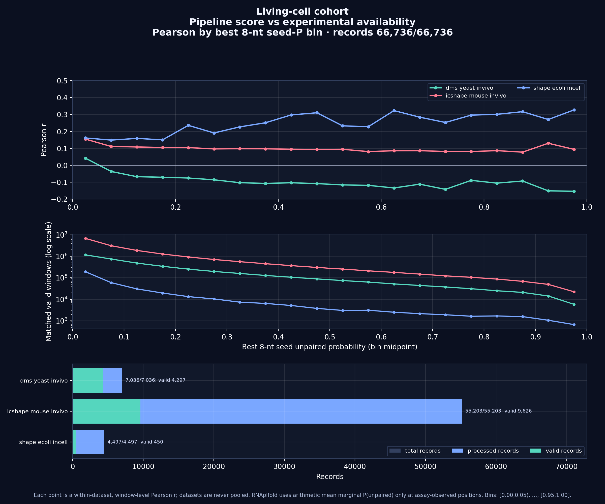
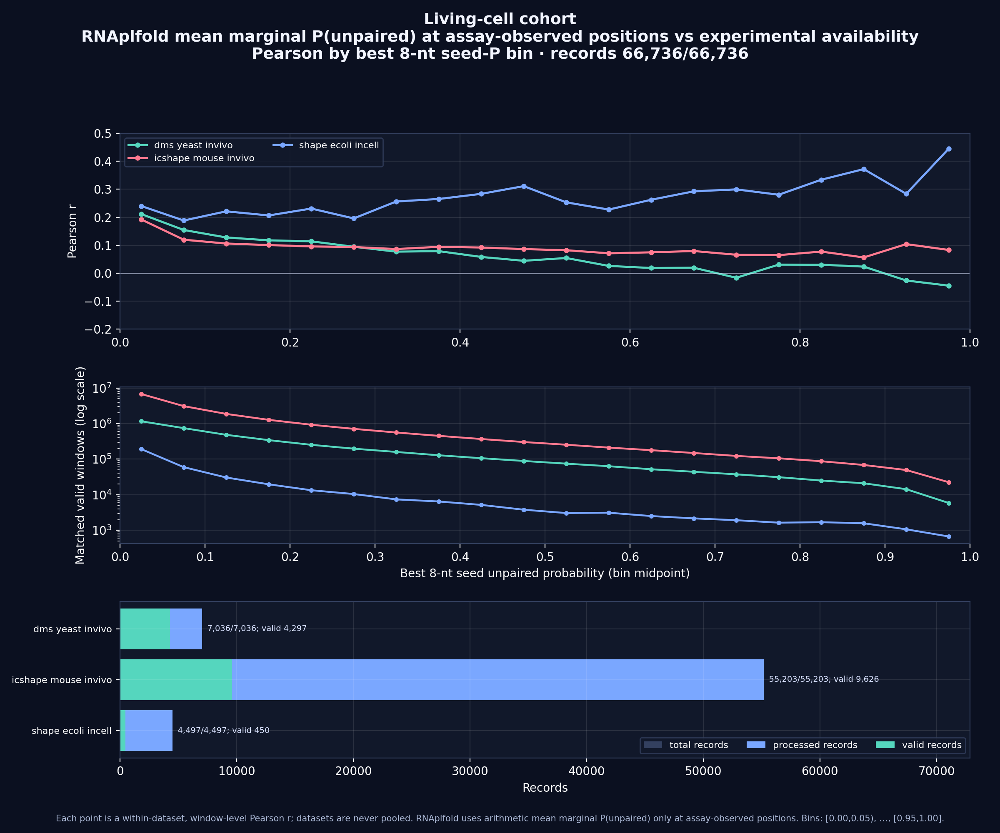

# Trigger-selection development logbook

**Document status:** reconstructed development notebook for iGEM review

**Notebook cutoff:** 2026-09-20 (dates and times are Israel local time, UTC+03:00, when preserved by Git)

**CERNAL snapshot:** branch `ziv/global-rna-off-target-scanner`, commit [`0d176a45`](https://github.com/zivbental/cernal_software/commit/0d176a45a480cdceb6ab1471dc17a1f3d38a4ec6)

**Companion validation repository:** [`zivbental/dna_rna_availability`](https://github.com/zivbental/dna_rna_availability)
**Open implementation review:** [CERNAL pull request 33](https://github.com/zivbental/cernal_software/pull/33)

## Executive summary

This notebook records how CERNAL's RNA-trigger selection moved from transcript acquisition and a simple sliding-window ranker to a gate-aware, geometry-exact accessibility model, and how that model was tested against experimental RNA-structure data. The chronology is reconstructed from Git commits, checked-in documentation and source code, generated reports, machine-readable result bundles, and preserved local worktrees. Where an exact execution start time was not retained, the entry gives the date supported by those artifacts rather than inventing a time.

The first prerequisite was not a scoring equation. CERNAL needed traceable public expression inputs, stable gene identifiers, organism-aware gene selection, and full transcripts. Work from 13–15 September established those layers. In parallel, `dna_rna_availability` supplied a reproducible RNA accessibility implementation and a validation harness. The first large control used Kertesz *et al.* yeast PARS data. Five sanity checks passed. Across all selected transcripts, RNAplfold's local ensemble output—expressed in that report as predicted per-base **pairing** probability—correlated positively, but only moderately, with the native pairing-directed PARS signal. That was useful evidence that the implementation carried signal; it was not a validation of switch success.

On 18 September the candidate ranker evolved in two steps. The initial implementation ranked mean marginal RNAplfold openness. The second implementation represented the physical recognition geometry explicitly: exact 30/33/36-nt footprints; 12/15/18-nt exposed toeholds; a fixed 18-nt branch-migration region; an explicitly named terminal-20 hypothesis; the best contiguous 8-nt seed among 5, 8, or 11 legal placements; joint opening probabilities for 8 and 20 nt; and opening free energy per nucleotide. Fair round-robin selection prevents the most numerous length bucket from occupying the entire shortlist. The implementation and its verification are in open PR 33. Its outputs remain thermodynamic ranking evidence. They are not binding probabilities, activation probabilities, or calibrated predictions of successful gates.

Validation then broadened. A resumable multi-dataset runner began as a seven-dataset exercise and encountered memory failures during the mouse in-vitro phase. Recovery tooling was built, but the scientific scope changed before that obsolete phase was completed. On 20 September the project explicitly restricted the question to three living-cell datasets: yeast DMS in vivo, mouse icSHAPE in vivo, and *E. coli* SHAPE in-cell. All 66,736 records were processed. The final comparison kept each assay separate, computed within-dataset Pearson correlations in bins of best joint 8-nt seed probability, and compared two predictors separately: the composite pipeline score and the standalone arithmetic mean of RNAplfold marginal P(unpaired) at exactly the assay-observed positions. Raw assay values were never pooled across studies.

The living-cell results were informative but not a victory claim. Correlations varied irregularly by seed bin. Standalone marginal RNAplfold generally aligned with experimental accessibility better than the composite pipeline score, especially in yeast. That observation motivated a frozen six-tool comparison—RNAplfold, RNAfold, RNAstructure, CONTRAfold, LinearPartition-C, and EternaFold—with equal study weight and robust winner gates. Core and strict-adapter work exists with focused tests, but the six-tool installation scripts were still uncommitted and in progress at the cutoff. No six-tool benchmark result can yet be claimed.

## Scope, terminology, and evidence labels

### Scope

A **trigger** here is a contiguous segment of a target RNA considered for recognition by a synthetic RNA gate. Trigger selection is a ranking and filtering problem over transcript windows. It includes sequence constraints, structural accessibility, candidate geometry, and eventually off-target interaction evidence. It does not by itself model expression, translation, gate leakage, intracellular concentration, localization, or kinetic success.

A **footprint** is the full target segment recognized by a candidate gate. The implemented supported footprint lengths are 30, 33, and 36 nt. For those lengths, the corresponding exposed toehold lengths are 12, 15, and 18 nt, while the branch-migration region remains 18 nt. A **seed** is an 8-nt contiguous subwindow considered as a possible nucleation region. A **marginal unpaired probability** is the probability that one nucleotide is unpaired, considered position by position. A **joint opening probability** is the probability that every base in a contiguous region is unpaired simultaneously. These are different estimands and must not be substituted for one another.

The validation assays do not all report an identical physical quantity or numerical scale. Therefore each study is interpreted using its documented direction, filtering, and coverage rules. Correlations are calculated within a dataset. Study-level conclusions may later be combined with equal study weight, but raw assay values are not pooled.

### Evidence-label legend

| Label | Meaning in this notebook |
|---|---|
| **Confirmed** | Directly supported by a commit, tracked source file, test output, or machine-readable artifact at the cited snapshot. |
| **Observed** | Measured in a completed run or report and tied to a retained artifact; an observation, not necessarily a causal conclusion. |
| **Reported** | Preserved in a run report or session artifact, but not independently rerun while preparing this notebook. |
| **Inferred** | A cautious interpretation derived from confirmed or observed evidence; alternatives remain possible. |
| **Hypothesis** | A scientific or engineering proposition deliberately awaiting stronger validation. |
| **Planned** | Specified work that was not complete at the notebook cutoff. |

The labels matter because development artifacts have different epistemic strength. For example, “the code computes a 20-nt joint opening probability” is **Confirmed** by source and tests; “20 nt is the decisive biological opening region” is a **Hypothesis**; and “this candidate will activate a gate” is unsupported.

## Reproducibility map

### Repositories and branches

| Repository/worktree | Branch at the relevant evidence | Role | Reproducibility note |
|---|---|---|---|
| [`cernal_software`](https://github.com/zivbental/cernal_software) | `ziv/gene-selection-impl` then `main`; `ziv/rnaplfold-trigger-ranking`; `ziv/global-rna-off-target-scanner` | Product pipeline, gene selection, trigger ranking, and off-target design | This document lives in the `ziv/global-rna-off-target-scanner` worktree at `0d176a45`. |
| [`dna_rna_availability`](https://github.com/zivbental/dna_rna_availability) | `main`; `feat/multi-dataset-rna-benchmark`; `ziv/multi-tool-accessibility-benchmark`; focused implementation branches | Accessibility models, controls, dataset preparation, benchmarking | Commit identities below are shared by the preserved worktrees. |
| `/home/zivbental/workspace/projects/rna/dna_rna_availability-multi-dataset` | `feat/multi-dataset-rna-benchmark` | Completed living-cell run and reports | **Local-only Lab-PC path.** Contains generated work products and one untracked parallel runner. |
| `/home/zivbental/workspace/projects/rna/dna_rna_availability-multitool-core` | `ziv/multitool-core` | Multi-tool benchmark core | **Local-only Lab-PC worktree.** |
| `/home/zivbental/workspace/projects/rna/dna_rna_availability-multitool-adapters` | `ziv/multitool-adapters` | Strict complete-mass adapters | **Local-only Lab-PC worktree.** |
| `/home/zivbental/workspace/projects/rna/dna_rna_availability-multitool-toolchain` | `ziv/multitool-toolchain` | Installation/smoke work in progress | **Local-only Lab-PC worktree.** Uncommitted scripts mean this is not a validated installation artifact. |

### Key CERNAL source and documentation

- [Trigger-selection documentation](triggers.md) records the user-facing model and limitations.
- [`src/engine/stages/triggers.py`](../src/engine/stages/triggers.py) implements candidate enumeration, accessibility features, ranking, and shortlist behavior.
- [`tests/engine/test_triggers.py`](../tests/engine/test_triggers.py) contains focused engine tests.
- [Gate-agnostic off-target design](off-target-analysis.md) separates physical RNA–RNA interaction search from gate interpretation.
- [Gene-selection documentation](genes.md) records the upstream gene-selection stage.
- [Public-dataset documentation](public-datasets.md) records data ingestion and catalog behavior.
- [Engine documentation](engine.md) and [architecture](architecture.md) provide pipeline context.

### Validation sources and live artifact paths

The living-cell evidence bundle copied into this repository contains:

- [Pipeline score versus experiment, by seed bin](assets/trigger-selection-logbook/pipeline_vs_experiment_by_seed_p_live.png)
- [Standalone RNAplfold marginal P(unpaired) versus experiment, by seed bin](assets/trigger-selection-logbook/rnaplfold_vs_experiment_by_seed_p_live.png)
- [Machine-readable dual-predictor summary](assets/trigger-selection-logbook/seed_bin_dual_predictor_summary_v3.json)
- [Flat per-bin correlation table](assets/trigger-selection-logbook/seed_bin_dual_predictor_correlations_v3.csv)

The generating artifacts remain at the **local-only Lab-PC path**:

`/home/zivbental/workspace/projects/rna/dna_rna_availability-multi-dataset/validation/multi_dataset/work/results_parallel/`

Important files there include `seed_bin_dual_predictor_summary_v3.json`, `seed_bin_dual_predictor_state_v3.json`, the two report plots, and the archived bundle. The report embeds the selected dataset IDs, hashes of prepared inputs, implementation hashes, tool versions, prediction parameters, processed totals, and report schema. This copied evidence is suitable for audit, but reproducing it also requires the source datasets and tool environment documented in the companion repository.

Checksums of the files copied into this notebook are:

| Artifact | SHA-256 |
|---|---|
| `pipeline_vs_experiment_by_seed_p_live.png` | `91dbea63f22934d003f6d1355842c4004e6c9fd3176858ecfa35b5da91bea2c3` |
| `rnaplfold_vs_experiment_by_seed_p_live.png` | `72baa7e6986f9820af8aa90a0118d606df1913c2965ee40020d3c171cbaf4ad7` |
| `seed_bin_dual_predictor_summary_v3.json` | `0909963df66d03c732d4e99923191668850ce8e22c3535f281f889306ded5b78` |
| `seed_bin_dual_predictor_correlations_v3.csv` | `d480b427e3e89c750ac8dff1411aeb8d4fda04cb62bb28c322fab51a0e201417` |

### Commit index

| Date/time (+03) | Commit | Evidence carried forward |
|---|---|---|
| 2026-09-13 22:08 | [`6959a51`](https://github.com/zivbental/dna_rna_availability/commit/6959a51e629269358d7a097111ea3ddcbc918b32) | Initial accessibility-tool import. |
| 2026-09-14 15:54 | [`9889759`](https://github.com/zivbental/cernal_software/commit/9889759a4f3e5b5c934e7724fd15be77643eb867) | Gene-selection assessment and plan. |
| 2026-09-14 16:24 | [`91845e6`](https://github.com/zivbental/cernal_software/commit/91845e6602e10642dc72673b6cafb12afc8a2563) | Filled `GeneSelector` implementation and docs. |
| 2026-09-14 17:17 | [`f502471`](https://github.com/zivbental/cernal_software/commit/f50247126aa59bc0f17aee52002f2061fd572936) | Real *E. coli* differential-expression mode. |
| 2026-09-14 18:28 | [`0fcfcc3`](https://github.com/zivbental/cernal_software/commit/0fcfcc3adfac74e24027ade98c00ba2a9d98c151) | Yeast extension and explicit human open question. |
| 2026-09-15 13:32 | [`b8e20f5`](https://github.com/zivbental/cernal_software/commit/b8e20f5d6148720a2de60e05d94b792eaacff71d) | Merge of CERNAL PR 31. |
| 2026-09-16 21:17 | [`915fd6b`](https://github.com/zivbental/dna_rna_availability/commit/915fd6bd98c85a242571cb73a232b5fd97a34444) | Expanded docs and traceable PARS validation. |
| 2026-09-16 21:19 | [`ea04b4`](https://github.com/zivbental/dna_rna_availability/commit/ea04b4f917d5810cd0bd4cccbcea59c135e5068a) | Merge of companion-repository PR 1. |
| 2026-09-16 22:51 | [`2c72a16`](https://github.com/zivbental/dna_rna_availability/commit/2c72a1603a265be1d8dcdf58db1bbf24593db1b8) | All-transcript Kertesz results. |
| 2026-09-16 23:40 | [`46b9d1d`](https://github.com/zivbental/dna_rna_availability/commit/46b9d1d63060dcfe7fd8916e1cd9a785ec8b23ce) | Resumable multi-dataset benchmark runner. |
| 2026-09-18 14:24 | [`c4680ca`](https://github.com/zivbental/cernal_software/commit/c4680ca18cdf4f82356d2c36f2fc1d1140f9312f) | Initial RNAplfold mean-marginal ranking. |
| 2026-09-18 20:03 | [`b8472f5`](https://github.com/zivbental/cernal_software/commit/b8472f5eb97c0ead60f5d5d2945fb131d68d0ff9) | Gate-aware exact-geometry ranking. |
| 2026-09-18 20:32 | [`f8cdce8`](https://github.com/zivbental/cernal_software/commit/f8cdce8676cf8e8695c5fdad0b40d9123c236d2a) | Exact scanned-footprint enforcement. |
| 2026-09-18 20:40 | [`813755c`](https://github.com/zivbental/cernal_software/commit/813755cb5327116b80eff0df744bf154b19ce6b4) | R API example corrected to include 33 nt. |
| 2026-09-18 22:07 | [`0d176a45`](https://github.com/zivbental/cernal_software/commit/0d176a45a480cdceb6ab1471dc17a1f3d38a4ec6) | Gate-agnostic off-target design; not implementation. |
| 2026-09-19 19:55–20:28 | `7650f87`, `ccb0ff8`, `fbf97af`, [`c650aec`](https://github.com/zivbental/dna_rna_availability/commit/c650aec0c976651df0f0d73d2e5cf40c1e863de3) | Multi-tool plan, invariants, ranking/inference freeze, final refinements. |
| 2026-09-20 09:37 | `6f668ab` (local-only commit at cutoff) | Scope restricted to living-cell studies. |
| 2026-09-20 12:33 | `402b593` (local-only commit at cutoff) | Strict complete-mass predictor adapters and tests. |
| 2026-09-20 12:34 | `9c32334` (local-only commit at cutoff) | Test-first multi-tool benchmark core. |

## Scientific protocol carried through the work

### Coordinates and orientation

CERNAL stores transcript sequences in biological 5′→3′ orientation. A candidate window is represented internally by a zero-based, half-open interval `[start, end)`, which is standard for Python slicing. Human-facing nucleotide positions and RNAplfold lookup coordinates are one-based and inclusive. Conversion is explicit: a Python window `[start, end)` corresponds to positions `start + 1` through `end` inclusive.

RNAplfold's `*_lunp` tables index a joint unpaired interval by its **one-based inclusive end position** and its **length**. For a window ending at Python-exclusive coordinate `end` with length `u`, the relevant lookup is therefore the row keyed by end `end` and the column keyed by `u`; the implied start is `end - u + 1` in one-based coordinates. Off-by-one tests are essential because using a start coordinate as an RNAplfold row index can return a plausible but physically different interval.

Trigger sequences remain in the target transcript's 5′→3′ orientation when reported. A gate recognition sequence may be reverse-complementary to that trigger, but candidate enumeration must not reverse the transcript or relabel its coordinates. The same rule carries into the off-target design: callers provide real molecular sequences 5′→3′, and the interaction backend is responsible for antiparallel pairing. A same-orientation copy of trigger `T` can resemble a cross-activator for a recognition region complementary to `T`; a sequence complementary to `T` can sequester `T`. Those are distinct biological projections over the same physical interaction primitive.

### RNAplfold settings

For a transcript of length `L`, the protocol resolves settings as:

- window size `W = min(L, 200)`;
- maximum base-pair span `max_span = min(L, 150)`;
- maximum requested unpaired interval `u = min(L, 20)`;
- temperature `37 °C`;
- one-base step for candidate scanning;
- one-based inclusive `pU` lookup by interval end and interval length.

The caps allow short transcripts to be handled without passing impossible values. On ordinary transcripts the intended local context is a 200-nt RNAplfold window with pairing span at most 150 nt and joint probabilities available through 20 nt. The method models a local thermodynamic ensemble. It does not model ribosomes, RNA-binding proteins, cotranscriptional history, compartment, degradation, concentration, or the gate's downstream conformational change.

### Marginal and joint quantities

For a footprint with per-position marginal probabilities `p_i = P(base i is unpaired)`, the arithmetic mean `sum(p_i)/n` answers: “on average, how often is a position unpaired?” It does not answer: “how often are all bases open together?” Marginals can be high even when no ensemble state exposes the entire contiguous region at once.

RNAplfold's joint `P_u(start, length)` answers a stricter event: every nucleotide in that contiguous interval is simultaneously unpaired under the local ensemble model. The best 8-nt seed joint probability (`P8`) is used as a nucleation-related feature. The terminal/full-hypothesis joint probability (`P20`) is used as a larger opening feature. They are distinct because a gate might find a locally accessible seed even when the broader recognition region is rarely open, or vice versa. Neither event is a measured association rate.

The implemented opening-cost feature is calculated from the same joint probability as `dG_open/nt = -R*T*ln(max(P20, 1e-12))/20`. The `1e-12` floor protects the logarithm and caps the reported numerical cost; raw `P20` is retained separately. Therefore `P20` and `dG_open/nt` are two representations of the same underlying modeled event. They are not independent corroborating evidence and must not be double-counted as though two tools agreed.

## Chronological notebook

## 2026-09-13 — Establishing inputs and an accessibility toolbase

**Question.** Can trigger discovery operate on real transcript data with enough provenance to make a later ranking auditable, and is there a reusable accessibility implementation to evaluate windows rather than relying on ad hoc sequence heuristics?

**Work.** CERNAL's public-dataset path was built in staged commits on 13 September and merged as PR 30. The work introduced the expression application skeleton, separated stable gene identifiers from display symbols, added provider adapters and a curated catalog, then added service, API, wizard, and documentation layers. Earlier that day the trigger-selection integration had also been merged, ensuring a pasted transcript was scanned rather than silently truncated. The companion `dna_rna_availability` repository was imported at 22:08:48 +03 in `6959a51`, creating an independent place for accessibility algorithms, parsers, visualization, and validation.

**Evidence.** CERNAL Git history includes public-dataset commits `d08b1f6` through `7887bda` and merge `f42ccd6`. The trigger-selection merge is `c4bccd1`, with implementation commit `5a43cbc`. Companion-repository commit `6959a51` is the initial import. Current stable documentation is available in [public datasets](public-datasets.md), [genes](genes.md), and [triggers](triggers.md).

**Decision.** Treat data provenance and transcript identity as part of trigger selection, not merely upstream plumbing. Candidate coordinates are scientifically meaningful only if the exact transcript sequence, identifier, source, and normalization rules are recoverable.

**Outcome.** **Confirmed:** CERNAL had a route from curated or supplied data to transcript scanning, and an independent repository existed for accessibility computation. This established the separation between product logic and scientific validation that was used throughout the week.

**Limitations.** Public expression catalogs do not by themselves guarantee full-transcript structural context. CDS-only references, missing UTRs, and isoform collapse can change both candidate geometry and off-target interpretation. Initial import is not validation.

**Next step.** Implement and verify organism-aware gene selection, then test accessibility outputs against experimental structure data before assigning them a major ranking role.

## 2026-09-14 — From a gene-selection plan to organism-aware selection

**Question.** Which expressed genes should be carried into expensive transcript scanning, and can the same interface support real differential-expression decisions across organisms without pretending all datasets are interchangeable?

**Work.** At 15:54:59, CERNAL commit `9889759` recorded the gene-selection assessment and implementation plan. At 16:24:27, `91845e6` filled the `GeneSelector` stub and documented its contract. At 17:17:34, `f502471` enabled an *E. coli* differential-expression mode and demonstrated a real end-to-end question and compile path. At 18:28:08, `0fcfcc3` extended the mode to yeast while leaving human behavior as an explicit open question rather than generalizing without evidence.

**Evidence.** The commits are preserved on `ziv/gene-selection-impl` and reachable from merge `b8e20f5`. [Gene-selection documentation](genes.md) is the stable repository-facing description. The sequence of commit subjects establishes the progression from assessment to implementation, then organism-specific validation.

**Decision.** Keep organism-specific behavior explicit. A shared software interface may normalize records, but biological selection rules and available evidence differ. Unanswered human scope was documented instead of inferred from bacterial or yeast behavior.

**Outcome.** **Confirmed:** gene selection ceased to be a stub, and real *E. coli* and yeast differential-expression paths existed. This reduced the candidate universe before structural scoring and preserved stable gene IDs for joining expression, sequence, and reports.

**Limitations.** Differential expression identifies biologically relevant genes under a stated comparison; it does not identify structurally accessible trigger sites. Transcript isoform choice and complete sequence retrieval remain separate decisions. A selected gene may still contain no candidate satisfying exact gate geometry or sequence constraints.

**Next step.** Merge the gene-selection work, then connect selected genes to exact transcript windows and experimentally check the accessibility estimator.

## 2026-09-15 — Gene-selection merge and the boundary to candidate generation

**Question.** Is the upstream selection layer stable enough to serve as the entry point for reproducible trigger ranking?

**Work.** PR 31 was merged at 13:32:35 in `b8e20f5`. Related development around this period established transcript-level trigger-pair enumeration and stage-one filtering in gate experiments, but the product-level trigger ranker still used comparatively simple accessibility proxies.

**Evidence.** Merge commit `b8e20f5` is on CERNAL `main`. The merged parent history contains `9889759`, `91845e6`, `f502471`, and `0fcfcc3` in order.

**Decision.** Use the merged gene selector as the upstream boundary. Do not conflate “gene chosen for design” with “window structurally suitable for recognition.” The latter requires complete per-window evidence and explicit gate geometry.

**Outcome.** **Confirmed:** the public-data/gene-selection groundwork from 13–15 September was integrated. Candidate ranking could now refer to stable gene and transcript context instead of free-floating sequences.

**Limitations.** Merge completion is an engineering milestone, not scientific validation. The scoring layer still needed tests for direction, coordinates, and correlation with structure assays.

**Next step.** Complete a traceable experimental control using the Kertesz yeast PARS dataset and run it across all eligible transcripts.

## 2026-09-16 — Kertesz controls, all-transcript validation, and a resumable runner

**Question.** Does the accessibility implementation behave coherently on known controls, and do its predicted pairing, marginal-unpairedness, and joint-opening quantities show directionally coherent relationships with experimental PARS measurements across many transcripts?

**Work.** Companion commit `915fd6b` at 21:17:34 expanded scientific documentation and added traceable PARS validation artifacts; it was merged two minutes later as `ea04b4`. Commit `2c72a16` at 22:51:58 added the all-transcript Kertesz comparison. Commit `46b9d1d` at 23:40:07 added a resumable multi-dataset benchmark runner.

Five sanity checks passed. The controls included known genes CCW12 and RPL41A. CCW12 was weak and mixed rather than a clean positive demonstration; RPL41A showed moderate agreement. Preserving those mixed results was important: a control is useful when it can reveal limited validity, not only when it produces a favorable plot.

The all-transcript run selected 3,196 transcripts: 2,936 completed with status OK, 10 were insufficient for evaluation, and 250 failed. Its primary per-base comparison used experimental PARS against **predicted pairing probability**. For RNAplfold, pooled per-base Pearson correlation was `0.3075715`; the median per-gene Pearson was `0.3142457`; and median per-gene Spearman was `0.3038924`. For RNAfold, the corresponding values were `0.2582875`, `0.2676007`, and `0.2634613`. RNAplfold therefore had the higher values under these specific estimands, but neither result supports a universal accuracy claim.

**Estimand and direction semantics.** PARS is pairing/structuredness-directed, so the all-transcript primary comparison expressed the model output as predicted pairing probability and expected a positive association. The local-window diagnostics instead compared mean native PARS with joint 20-nt opening probability and best joint 8-nt seed probability; because opening is opposite to pairing, a negative tendency was expected. The observed pooled Pearson values were `-0.0630` for full-window P20, `-0.1686` for best-seed P8, and `-0.2547` when the selected seed was compared with its own mean PARS. Those signs are not failures merely because they are negative. The later living-cell report used a different convention: it direction-normalized each assay so larger experimental values meant greater accessibility, then compared those values with unpairedness-derived predictors, making positive association the expected direction. Any report must state both the modeled quantity and the assay direction; “correlation with PARS” alone is ambiguous.

The per-base pooled Pearson statistic gives every retained nucleotide weight. Long transcripts and densely observed regions contribute more. Median per-gene correlations first estimate a correlation within each eligible gene and then summarize genes equally; this asks a different question. Spearman tests rank agreement within genes and is less tied to linear scaling. None of these statistics estimates switch activation, binding affinity, or causal opening by a gate.

**Evidence.** Commits `915fd6b`, `ea04b4`, `2c72a16`, and `46b9d1d`; Kertesz validation reports and scripts in the companion repository under `validation/controls_2010/`; retained all-transcript result artifacts. Counts sum exactly: 2,936 + 10 + 250 = 3,196.

**Decision.** Accept RNAplfold-derived ensemble quantities as useful ranking signals with explicit limitations, not as ground truth. Preserve both pooled and per-gene summaries because they answer different questions. Keep predicted pairing, marginal unpairedness, joint-seed opening, and full-window opening direction-aware and semantically separate. Build resumability before expanding to larger datasets.

**Outcome.** **Observed:** all five sanity checks passed; RPL41A was moderate and CCW12 weak/mixed; RNAplfold showed modestly stronger agreement than RNAfold under the reported Kertesz summaries. **Inferred:** local ensemble accessibility carries relevant structural information but leaves substantial unexplained variation.

**Limitations.** PARS is in vitro and yeast-specific. Experimental coverage is nonuniform. Transcript mapping, missing positions, and minimum-observation rules reduce the analyzable cohort. Pooled base statistics violate the intuition that each gene contributes equally. Correlation does not demonstrate calibrated probability or prospective gate performance.

**Next step.** Transfer exact accessibility semantics into CERNAL's candidate ranker and broaden validation across assays, while retaining resumability and per-dataset analysis.

## 2026-09-17 — Multi-dataset execution and failure recovery

**Question.** Are the Kertesz findings stable across organisms, assay chemistries, and experimental contexts, and can the workload complete reproducibly at larger scale?

**Work.** The multi-dataset run began across 17–18 September using the resumable runner and was moved to Sackler616 for more appropriate execution resources. The initial historical scope contained seven datasets spanning in-vivo, in-vitro, and cell-free conditions. During mouse in-vitro processing, 13,175 of 55,203 records had completed when a `BrokenProcessPool` associated with out-of-memory pressure stopped the run. Checkpoint inspection, resumable execution, and recovery tooling were developed to avoid discarding valid completed work.

**Evidence.** **Reported:** preserved run states and local work artifacts in `validation/multi_dataset/work/`, plus the resumable implementation introduced in `46b9d1d`. Historical helper scripts and archived states retain the failure/recovery process. Exact initial process start time was not preserved, so this entry deliberately does not invent one.

**Decision.** Separate recoverable engineering state from scientific scope. A checkpoint can make a computation resumable, but it does not make an obsolete comparison scientifically necessary. Recovery work was paused when the research question was narrowed on 20 September.

**Outcome.** The run exposed a real scalability issue and produced recovery mechanisms. The mouse in-vitro phase remained incomplete at 13,175/55,203 and was later canceled. This historical seven-dataset phase is **obsolete scientific scope**, retained only because it explains engineering changes and why incomplete files may exist.

**Limitations.** A process-pool failure may leave incomplete or ambiguous output unless publication is atomic and counts are reconciled. Partial completion cannot be interpreted as a dataset result. Cross-context comparisons between in-cell and in-vitro assays can answer useful questions, but they were no longer the project question after the later decision.

**Next step.** Complete the gate-aware CERNAL ranker; then define the exact biological scope before spending further resources on recovery of excluded datasets.

## 2026-09-18 — Gate-aware candidate ranking and an off-target design boundary

**Question.** How should CERNAL rank trigger windows for gates whose physical recognition geometry differs by footprint length, without calling a heuristic score a probability of success?

**Work, first implementation.** At 14:24:01, commit `c4680ca` added RNAplfold ranking based on mean marginal openness across a candidate window. This replaced a less direct proxy with an interpretable ensemble feature and established ViennaRNA integration.

**Work, geometry-aware revision.** At 20:03:42, `b8472f5` implemented a gate-aware model:

- exact footprint buckets of 30, 33, and 36 nt;
- corresponding exposed toeholds of 12, 15, and 18 nt;
- a fixed 18-nt branch-migration region;
- a terminal 20-nt joint-opening feature, explicitly treated as a hypothesis;
- the best contiguous 8-nt seed, with legal placements numbering 5, 8, or 11 according to toehold length (`toehold_length - 8 + 1`);
- joint `P8` and `P20` features;
- opening free energy per nucleotide derived from `P20`;
- exact-coordinate RNAplfold lookup and explicit failure handling;
- length-bucket ranking followed by round-robin shortlist assembly.

At 20:32:56, `f8cdce8` enforced exact scanned footprints, closing a mismatch between configured lengths and actual windows. At 20:40:57, `813755c` corrected R API documentation to include the 33-nt option. Together these commits form open [PR 33](https://github.com/zivbental/cernal_software/pull/33).

**Why the geometry matters.** A 30-nt trigger does not expose the same toehold length as a 36-nt trigger under the modeled family. Treating every footprint as one generic mean hides which segment is expected to nucleate and which supports branch migration. The seed search evaluates all legal contiguous 8-nt placements in the exposed toehold: five for 12 nt, eight for 15 nt, and eleven for 18 nt. Selecting the maximum joint `P8` identifies the most favorable modeled placement among the permitted seeds. It is a ranking statistic, **not** the union probability that at least one seed is open, and it does not claim that the gate uses that seed in vivo.

`P8` and `P20` remain separate because nucleation and broader opening are different structural events. A favorable `P8` with unfavorable `P20` describes a possible accessible foothold followed by a larger barrier. A favorable `P20` with no strong local `P8` can indicate broadly moderate openness without a standout nucleation patch. The terminal 20-nt region is a **Hypothesis**, not an experimentally fixed universal footprint.

**Fairness across lengths.** Enumeration creates different numbers of valid windows and different feature distributions for each footprint length. A global top-N can therefore be dominated by one length before any wet-lab comparison. CERNAL ranks candidates within each 30/33/36 bucket and uses round-robin extraction across buckets for the shortlist. This is a design-diversity policy, not proof that the lengths are biologically equivalent. It ensures each supported geometry can reach downstream review while retaining a deterministic within-bucket order.

**Evidence.** The four commits above, [trigger documentation](triggers.md), [implementation](../src/engine/stages/triggers.py), and [tests](../tests/engine/test_triggers.py). Verification reported 1,148 pytest tests passing, frontend tests/build and client-conformance checks passing, and a ViennaRNA 2.7.2 smoke test passing.

**Decision.** Replace mean-only ranking with explicit geometry and joint-opening features, but preserve marginal openness as a descriptive quantity. Present component evidence rather than a universal probability. Use deterministic, fair shortlist construction across supported lengths.

**Outcome.** **Confirmed:** exact-footprint, gate-aware ranking is implemented on the PR branch and verified in the reported suites. **Observed:** ViennaRNA 2.7.2 executed successfully in smoke verification. **Hypothesis:** the terminal 20-nt event and best 8-nt exposed-toehold seed are useful proxies for gate recognition. No binding or success-probability claim is made.

**Limitations.** The ranker models target-RNA ensemble accessibility, not bimolecular association, gate folding after contact, kinetics, abundance, or localization. `P20` and `dG_open/nt` are mathematically dependent. Round-robin fairness changes shortlist composition and should be retained as policy metadata. PR 33 was open at cutoff rather than merged.

**Off-target boundary.** At 22:07:06, `0d176a45` added [gate-agnostic RNA off-target analysis](off-target-analysis.md). It specifies a general RNA–RNA interaction search, orientation rules, provenance, run states, a feasibility-gated IntaRNA candidate backend, and strict limits on interpretation. It is a design document, **not an implementation**. It intentionally refuses to map interaction evidence to activation, sequestration, or failure probability without a separately validated gate-specific model.

**Next step.** Finish living-cell validation of the structural predictors; separately run the off-target feasibility spike before integrating any transcriptome-wide scanner.

## 2026-09-19 — Freezing a fair multi-tool comparison plan

**Question.** If one composite score underperforms a simpler marginal predictor in some settings, which alternative structure predictors should be compared, and what rules prevent study size or missing probability mass from deciding the winner?

**Work.** Commits `7650f87`, `ccb0ff8`, `fbf97af`, and `c650aec` iteratively specified and tightened the multi-tool accessibility benchmark. The frozen six tools are RNAplfold, RNAfold, RNAstructure, CONTRAfold, LinearPartition-C, and EternaFold. The plan requires equal-weight per-study aggregation, strict adapter semantics, complete probability mass, predefined robustness checks, and winner gates rather than choosing the numerically largest noisy estimate.

**Evidence.** Companion-repository history from 19 September preserves the plan, invariant tightening, ranking/inference freeze, and final refinements. The branches remain visible from the later focused worktrees.

**Decision.** Compare tools under a common per-base accessibility contract. Give each study equal weight at the aggregation layer so the 55,203-record mouse input cannot overwhelm the smaller yeast and *E. coli* studies. Never pool raw assay values. Require a winner to pass robustness and evidence gates, not merely lead one summary statistic.

**Outcome.** **Planned:** a six-tool benchmark with frozen analysis rules. This was a protocol milestone, not a result. The plan created a defensible response to mixed predictor performance: expand model comparison rather than retrospectively tuning the current score.

**Limitations.** Tools expose different native objects and approximations. Deriving P(unpaired) from pairing probabilities requires complete probability mass, consistent treatment of omitted pairs, and explicit handling of numerical residuals. Agreement among computational tools is model agreement, not experimental replication.

**Next step.** Restrict the dataset scope to the actual biological question, complete the living-cell report, then implement the frozen core and strict adapters test-first.

## 2026-09-20 — Living-cell decision, completed report, and partial multi-tool implementation

**Question.** What do the accessibility predictors show specifically under living-cell probing, and is the infrastructure ready to compare the frozen six tools without overstating installation or benchmark status?

**Scope decision.** The project explicitly narrowed the benchmark to exactly three living-cell datasets:

1. `dms_yeast_invivo`;
2. `icshape_mouse_invivo`;
3. `shape_ecoli_incell`.

All in-vitro and cell-free datasets were excluded. Commit `6f668ab` at 09:37:34 records that decision in the benchmark documentation. The stated rationale was to align the benchmark with the cellular-context question. The selected IDs were then embedded in the report's scientific identity, counts, plots, and future benchmark plan so excluded contexts could not be silently reintroduced.

**Completed workload.** The living-cell run processed `66,736/66,736` records. Dataset record totals were 7,036 yeast, 55,203 mouse, and 4,497 *E. coli*, summing to 66,736. Valid records after canonical coverage and analysis rules were 4,297, 9,626, and 450 respectively. “Valid” does not mean biologically correct; it means the record met the predetermined mapping, coverage, and calculability conditions for the stated statistic.

**Final comparison protocol.** Each candidate retained two distinct predictors:

- `pipeline_score`, the composite score generated by the existing availability pipeline;
- `mean_observed_base_rnaplfold`, reconstructed as the standalone arithmetic mean of marginal RNAplfold P(unpaired) at the exact one-based positions observed by that assay.

The second predictor is deliberately not the mean over the whole trigger window when the assay observed only a subset. Using exact assay-observed positions avoids treating model-only positions as though they had experimental values. Both predictors use the same matched candidate cohort. Candidates are binned by best joint 8-nt seed `P8` in fixed 0.05-wide bins from 0 to 1. Within each dataset and bin, Pearson correlation is computed at window level. The two predictor families are plotted separately, with a shared y-axis from -0.2 to 0.5. Raw yeast DMS, mouse icSHAPE, and *E. coli* SHAPE values are never pooled.





The exact schema, input hashes, totals, bin edges, tool inventory, and per-bin values are in [the v3 JSON summary](assets/trigger-selection-logbook/seed_bin_dual_predictor_summary_v3.json).

**Observed patterns.** Across the twenty fixed seed bins, yeast pipeline Pearson correlations ranged from `-0.1532` to `0.0422`, while standalone RNAplfold ranged from `-0.0445` to `0.2114`. Mouse pipeline values ranged from `0.0777` to `0.1547`, while standalone RNAplfold ranged from `0.0563` to `0.1921`. In *E. coli*, pipeline values ranged from `0.1489` to `0.3271` and standalone RNAplfold from `0.1883` to `0.4450`. The bins contained 4,042,881 matched yeast windows, 17,625,095 matched mouse windows, and 368,072 matched *E. coli* windows; these are overlapping windows, not independent experimental replicates.

These ranges are compact descriptions, not monotonic trends. The per-bin trajectories are irregular, sample sizes differ, and some bins may be more uncertain. It would be incorrect to claim that correlation consistently rises or falls with seed probability. The clearer observation is comparative: standalone marginal RNAplfold generally aligned better with experimental accessibility than the composite pipeline score in these matched comparisons, especially in yeast. That does not prove the pipeline score invalid. The score may target a broader design objective, combine dependent terms, or lose alignment with this particular experimental estimand. The result motivated comparison of more structural models and reconsideration of score composition.

**Evidence.** Commit `6f668ab`; the complete v3 JSON report; the two plots above; source scripts `correlation_by_seed_bin.py`, `render_seed_bin_reports.py`, and `summarize_live_seed_bins.py` in the local multi-dataset worktree. The JSON records RNAplfold and RNAfold as ViennaRNA 2.7.2 for that completed two-predictor report.

**Core and adapters.** Commit `9c32334` added the test-first multi-tool benchmark core with 9 focused tests. Commit `402b593` added strict complete-mass predictor adapters with 23 focused/parser tests. The commit timestamps differ by seconds and branch ordering is non-linear; the scientific point is that both focused implementation slices exist and were separately tested.

Full-suite runs in the isolated core worktree reported 204 passed, 23 skipped, and 46 failed; the adapter worktree reported 216 passed, 23 skipped, and 46 failed. The common failures were attributed to absent ViennaRNA Python bindings or external-tool dependencies. These failures are not converted into passes, but neither do they erase the separately green 9-test core slice or 23-test adapter/parser slice. They define an environment-provisioning boundary that the toolchain work must close.

**Toolchain status.** The `ziv/multitool-toolchain` worktree contains uncommitted `toolchain/`, `tools/bootstrap_toolchain.sh`, `tools/audit_toolchain.py`, and smoke-fixture helpers. Their presence shows active work only. At cutoff they did not constitute a committed, reproducible, validated six-tool installation. Therefore there are **no six-tool benchmark results** to report.

**Decision.** Treat the living-cell dual-predictor report as the completed evidence product. Continue toward the frozen six-tool benchmark, but block scientific result publication until all six adapters pass strict mass checks, the pinned toolchain is reproducible, required external smoke tests pass, and the complete three-study run is verified.

**Outcome.** **Observed:** living-cell processing completed for all 66,736 records; standalone marginal RNAplfold generally exceeded the composite pipeline correlation under these comparisons. **Confirmed:** core and adapter commits with 9 and 23 focused tests exist. **Reported:** 46 full-suite failures were attributable to missing environment dependencies in isolated environments. **Planned:** complete six-tool installation and benchmark.

**Limitations.** Correlation is not calibration and does not measure prospective gate activation. Binning on modeled `P8` can change cohort composition. Pearson is sensitive to outliers and assumes a linear association within each bin. Valid-record counts differ greatly across studies. Three studies are not enough to establish universality across organisms or probing chemistries.

**Next step.** Commit and audit the toolchain; execute deterministic smoke fixtures for all six tools; run the frozen living-cell benchmark; apply study-equal aggregation and winner gates; and test whether a revised trigger score prospectively improves gate outcomes.

## Candidate-scoring evolution

| Stage | Candidate evidence | Benefit | Scientific limitation |
|---|---|---|---|
| Sequence and simple fold proxies | sequence constraints, mean/minimum local profile, MFE, placeholder specificity | Fast, easy to inspect | Marginal/minimum values do not represent simultaneous opening; some off-target fields were proxies. |
| Mean-marginal RNAplfold (`c4680ca`) | average per-base P(unpaired) across footprint | Ensemble-based and interpretable | Can score mutually exclusive openings as if the whole region were accessible. |
| Gate-aware joint model (`b8472f5`) | exact geometry, best joint P8, joint P20, marginal summaries, dG opening/nt | Connects features to hypothesized nucleation and opening regions | Geometry is model-specific; P20 and dG are dependent; no kinetics or binding partner. |
| Living-cell diagnostic | composite score and standalone exact-observed-position marginal mean, compared separately | Reveals which component aligns with structure assays | Experimental accessibility is not gate success; binning and coverage affect cohorts. |
| Frozen multi-tool benchmark | six tools under common complete-mass adapters and study-equal inference | Tests model dependence and robustness | Not complete at cutoff; computational agreement is not biological validation. |

## Current algorithm pseudocode

The pseudocode below describes the implemented PR-33 trigger-ranking concept without promising exact private helper names. Tie-breakers and failure states should remain deterministic and visible in source/tests.

```text
INPUT:
    transcript in biological 5'→3' orientation
    supported footprints = [30, 33, 36]
    gate geometry:
        30 -> toehold 12, branch migration 18
        33 -> toehold 15, branch migration 18
        36 -> toehold 18, branch migration 18
    shortlist limit

NORMALIZE transcript (uppercase RNA alphabet; preserve source identity)
COMPUTE one RNAplfold profile for the full transcript at 37 °C:
    W = min(length(transcript), 200)
    max_span = min(length(transcript), 150)
    u = min(length(transcript), 20)
    retain marginal P(unpaired) and joint pU table

FOR each footprint length in [30, 33, 36]:
    INITIALIZE that length's candidate bucket
    FOR each exact one-base-step window [start, end):
        ASSERT end - start equals the footprint length
        REJECT sequence-constraint violations before expensive ranking
        MAP [start, end) to one-based inclusive coordinates

        toehold_length = {30:12, 33:15, 36:18}[footprint]
        branch_migration_length = 18

        marginal_mean = arithmetic mean of per-base P(unpaired)
        marginal_floor = minimum per-base P(unpaired)

        seed_candidates = every contiguous 8-nt placement wholly
                          inside the exposed toehold
        seed_count = toehold_length - 8 + 1   # 5, 8, or 11
        FOR each seed interval:
            LOOK UP joint P(unpaired) by one-based inclusive end and length 8
        SELECT best seed deterministically by joint P8 and coordinate tie-break

        DEFINE the terminal 20-nt hypothesis interval
        LOOK UP raw joint P20 by one-based inclusive end and length 20
        dG_open_per_nt = -R * T * ln(max(P20, 1e-12)) / 20

        SET candidate score field to selected joint P8
        RECORD every component, geometry, interval, assumptions, and warnings
        APPEND candidate to its footprint bucket

    SORT bucket by:
        higher selected P8,
        then lower dG_open_per_nt,
        then higher terminal-20 mean marginal openness,
        then earlier transcript coordinate and sequence tie-breakers

BUILD shortlist by round-robin selection from 30-, 33-, and 36-nt buckets
until the limit is reached or all buckets are exhausted
RETURN shortlist plus component evidence; do not label score as probability
```

The algorithm profiles the full transcript once and slices candidate evidence, avoiding a separate RNAplfold process for each overlapping window. Exact-footprint enforcement prevents accidentally ranking shortened terminal windows. Sequence constraints should be evaluated before expensive operations. Failure to obtain a probability is not silently converted to a clean or accessible candidate.

## Data dictionary

| Field/concept | Definition and units | Provenance/interpretation |
|---|---|---|
| `dataset_id` | Stable identifier such as `dms_yeast_invivo` | Names assay/organism/context; not a batch label to pool across. |
| `record_id` | Source transcript/record identifier | Must retain mapping to prepared input and digest. |
| `transcript_length` | Number of RNA nucleotides | Determines resolved RNAplfold caps. |
| `start_index` | Zero-based inclusive Python start | Internal coordinate. |
| `end_index` | Zero-based exclusive Python end | `end - start` equals exact footprint. |
| `footprint_length` | 30, 33, or 36 nt | Supported gate-recognition bucket. |
| `toehold_length` | 12, 15, or 18 nt | Geometry mapped from footprint. |
| `branch_migration_length` | 18 nt | Fixed implemented geometry. |
| `seed_start`, `seed_end` | Coordinates of selected contiguous 8-nt seed | Selected only among legal exposed-toehold placements. |
| `seed_p_unpaired` / `P8` | Joint probability all 8 seed bases are unpaired | RNAplfold local-ensemble model; not a rate. |
| `p20` / `P20` | Joint probability all bases in terminal 20-nt hypothesis are unpaired | Hypothesized larger opening event. |
| `dG_open` | Conceptual total opening cost `-RT ln(P20)` | Deterministic transform of P20, not independent evidence; not stored as the PR rank field. |
| `dG_open_per_nt` | Implemented as `-RT ln(max(P20, 1e-12))/20`, kcal/mol/nt | Length-normalized rank field; `1e-12` is a numerical floor, while raw P20 remains recorded. |
| `marginal_p_unpaired` | Per-base probability a position is unpaired | Does not require neighboring bases to be open simultaneously. |
| `mean_marginal` | Arithmetic mean of marginal probabilities over a stated set of positions | Position set must be named: full footprint or assay-observed positions. |
| `pipeline_score` | Existing composite availability score | Predictor under evaluation; not probability. |
| `experimental_value` | Direction-normalized arithmetic mean over canonical assay-observed positions | Comparable only within its dataset under the report protocol. |
| `seed_bin` | Fixed 0.05 interval based on best joint P8 | Used for stratified diagnostics; bin edge policy is in v3 JSON. |
| `pearson_r` | Within-dataset window-level linear correlation | Undefined/unstable for insufficient count or variance. |
| `records_total` | Prepared records presented to processing | 7,036; 55,203; 4,497 in final scope. |
| `valid_records` | Records meeting canonical coverage/calculability rules | 4,297; 9,626; 450; not a quality score. |
| `tool_version` | Executable/library version used | ViennaRNA 2.7.2 in retained completed report. |
| `input_sha256` | Digest of prepared dataset file | Links report to exact input bytes. |
| `evidence_label` | Confirmed/Observed/Reported/Inferred/Hypothesis/Planned | Prevents implementation from being described as biological proof. |

## Validation layers

1. **Input identity and normalization.** Stable IDs, transcript provenance, alphabet normalization, and content hashes prevent comparisons against the wrong molecule.
2. **Coordinate unit tests.** Zero-based half-open candidate intervals are checked against one-based inclusive RNAplfold end/length lookups, especially at transcript boundaries.
3. **Geometry tests.** Every candidate must be exactly 30, 33, or 36 nt; toeholds map to 12, 15, or 18 nt; branch migration remains 18 nt; seed-placement counts are 5, 8, and 11.
4. **Probability parser tests.** Missing, malformed, out-of-range, or incomplete probability output must fail explicitly. Complete probability-mass adapters cannot silently interpret omitted mass as unpaired.
5. **Determinism tests.** Ranking, ties, and round-robin shortlist order remain stable across repeated runs and input ordering where invariance is expected.
6. **Component tests.** P8, P20, marginal means, and dG transforms are checked independently before score composition.
7. **Tool smoke tests.** The completed CERNAL path passed a ViennaRNA 2.7.2 smoke test. The planned six-tool environment requires one real smoke fixture per tool and strict version capture.
8. **Product regression tests.** PR-33 verification reported 1,148 pytest tests plus frontend tests/build and client checks.
9. **Experimental controls.** Five Kertesz sanity checks passed, with mixed control strength disclosed rather than filtered.
10. **All-transcript validation.** Status counts and pooled/per-gene estimands were reconciled for 3,196 selected transcripts.
11. **Living-cell completion.** Processed and total counts reconcile exactly at 66,736, and per-dataset report cohorts are explicit.
12. **Inference discipline.** Correlations remain within dataset; raw assays are not pooled; planned cross-study aggregation weights studies equally; winner claims require robustness gates.
13. **Environment separation.** Missing optional/external dependencies are reported as environment failures. Focused parser/core success cannot be promoted into a full-toolchain claim.

## Decision register

| Date | Decision | Rationale | Status at cutoff |
|---|---|---|---|
| Sep 13 | Keep scientific accessibility validation in a companion repository | Separates reusable modeling/evidence from product integration | Active. |
| Sep 14 | Make organism-specific gene selection explicit | Avoid unsupported transfer from *E. coli*/yeast to human | Confirmed in merged history. |
| Sep 15 | Separate gene relevance from window suitability | Differential expression and structural accessibility answer different questions | Active. |
| Sep 16 | Use RNAplfold as a ranking signal, not ground truth | Kertesz signal was positive but moderate and heterogeneous | Active. |
| Sep 16 | Report pooled-base and per-gene estimands separately | They weight observations differently | Active. |
| Sep 17 | Build resumability and preserve partial state | Large jobs can fail without invalidating completed records | Implemented; obsolete in-vitro recovery canceled. |
| Sep 18 | Use exact gate geometry and joint opening features | Mean marginals do not describe simultaneous opening | Implemented in open PR 33. |
| Sep 18 | Round-robin across length buckets | Preserve design diversity and avoid candidate-count domination | Implemented policy. |
| Sep 18 | Keep P8 and P20 separate; do not double-count P20 and dG | Nucleation differs from broader opening; dG is a transform of P20 | Active. |
| Sep 18 | Separate gate-agnostic interaction evidence from functional claims | Binding evidence alone does not imply activation/sequestration/failure | Design only, not implemented. |
| Sep 19 | Freeze six tools and inference rules before running | Prevent result-driven tool/rule selection | Planned protocol. |
| Sep 20 | Restrict benchmark to three living-cell datasets | Align context with the scientific question | Confirmed in `6f668ab`. |
| Sep 20 | Compare composite and standalone marginal predictors separately | Diagnose score composition without conflating estimands | Completed report. |
| Sep 20 | Weight studies equally and never pool raw assays | Prevent mouse record count and assay scale from dominating | Frozen for multi-tool benchmark. |
| Sep 20 | Withhold six-tool claims until toolchain validation | Scripts are uncommitted and external dependencies incomplete | Required next gate. |

## Failure and repair log

| Failure or risk | Detection | Repair/containment | Remaining caution |
|---|---|---|---|
| Transcript scanning could truncate supplied sequence | Earlier trigger-selection integration review | Commit `5a43cbc` scanned pasted transcripts rather than truncating; merge `c4bccd1` | Exact transcript/isoform provenance still required. |
| Gene selection existed as a stub | Assessment `9889759` | Implementation `91845e6`, organism extensions, PR-31 merge | Human behavior remained explicitly open. |
| Accessibility direction could be misread | PARS is pairing-directed while predictor is unpairedness | Direction-normalized targets and explicit negative native-direction diagnostics | Every new assay requires a documented direction rule. |
| Mean marginal openness could imply simultaneous opening | Candidate model review | Added joint P8/P20 and retained marginals separately | Joint local thermodynamics still does not equal binding or kinetics. |
| Configured and actual footprints could diverge | Exact-window review/tests | `f8cdce8` enforced exact 30/33/36-nt windows | Boundary candidates must fail/skip explicitly, never shorten. |
| API example omitted 33 nt | Documentation review | `813755c` corrected R example | Examples must remain synchronized with supported geometry. |
| Global top-N could be dominated by one length | Bucket distribution reasoning | Within-bucket ranking plus round-robin shortlist | Policy is fairness, not evidence of equal biological value. |
| Mouse in-vitro job failed at 13,175/55,203 | `BrokenProcessPool`/OOM | Checkpoint and recovery tooling developed; job later canceled after scope change | Partial in-vitro output must not enter final evidence. |
| Seven-dataset scope mixed contexts | Scientific review | `6f668ab` restricted to exactly three living-cell datasets | Historical artifacts still list seven inputs; selected IDs govern final report. |
| Composite score aligned less well than marginal predictor | Dual-predictor living-cell report | Freeze broader six-tool comparison; avoid declaring pipeline invalid | Prospective gate data are still needed. |
| Full suites lacked external dependencies | 46 environment failures | Keep focused tests distinct; build pinned toolchain and required lanes | No full six-tool readiness claim. |
| Toolchain scripts are uncommitted | Worktree status inspection | Treat as in-progress only | Commit, audit, and reproduce before benchmarking. |
| Off-target stub/semantics conflated modes | Architecture review | `0d176a45` defined neutral interaction primitive and correct orientations | Design remains unimplemented and backend feasibility unmeasured. |

## Claims boundary

| We can claim | Evidence level | We cannot claim |
|---|---|---|
| CERNAL implements exact 30/33/36-nt candidate geometry on the PR branch | Confirmed | Those lengths are universally optimal. |
| The model evaluates 12/15/18-nt toeholds, fixed 18-nt branch migration, best 8-nt seed, and terminal P20 | Confirmed | Cells necessarily nucleate at the selected seed or require exactly terminal 20 nt. |
| RNAplfold uses the recorded 37 °C, W/span/u protocol | Confirmed | The local equilibrium ensemble reproduces intracellular folding history. |
| Kertesz controls passed and predicted per-base pairing correlated modestly and positively with native pairing-directed PARS | Observed | RNAplfold is experimentally validated for gate activation. |
| Joint diagnostics are negative against native PARS pairing direction as expected | Observed/semantic | Negative sign means the algorithm failed. |
| Living-cell processing completed 66,736 records and reports reconcile totals | Confirmed/Observed | Every record was valid or equally informative. |
| Standalone marginal RNAplfold generally aligned better than composite pipeline score, especially in yeast | Observed | The composite pipeline is invalid or RNAplfold is universally best. |
| Per-bin trends are irregular | Observed | Correlation changes monotonically with seed P8. |
| Six tools and inference rules are frozen in a plan | Confirmed | A six-tool benchmark has completed or has a winner. |
| Core and adapter focused tests exist | Confirmed | All external tools are installed, validated, and production-ready. |
| Off-target architecture is documented | Confirmed | Off-target scanning is implemented or calibrated to failure probability. |
| PR-33 verification reported 1,148 pytest plus frontend/build/client checks and a ViennaRNA smoke | Reported | Those tests directly establish biological efficacy. |

## Interpreting the living-cell figures

The pipeline figure and standalone RNAplfold figure share the same y-axis limits so visual differences are not artifacts of auto-scaling. Each point represents a within-dataset Pearson estimate for candidates in one fixed P8 bin, not a pooled organism-wide estimate. A higher point means stronger linear alignment between that predictor and direction-normalized experimental accessibility in that dataset/bin.

The plots should be read horizontally only with caution. Moving to a higher seed bin changes the subset of candidate windows. It does not intervene on seed accessibility while holding transcript, composition, coverage, and all other properties constant. Therefore an irregular sequence of correlations does not establish a dose-response relation, and even a smooth sequence would remain observational.

The comparison between figures is more directly useful because the matched cohort is retained: the composite `pipeline_score` and standalone exact-observed-position marginal predictor are evaluated on the same candidates. The stronger standalone values in many bins suggest that score composition can dilute alignment with the assay's per-base accessibility estimand. This is an **Inferred** diagnostic, not proof that score components are biologically harmful. A composite gate-design objective may intentionally differ from a structure-probing assay, but that difference must be demonstrated rather than assumed.

## Unresolved questions

1. Does best P8 predict measured association kinetics or gate activation after controlling for marginal accessibility and sequence composition?
2. Is the terminal 20-nt region the correct broader-opening event for every supported gate geometry, or should the event track architecture-specific recognition boundaries?
3. Should P20 or its dG transform appear in the final score, and how will double-counting be prevented?
4. Does round-robin length fairness improve experimental design efficiency compared with calibrated cross-length ranking?
5. Which transcript isoform and UTR context should be canonical for organisms with complex alternative processing?
6. How robust are living-cell correlations to alternative coverage thresholds, rank correlation, robust regression, and confidence intervals?
7. Why is yeast composite-score alignment notably weaker? Candidate explanations include score composition, assay coverage, geometry, mapping, and biological context; none is established.
8. Can the six frozen tools all emit or support a defensible complete per-base unpaired probability under a common contract?
9. Will tool rankings remain stable when each study has equal weight and when one study is left out?
10. What winner margin, uncertainty bound, and robustness checks are sufficient to call one tool better rather than tied?
11. Can the pinned six-tool environment be reproduced outside the Sackler616 worktree from committed files alone?
12. Does the proposed IntaRNA profile meet its runtime/memory gate, and is an RIsearch2 candidate generator required?
13. How should target accessibility, gate accessibility, RNA–RNA hybridization, abundance, and localization be combined without inventing a calibrated success probability?
14. What prospective wet-lab panel is large and diverse enough to evaluate ranking lift rather than only retrospectively explain selected candidates?

## Next experimental and software steps

### Immediate software gates

1. Commit the multi-tool installation manifests and scripts; remove assumptions tied to one local worktree.
2. Pin exact versions/build identifiers for all six tools and capture license/source provenance.
3. Run deterministic synthetic smoke fixtures for RNAplfold, RNAfold, RNAstructure, CONTRAfold, LinearPartition-C, and EternaFold.
4. Require adapters to demonstrate complete probability mass, valid bounds, coordinate identity, and explicit failure states.
5. Resolve or correctly mark the 46 dependency-driven full-suite failures in an environment where required dependencies are provisioned.
6. Re-run the 9 core and 23 adapter/parser focused tests, followed by the full companion suite.
7. Execute the frozen benchmark only on the three selected living-cell datasets and preserve input/config/tool/implementation digests.
8. Publish per-study estimates, uncertainty, sensitivity analyses, equal-weight aggregate results, and winner-gate outcomes. If gates do not separate tools, report a tie.
9. Keep PR 33 reviewable as component evidence; do not collapse P8, P20, dG, and marginals into an opaque number without versioned rationale.
10. Run the off-target feasibility spike from [the design](off-target-analysis.md) before production implementation.

### Experimental validation

A prospective panel should stratify candidates across footprint lengths and structural regimes: high P8/high P20, high P8/low P20, low P8/high P20, and low/low, while balancing GC, transcript abundance, and target location. Measure at minimum gate OFF level, ON level with cognate trigger, dynamic range, replicate variance, and trigger abundance. Where feasible, add association or structure measurements that distinguish initial nucleation from downstream gate opening.

Candidate selection for that panel must be frozen before outcome measurement. Otherwise selecting only successful constructs creates circular validation. The analysis should compare the preregistered rank to outcomes, report failures, and retain candidates excluded for synthesis or sequence constraints as separate engineering exclusions.

A wet-lab result can validate a complete gate design in its tested context. It still should not be generalized to arbitrary organisms, gate families, expression systems, or concentrations without additional data. Conversely, weak performance should be decomposed among target accessibility, gate folding, expression, interaction, and assay noise rather than assigned automatically to RNAplfold.

## Reproduction checklist

- [ ] Check out CERNAL `ziv/global-rna-off-target-scanner` at `0d176a45a480cdceb6ab1471dc17a1f3d38a4ec6`.
- [ ] Inspect PR-33 commits `c4680ca`, `b8472f5`, `f8cdce8`, and `813755c` and their tests.
- [ ] Check out `dna_rna_availability` and verify commits `6959a51`, `915fd6b`, `ea04b4`, `2c72a16`, `46b9d1d`, `c650aec`, `6f668ab`, `402b593`, and `9c32334`.
- [ ] Verify prepared input digests against the v3 JSON before using generated reports.
- [ ] Confirm selected dataset IDs are exactly the three living-cell studies.
- [ ] Confirm `processed_total == records_total == 66736` and reconcile per-dataset totals.
- [ ] Recompute valid-record counts under the same canonical coverage rules.
- [ ] Confirm RNAplfold protocol resolution, temperature, coordinate conversion, and exact assay-position reconstruction.
- [ ] Recreate fixed 0.05 P8 bins and calculate Pearson only within each dataset.
- [ ] Keep pipeline and standalone marginal plots separate with y-axis `[-0.2, 0.5]`.
- [ ] Do not pool raw assay values or substitute record-weighted for study-equal aggregation.
- [ ] Label the seven-dataset/OOM phase obsolete and exclude incomplete in-vitro records.
- [ ] Do not report a six-tool winner until the committed toolchain and frozen gates complete.

## Closing assessment

By 20 September, trigger selection had advanced from a generic transcript scan to an auditable sequence of decisions: traceable inputs; organism-aware gene selection; exact trigger coordinates; local ensemble accessibility; gate-specific footprint, toehold, and branch-migration geometry; separate marginal and joint opening features; fair length-bucket shortlisting; and experimental diagnostics that preserve dataset identity. The record also contains negative and mixed evidence: weak/mixed CCW12 behavior, moderate rather than strong all-transcript correlations, an OOM-aborted obsolete phase, irregular seed-bin patterns, and weaker composite-score alignment than standalone marginal RNAplfold in many living-cell comparisons.

That mixed evidence is the main development result. It supports using structural accessibility as one ranked evidence layer while rejecting a claim of calibrated biological success. It also justifies the next phase: a preregistered six-tool comparison under complete-mass adapters, followed by prospective gate experiments and a separately validated off-target interaction implementation. Until those steps complete, CERNAL can explain why a candidate ranks highly under its declared model; it cannot promise that the candidate binds, activates, or succeeds in a cell.
